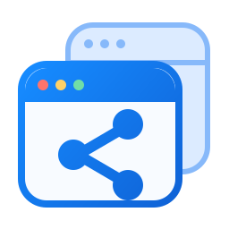

<p align="center"><a href="README.md">English</a> | 简体中文</p>

<p align="center">
  
</p>

<h1 align="center">BrowShare</h1>

<p align="center">把团队的浏览器工作区，放在自己的服务器上。</p>

<p align="center">
  <a href="https://github.com/x3zvawq/browshare/actions/workflows/ci.yml"></a>
  <a href="LICENSE"></a>
  <a href="https://www.typescriptlang.org/"></a>
  <a href="https://github.com/x3zvawq/browshare-remote-tab"></a>
</p>

<p align="center">
  <a href="#quick-start">快速开始</a> ·
  <a href="docs/README.md">文档</a> ·
  <a href="docs/CONTRIBUTING.md">参与贡献</a> ·
  <a href="https://github.com/x3zvawq/browshare/issues">反馈问题</a>
</p>

BrowShare 是开源、自托管的共享浏览器工作区。管理员集中管理持久的 Google Chrome Profile，团队成员通过网页进入获授权的工作区，使用各自独占的远端标签页。登录状态与浏览器数据保留在服务器，访问权限、导航策略和会话生命周期由平台统一管理。

## 为什么选择 BrowShare

- **持久工作区**：每个 Profile 保存独立的 Chrome 数据目录，重启后延续原有登录状态与业务环境。
- **浏览器即入口**：通过 WebRTC 传输画面和音频，支持鼠标、键盘、中文输入、剪贴板、上传与下载。
- **团队权限管理**：用户、角色、Profile 授权、维护会话与操作审计，让日常使用和管理职责清晰分开。
- **可控的业务访问**：为 Profile 配置代理、导航规则、会话策略和 Page Script，让共享环境适应业务流程。
- **可运维的节点**：Worker 支持注册、证书轮换、容量管理、故障对账与运行时恢复。
- **数据自己掌握**：单租户部署，PostgreSQL 保存业务状态，Profile 和文件存储在自己的 Worker 上；提供备份与恢复工具。

同一 Profile 中的标签页共享 Cookie 和站点数据，适合使用同一业务环境的成员。需要不同登录状态时应创建不同 Profile。

## Quick start

部署环境：**Linux amd64、Docker Engine / Compose / Buildx、Node.js 24.12.0、pnpm 10.28.2、OpenSSL**。Chrome 运行在 Linux Worker 上，使用者只需桌面浏览器。

### 1. 获取源码

```bash
git clone https://github.com/x3zvawq/browshare.git
git clone https://github.com/x3zvawq/browshare-remote-tab.git browshare-tab-remote
cd browshare
corepack enable
pnpm install --frozen-lockfile
pnpm --dir ../browshare-tab-remote install --frozen-lockfile
```

### 2. 部署服务

按[容器部署指南](deploy/docker/README.md)选择经过验证的源码配对，构建镜像、配置 HTTPS、初始化管理员，并注册 Worker。指南包含单机部署、TURN、文件入口、备份和恢复步骤。

BrowShare 提供五个镜像构建目标：Portal、Backend、Migrator、Gateway 和 Worker。Worker 在本地构建时安装固定版本的 Google Chrome Stable；运行配置与签名密钥不进入镜像。

### 3. 打开第一个工作区

1. 登录 Portal，在 Worker 管理中确认节点在线且可调度。
2. 创建 Profile，选择 Worker，设置运行方式、访问权限和已发布的导航规则。
3. 从工作区进入会话，在 Viewer 中使用远端标签页。文件下载可在下载收件箱领取。

详细流程见[创建第一条业务 Session](deploy/docker/README.md#创建第一条业务-session)。开发 Portal 或 Backend，请使用[本地开发指南](docs/development.md)。

## 两个项目，清晰分工

| 项目 | 用途 |
| --- | --- |
| **BrowShare** | 完整工作区平台：Portal、用户与权限、Profile、Worker 调度、策略、审计和数据运维。 |
| **[BrowShare Remote Tab](https://github.com/x3zvawq/browshare-remote-tab)** | 可嵌入的远程标签页引擎：Chrome 捕获、WebRTC、输入、Viewer、信令和公共接口。 |

BrowShare 的 Worker 嵌入 Remote Tab Core，Portal 复用它的 Viewer。需要完整共享工作区时使用本项目；为自己的应用加入远程标签页时，可以直接使用 Remote Tab。

## 阅读文档

- [文档导航](docs/README.md)：按使用、运维和开发任务查找指南。
- [部署与运维](deploy/docker/README.md)：安装、网络入口、Worker 和数据恢复。
- [本地开发](docs/development.md)：启动 Portal、Backend 和开发链路。
- [系统架构](docs/design/02-architecture.md) · [接口与协议](docs/design/07-protocols.md)。
- [版本说明](CHANGELOG.md) · [兼容性](deploy/compatibility.json) · [安全策略](docs/SECURITY.md)。

## 参与贡献

欢迎修复问题、改进交互、完善文档和提交功能建议。先查看[贡献指南](docs/CONTRIBUTING.md)，然后提交范围清晰的 Pull Request，说明使用场景、行为变化和验证方式。

发现问题请[提交 Issue](https://github.com/x3zvawq/browshare/issues/new/choose)，附上版本、部署方式、浏览器及复现步骤。安全漏洞请通过[私密安全报告](docs/SECURITY.md)提交。

## 许可证

BrowShare 使用 [MIT License](LICENSE)。Google Chrome 的使用与分发适用其自身条款，详见[第三方声明](THIRD_PARTY_NOTICES.md)。
