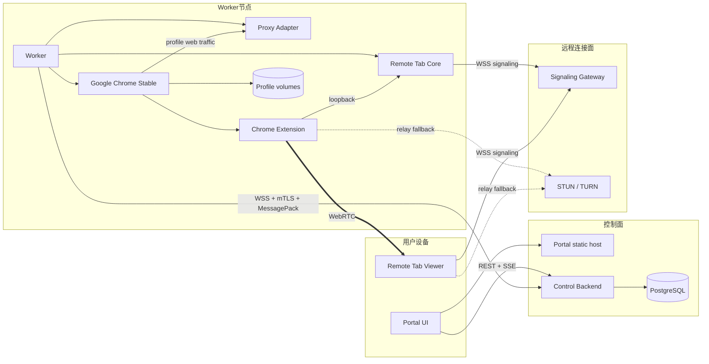
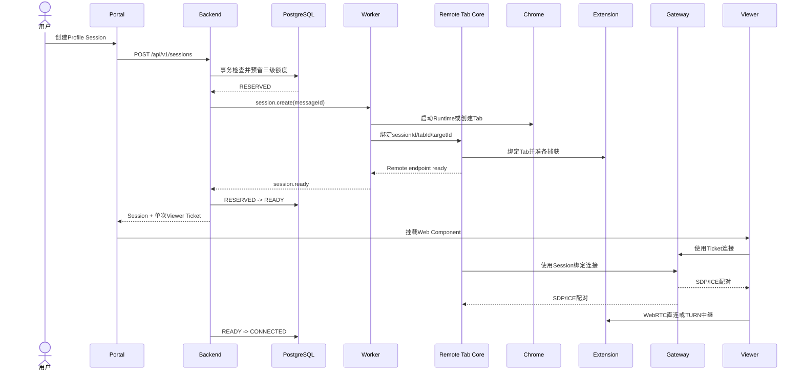

# System architecture

## 架构原则

1. 控制面只管理身份、策略、调度和状态，不承载媒体与文件流量。
2. Worker拥有本机 Profile、Chrome进程和 Tab事实状态。
3. Remote Tab只拥有单 Tab捕获与交互，不理解 BrowShare业务实体。
4. 所有公网可达入口显式鉴权；CDP和 Extension loopback接口永不暴露公网。
5. 组件重启后通过持久状态和 Worker快照恢复，不依赖无法重建的进程内事实。

## 组件关系

## 职责边界

| 组件            | 拥有                                                    | 不拥有                             |
| --------------- | ------------------------------------------------------- | ---------------------------------- |
| Portal          | 业务页面、管理员页面、Viewer容器                        | 媒体转发、Worker命令执行           |
| Backend         | 用户、权限、Profile元数据、调度、策略、审计             | Chrome进程、CDP、媒体和文件内容    |
| Worker          | 本机Profile目录、Chrome、Proxy Adapter、Runtime事实     | 用户密码、全局授权判定、Portal会话 |
| Remote Tab Core | tabId/targetId映射、CDP控制、Extension协调              | Profile可见性、Proxy配置、计费     |
| Extension       | `tabCapture`、WebRTC PeerConnection、下载归属、页面注入 | BrowShare权限、持久业务数据        |
| Gateway         | Ticket校验、Peer配对、SDP/ICE中继                       | 媒体、页面内容、长期Session状态    |
| TURN            | 无法直连时中继WebRTC流量                                | 业务身份、Profile和页面策略        |

## 创建Session时序

任何步骤失败都必须以同一个 `messageId`幂等收敛。Worker创建失败、超时或拒绝后，Backend释放预留额度并将 Session标为 `FAILED`。

## 信任边界

### 公网边界

- Portal/API使用 HTTPS；Portal Session只存 HttpOnly Cookie。
- Viewer和 Core通过 WSS连接 Gateway。
- TURN使用短期凭据，不公开永久共享密钥。
- Worker使用注册后获得的客户端身份主动连接 Backend。

### Worker边界

- CDP只监听 loopback或进程私有通道。
- Extension只连接本机 Core。
- Profile目录只允许 Worker运行用户访问。
- Proxy Adapter只监听 loopback，并且上游失败时拒绝连接。
- Session临时目录不得位于 Profile内。

### 页面边界

- Page Script在 MAIN world运行，因此可以看到目标页面JS环境；只有 Profile管理者能够编辑和发布。
- Page Script不能调用 BrowShare Backend内部接口或获得凭据。
- Navigation Policy Script运行在受限沙箱，不接触DOM、网络、文件、Node进程或秘密。

## 部署拓扑

### All-in-one

同一台服务器运行 Portal、Backend、PostgreSQL、Gateway、coturn和一个 Worker。组件仍使用正式网络协议，不走进程内捷径，因此可以平滑拆分。

### 分布式

- Portal与 Backend可以部署在控制面服务器。
- PostgreSQL只允许控制面网络访问。
- Gateway和 TURN可部署到具备良好公网连通性的位置。
- Worker 主动出站访问 Backend 和 Gateway，不需要公网 IP 或入站控制端口。
- 启用保留下载领取时，浏览器通过独立 HTTPS 文件入口访问 Worker 文件监听；反向代理可走私有网络，Backend 和 Gateway 不转发文件字节。
- Profile固定归属 Worker；当前不提供跨节点迁移。

## 故障模型

| 故障              | 已有Session                 | 新Session               | 恢复方式                |
| ----------------- | --------------------------- | ----------------------- | ----------------------- |
| Backend短暂不可用 | 在有效租约内继续            | 拒绝                    | Worker重连并上报快照    |
| Gateway故障       | 已建立WebRTC继续            | 失败或重新分配          | 新Ticket绑定健康Gateway |
| TURN故障          | 直连不受影响；relay连接失败 | 可尝试其他ICE Server    | 配置多个TURN endpoint   |
| Worker进程崩溃    | 本节点Session失败           | 本节点拒绝              | Worker重启、Probe、对账 |
| Chrome崩溃        | 该Profile全部Session失败    | 等Runtime恢复           | 按Profile运行模式处理   |
| 单Tab崩溃         | 仅对应Session失败           | 其他Tab正常             | 用户创建新Session       |
| Proxy故障         | 保留Tab但网页请求失败       | Profile拒绝启动或新会话 | fail-closed并持续探测   |
| 数据库不可用      | 已有WebRTC按租约继续        | 拒绝                    | Backend恢复后对账       |

## 已冻结的架构决策

- 使用单活动 Control Backend和 PostgreSQL，不提前建设控制面HA。
- Worker控制协议为 WSS + MessagePack + TypeBox，不使用gRPC/Protobuf。
- Portal使用REST JSON + SSE，不使用GraphQL或通用业务WebSocket。
- Worker内嵌 Remote Tab Core，不再额外启动BrowShare专用Remote Tab sidecar。
- Remote Tab仍提供独立CLI/Daemon供第三方使用。
- Viewer是框架无关Web Component，不用Xpra/KasmVNC iframe。
- Profile不复制；一个持久Profile运行一只Chrome并承载多个Tab。
