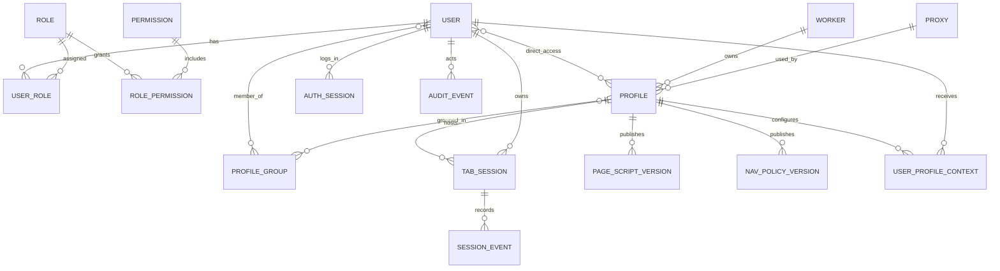
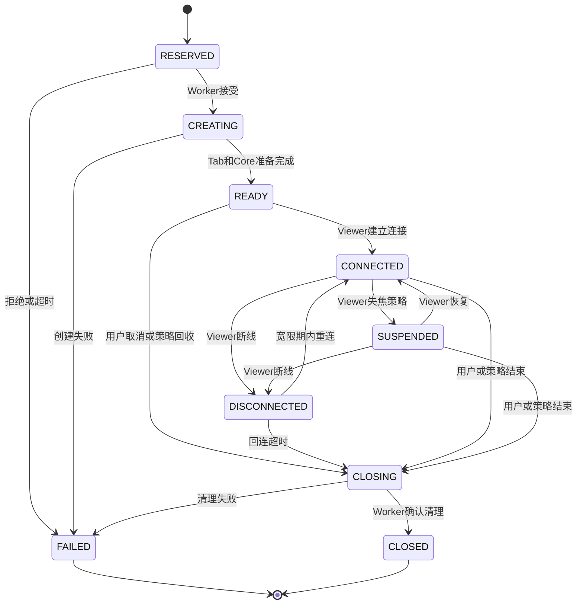

# Domain model

## 建模约定

- 所有外部可见主键使用UUIDv7。
- 所有时间戳以UTC写入PostgreSQL。
- `created_at`和`updated_at`由服务端管理。
- 软删除实体使用`deleted_at`，查询默认排除已删除记录。
- 枚举值存稳定英文机器码；界面负责本地化。
- `null`表示“未设置”或“不限制”，不使用魔法数字表达无限。

## 关系总览



多对多关系必须使用显式关联表，不能把User ID或Group ID数组塞入JSON字段。

## 身份与权限

### User

| 字段                  | 说明                  |
| --------------------- | --------------------- |
| `id`                  | UUIDv7                |
| `email`               | 规范化邮箱，唯一      |
| `display_name`        | 页面显示名            |
| `password_hash`       | Argon2id结果          |
| `status`              | `ENABLED`、`DISABLED` |
| `max_active_sessions` | `null`或非负限制      |
| `email_verified_at`   | 首版通常为空          |
| `deleted_at`          | 软删除时间            |

禁用或删除用户必须撤销Auth Session、Viewer Ticket和活动Tab Session。最后一名拥有`system.manage`权限的用户不能被禁用或删除。

### Role与Permission

首版预置平台管理员和普通成员，但业务代码只查询Permission。核心Permission：

```text
user.read
user.manage
profile.read
profile.manage
profile.maintain
worker.read
worker.manage
proxy.read
proxy.manage
proxy.credential.read
system.manage
audit.read
session.use
session.terminate_any
```

Role、Permission、UserRole和RolePermission使用独立表，为未来自定义RBAC保留正确数据形态；首版不提供自定义角色UI。

### AuthSession

数据库只保存随机Token摘要和设备元数据。默认14天滑动有效。密码修改、管理员重置、用户禁用和主动撤销都会使其失效。

## Profile与分组

### Profile

| 字段                  | 说明                                                                 |
| --------------------- | -------------------------------------------------------------------- |
| `id`                  | UUIDv7                                                               |
| `name`、`description` | 名称与备注                                                           |
| `worker_id`           | 固定归属Worker                                                       |
| `proxy_id`            | 可为空，空表示Direct                                                 |
| `visibility`          | `RESTRICTED`或`ALL_ENABLED_USERS`                                    |
| `business_status`     | `ENABLED`、`DISABLED`                                                |
| `runtime_state`       | `STOPPED`、`STARTING`、`RUNNING`、`MAINTAINING`、`STOPPING`、`ERROR` |
| `data_initialized` | 内部持久标记；确认当前 Runtime 成功 RUNNING 后置 true，停止、重启和失败不清除 |
| `runtime_id`、`runtime_worker_instance_id` | 当前启动命令ID及其绑定的Worker进程实例，内部持久字段 |
| `runtime_generation`、`runtime_desired_state` | 运行代数与管理员意图（RUNNING或STOPPED） |
| `runtime_observed_at` | 同一Worker时钟下最后接受的事实/结果时间，用于拒绝迟到状态 |
| `healthcheck_url` | 可为空的HTTPS业务启动检查地址；手动启动前必须配置，禁止URL内嵌凭据 |
| `runtime_mode`        | `ALWAYS_ON`、`ON_DEMAND`、`MANUAL`                                   |
| `runtime_idle_timeout_seconds` | ON_DEMAND无人使用后的停止延迟，默认300秒，0为立即停止 |
| `runtime_idle_since`、`runtime_healthy_since` | 持久空闲起点和本代稳定运行起点，内部字段 |
| `runtime_failure_count`、`runtime_failure_generation`、`runtime_retry_at` | 连续失败计数、去重代数和下一次自动启动时间 |
| `max_normal_sessions` | 默认4，`null`为不限制                                                |
| `tab_audio_enabled`   | 默认true                                                             |
| `quality_policy`      | 分辨率、FPS、码率上限；码率为`null`表示使用引擎默认值                |
| `delete_requested_at` | 可为空；非空表示已禁用并等待Worker完成资源清理                       |

Profile目录路径是Worker内部实现，不进入用户可编辑API。创建时选择的`worker_id`此后不能通过Profile
编辑接口修改；调整节点归属必须由未来显式迁移能力拥有，当前版本不提供。Profile删除先进入待删除
状态，停止Runtime并结束Session后才物理删除目录；只有Worker确认目录清理完成后，控制面才最终
软删除记录。后台任务在全部Session终态后自动提交DELETE命令；无目录的Profile也必须取得Worker
确认。目录错误保留ERROR与待删除记录，30秒后自动重试；Worker离线或版本不具备删除能力时等待。

已初始化 Profile 启动时必须保留原目录及 Chrome `Local State` 文件；缺失时返回
`PROFILE_DATA_MISSING`，不创建目录或启动 Chrome，也不让 ALWAYS_ON 自动重试。管理员在原 Worker
恢复该 Profile 归档后手动 START。新 Profile 第一次成功运行前可以创建目录，因此代理健康检查等
首次启动失败不会误把尚未创建的数据视为丢失。迁移 0022 对历史 `runtime_generation > 0` 的记录
保守置 true：旧版无法区分失败前是否写过数据，不能用一次失败推断可以安全重置登录态。

### ProfileRuntimeOutbox

`profile_runtime_outbox`保存最新未完成命令，每个Profile最多一行。不可变命令ID、Worker实例、
generation、到期时间以及启动时选定的Proxy快照与Profile意图在同一事务写入。Profile行锁串行化
并发启停；后续STOP替换待处理START，旧结果不能删除或覆盖新命令。Backend重启后继续投递原命令，
完成后删除outbox；公开API不返回命令正文、Proxy凭据或内部运行身份。DELETE复用此队列与
Worker实例/generation校验，清理确认后写软删除时间及最终审计。快照中的Runtime缺失不能作为
目录删除证据，也不能清除待删除Profile的清理错误。Backend重启继续原命令，Worker进程改变或
命令过期后保留错误并重新调度，已经不存在的目录允许幂等确认。

迁移0005为旧活动Runtime设置`ERROR / RUNTIME_IDENTITY_UPGRADE_REQUIRED`，保留已停止记录；
所有旧记录默认期望STOPPED。部署前停止旧Runtime，新Worker对账会清理无持久身份的旧事实，
管理员重新启动后建立新的运行身份。该迁移不会迁移Chrome目录或启动自动运行模式。

### Profile列表与容量派生值

管理清单中的运行状态和容量直接由权威数据库事实派生，不把Portal显示值写回Profile。一个
普通（`kind=NORMAL`）Tab Session只要尚未进入`CLOSED`或`FAILED`，就占用Profile普通Session容量；这包含预留、创建、
待连接、已连接、暂停、断线宽限和关闭中的状态，避免生命周期中途重复分配额度。

有限容量Profile的可用数为`max(max_normal_sessions - active_sessions, 0)`，状态按以下顺序判定：

- 活动数大于上限为`OVER_LIMIT`，用于管理员降低上限后保留既有Session的可观察状态。
- 活动数等于上限为`FULL`，包括上限为0且没有活动Session的情况。
- 其余为`AVAILABLE`。
- `max_normal_sessions=null`时为`UNLIMITED`，可用数保持`null`而不是伪造一个大整数。

Profile列表摘要必须使用当前搜索和筛选条件的完整结果集计算，不受当前游标页影响。摘要分别给出
业务启禁用数量、六种Runtime状态、活动Session总数、有限容量上限与剩余数、无限Profile数以及
`FULL`、`OVER_LIMIT`数量；它用于运营判断，不替代创建Session时User、Profile、Worker三级原子
Reservation检查。

### ProfileGroup

Group不嵌套。它拥有名称、备注、启用状态和用于Policy冲突判定的显式优先级。禁用Group只取消该授权和Policy路径。

关联表：

- `user_profile_grants(user_id, profile_id)`
- `user_profile_groups(user_id, profile_group_id)`
- `profile_group_members(profile_id, profile_group_id)`

同一对关联只能出现一次。删除Group级联删除关联行，但不删除User或Profile。

## Worker与Proxy

### Worker

| 字段               | 说明                                                   |
| ------------------ | ------------------------------------------------------ |
| `id`               | 注册后稳定UUIDv7                                       |
| `name`             | 管理员可读名称                                         |
| `status`           | `PENDING`、`ONLINE`、`DRAINING`、`OFFLINE`、`DISABLED` |
| `max_active_tabs`  | 默认4，`null`为不限制                                  |
| `last_seen_at`     | Backend最后收到心跳时间                                |
| `capabilities`     | 最近一次Probe结果                                      |
| `versions`         | Worker、Core、Chrome和Extension版本                    |
| `metrics_snapshot` | CPU、内存、磁盘、Chrome数和Tab数摘要                   |

存在Profile归属时不能删除Worker。禁用Worker撤销节点身份并拒绝新连接；`DRAINING`拒绝新Session但允许已有Session结束。

### Proxy

| 字段                   | 说明                                |
| ---------------------- | ----------------------------------- |
| `type`                 | `DIRECT`、`HTTP`、`HTTPS`、`SOCKS5` |
| `host`、`port`         | 上游地址                            |
| `username`、`password` | 可为空；首版允许明文存储            |
| `healthcheck_url`      | 可选HTTPS探测地址                   |
| `status`               | 最近健康结果和时间                  |

Proxy被Profile引用时禁止删除。只有`proxy.credential.read`能读取完整凭据；日志和审计事件始终排除密码。

## Tab Session

### 状态机



### 核心字段

| 字段                                 | 说明                             |
| ------------------------------------ | -------------------------------- |
| `id`                                 | Session UUIDv7                   |
| `user_id`、`profile_id`、`worker_id` | 不可由Viewer自行声明             |
| `kind`                               | `NORMAL`或`MAINTENANCE`；旧记录默认NORMAL |
| `maintenance_released_at`             | 维护占用解除时间；维护记录为null期间同Profile不能重复维护或普通预约 |
| `status`                             | 当前显式状态                     |
| `display_name`                       | 用户自定义名；null表示使用远端标题，再回落Profile名称 |
| `remote_title`                       | 最近上报页面标题                 |
| `tab_id`、`target_id`                | Worker事实映射，不返回普通客户端 |
| `gateway_id`                         | 分配的Signaling Gateway          |
| `core_binding_token_digest`          | 本Session的Core绑定Token SHA-256摘要，不返回客户端 |
| `runtime_id`、`profile_generation`、`worker_instance_id` | 本次创建绑定的Runtime及Worker进程，不随Profile重新启动而变更 |
| `runtime_observed_at`                | 该Worker进程最后一个已接纳Session事实的观察时间 |
| `policy_snapshot`                    | 创建时命中的完整回收策略         |
| `page_script_version_id`             | 创建时锁定的发布版本             |
| `navigation_policy_version_id`       | 创建时锁定的发布版本             |
| `lease_expires_at`                   | Worker授权租约截止时间           |
| `close_reason`                       | 独立稳定原因码                   |

Session结束后保留元数据至保留期届满，不尝试恢复已关闭Tab。

### 维护占用

维护复用TabSession、Reservation、创建/关闭outbox、Viewer Ticket和租约。迁移0013增加类型和
释放时间，部分唯一索引保证每Profile最多一条未释放维护记录。维护者由Session.user_id确定；
维护权限为`profile.maintain`，不要求普通Profile授权，也不消耗User/Profile普通额度。
Worker物理容量仍受约束，维护预约按排空该Profile后新增一个主Tab计算。

维护意图与普通Session关闭命令原子提交，普通预约在Profile行锁下检查该意图。创建dispatcher
等待数据库中其他活动会话结束，并等待Worker完整快照不再报告这些Tab；随后设置MAINTAINING并
投递维护创建命令。Worker另行执行真实独占检查。维护可以显式启动停止/错误的MANUAL、ALWAYS_ON
或ON_DEMAND Profile，但仍要求Worker就绪及有效Proxy/健康探测配置。

关闭或失败不会仅凭终态立即解除占用：完整Worker快照必须不再包含维护Session；失败且已经开始
投递的创建，还须等预约失效后观察，避免迟到命令重建Tab。未投递预约和确认已清理的CLOSED会话
无需等待原预约截止时间。释放后只把仍为MAINTAINING的Profile恢复RUNNING，保留真实ERROR状态。
维护失败不会重新创建维护Session。恢复、删除和普通运行模式继续由现有Profile Runtime管理。

### Reservation

创建时在同一数据库事务中检查User、Profile和Worker活动数，并创建`RESERVED`记录。Worker使用`message_id`幂等接纳；失败、拒绝或预留超时释放额度。

当前`SessionReservationService`已经承担此事务。它先取得策略/Group配置的共享事务锁，再按
Profile、User、Worker顺序锁行，与直接授权、Profile运行意图和对账的锁顺序一致。事务内重新验证
`session.use`及共享Profile访问条件；平台管理员没有普通使用越权路径。Worker必须ONLINE且当前
控制连接、能力报告和对账均就绪。维护、错误、停止中、非ON_DEMAND的停止Profile，以及
当前运行路由缺少HEALTHY事实的Profile均拒绝预约；Proxy目录的跨Worker探测不承担此判断。额度失败携带USER、PROFILE或WORKER来源，以及该层的limit/active；不排队。

容量来自User.maxActiveSessions、Profile.maxNormalSessions和Worker.maxActiveTabs。null表示
不限制，0表示拒绝新建；User/Profile普通额度只计NORMAL，Worker额度计全部类型；均只使用非CLOSED/FAILED的Tab Session，包含RESERVED、CREATING及
CLOSING，不再叠加Reservation行，以免重复计数。降低上限不会结束已经占用的Session。

预约有效期120秒，初始租约10分钟；时间在数据库取得锁后生成。命中的整套SessionPolicy连同
命中来源写入policy_snapshot，后续配置修改不改变该快照。停止的ON_DEMAND Profile在同一事务
中写入新Runtime代数、运行意图和现有Profile outbox；并发预约复用同一STARTING代数。任一步骤
失败都会回滚Session、Reservation和新启动意图。

命令投递前调用begin固定Runtime身份，重复调用不延长预约期限。结果接纳必须匹配messageId、
Session、Profile Runtime、Worker进程、Tab/Target与初始租约。已接纳结果的重放不覆盖后续连接
状态或续签租约。过期扫描由Backend生命周期启动，可在Backend重建后继续处理持久ACTIVE预约；
Session变FAILED，Reservation变EXPIRED，容量随终态释放。

第0006号增量migration新增Session Runtime身份及观察时间，允许尚未绑定的预约和历史记录保持
全空，但拒绝部分身份。用户创建REST、Worker创建命令及本人Viewer Ticket签发已接入；Portal
使用入口仍以PROGRESS中的各项为准。

### Session创建意图与投递

第0010号migration增加Session capabilities快照，公开创建保存实际授予Core的能力集合。
Viewer Ticket始终使用该快照。历史记录默认为空对象，不推断历史能力；没有有效快照的Session
明确拒绝新Ticket，当前测试部署迁移前没有活动Session。

第0009号migration新增`session_create_outbox`，每个Session最多一条不可变命令，命令ID复用
Reservation.messageId。公开创建事务同时保存Session、Reservation、Gateway绑定Token摘要、
已发布Navigation Policy和适用于普通Session的Page Script版本ID，以及命令中的完整配置快照。
命令包含仅控制面可读的Gateway绑定Token；消费、终止或过期后删除outbox，公开响应不包含该Token。

投递器等待Profile为RUNNING，再按共享策略锁、Profile、User顺序复核授权，通过begin固定身份。
Worker实例或Runtime代数改变时终止原预约；重连和Backend重启继续投递同一messageId。ACK只表示
接收命令，READY结果或合法快照才能消费Reservation。用户关闭、预约过期和创建结果竞争时，终态
不可复活；迟到Tab由现有对账清理。公开创建需要已发布导航策略，不自动生成放行规则。

### Session结束意图与投递

用户结束操作按Profile、Session顺序加锁，在同一事务中保存CLOSING、撤销ACTIVE Viewer Ticket、
记录事件和审计，并写入`session_close_outbox`。尚未绑定Runtime的RESERVED可直接CLOSED并释放
Reservation。重复结束不会增加第二条命令、审计或改变原始关闭时间。

第0007号migration增加该outbox：每个Session一条不可变命令，含独立messageId、Session和
Runtime身份、Worker进程身份、原创建期限和120秒投递期限。Backend重建后继续投递；Worker
清理成功或快照确认主Tab不存在时才转CLOSED并释放容量。投递失败、超时或Worker重启只终止
本条命令，CLOSING继续由快照对账，不把网络错误当作清理证明。

Session列表、详情和用户结束均限定本人所有权，不因管理员角色扩大范围；撤销Profile授权
不会隐藏已属于本人的历史记录或阻止其结束。管理员管理入口使用独立权限；权限撤销传播和策略回收复用持久关闭及事实对账。

### Gateway绑定与Viewer Ticket消费

第0008号migration新增可空的core_binding_token_digest；历史Session保持原样，未分配绑定Token的
记录不能通过Gateway Core认证。Gateway部署注册表来自Secret配置，数据库Session保存稳定gateway_id。

viewer_tickets保存随机不透明Token的摘要、用户/Session/Gateway、generation、能力和过期时间。
能力JSON使用`{ allowed: string[] }`。消费先取得策略配置共享锁，再按Profile、User、Session、Ticket
顺序锁行；在数据库当前时间校验ACTIVE、期限、租约、generation、Session状态、用户权限和Profile
访问条件后，同一事务改为CONSUMED。Gateway重启不会重置消费状态；失败校验不消耗Ticket。
返回引擎claims仅含绑定ID、generation、能力、签发/过期时间、jti、issuer和audience，不含用户身份。

当前完成消费与Core绑定校验；Token签发、创建命令及Viewer接管仍需Session主链路接入。

## 策略与脚本

### SessionPolicy

整套策略按以下顺序命中：

1. User + Profile。
2. User + ProfileGroup。
3. 全局默认。

命中后不与低优先级逐字段混合。Profile属于多个Group时使用数值较高的显式优先级；相同优先级存在不同策略时拒绝保存。当前配置API与分组修改共享事务锁，详情见[身份、授权与策略](04-auth-and-policy.md)。

策略可包含Viewer断开、无输入、无画面变化且无输入、最长时间、Proxy持续故障等回收条件。Session保存创建时快照，后续编辑不改变已创建Session。

### PageScriptVersion

每个Profile只有一份逻辑Page Script，但拥有多个不可变版本。状态包含草稿、已发布和已禁用。普通Session锁定创建时发布版本；维护Session可测试草稿。

### NavigationPolicyVersion

包含有序结构化URL规则和可选受限Policy Script。版本不可变，通过发布指针切换当前版本。

当前草稿可原位更新；首次发布后规则、Script源码、默认动作和修改说明不再修改。继续编辑需
创建下一版本草稿，也可以把历史内容复制到草稿。发布、禁用和回滚只改变版本状态及Profile发布
指针，不改写已创建Session。每个Profile的草稿保存与发布操作持有Profile行锁，版本号顺序分配；
Session预约使用同一Profile锁读取发布内容。禁用历史非当前版本不会清除其他版本的发布指针。

### UserProfileContext

`(user_id, profile_id)`唯一，保存管理员配置的JSON变量。允许发送到Page Script的`event.detail`，但不能包含密码、Cookie、Token或Proxy凭据。

## 审计与设置

### AuditEvent

记录操作者、动作、目标类型、目标ID、结果、时间、来源IP摘要和结构化非敏感差异。禁止记录页面正文、Cookie、密码、代理密码、剪贴板、文件内容和敏感完整URL。

### SystemSetting

数据库只保存运行期可修改的业务设置。部署级秘密和监听配置来自环境变量或Secret文件。环境变量初始化值只在数据库尚未初始化时写入一次，之后不覆盖管理员配置。

### Session回收观察

`tab_sessions.recycling`保存Worker最新完整回收事实（可空JSON），由0011 migration增加。
`policy_snapshot`仍是创建时不可变的策略来源；`recycling`只是该快照与当前活动状态计算出的结果。
输入及画面时间使用既有`last_input_at`、`last_frame_changed_at`列。最终关闭原因、Reservation释放、
未消费Ticket撤销与Session事件在接受关闭事实时同事务提交。


0012_profile_runtime_modes新增上述运行模式字段及非负约束。旧Profile模式不变，默认空闲延迟300秒，
计数为0、时间为空。Profile管理响应暴露空闲延迟、失败次数和下次重试时间；内部空闲/稳定起点与去重
代数不返回Portal。自动调度与手动命令共用持久outbox；完成度以PROGRESS中的checkbox为准。

### 路由配置与运行事实

Proxy的configurationVersion标识网络配置及显式探测URL版本；lastProbeWorkerId说明最近一次
探测从哪台Worker执行，lastProbeMode/lastExitIp描述该次探测，不能推导其他Worker网络健康。
内部lastProbeId复用命令UUIDv7，既处理配置更新期间的迟到结果，也处理同毫秒并发请求的覆盖。

Profile的routeVersion标识绑定Proxy网络参数及自身healthcheckUrl组成的预期路由。
runtimeRouteVersion与runtimeProxyHealth属于当前不可变Runtime，保持真实运行状态直到显式
停启或正常生命周期替换；版本不一致显示restartRequired，不偷偷改动存量Chrome。
修改Proxy名称不影响路由；修改Proxy探测URL只影响Proxy探测版本，Profile使用自己的检查URL。

新Session准入以归属Worker的当前Runtime健康为依据；按需启动依然必须通过真实路由检查。
所有健康字段都只是最近观察事实，并非持续可用性承诺。具体消息、权限和陈旧结果规则见
[Control 1.18接口](07-protocols.md#proxy显式探测与runtime路由事实control-118)。
