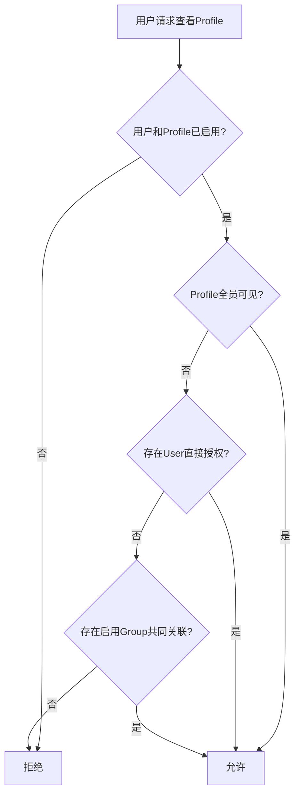

# Identity, authorization, and policy

## 身份验证

### 初始化首位管理员

Backend在没有任何用户时进入未初始化状态。部署者可以通过环境变量预置首位管理员邮箱与密码，
或配置高熵 `BOOTSTRAP_TOKEN`（至少 32 个字符）/`BOOTSTRAP_TOKEN_FILE`，由 Portal `/setup`
向导验证该凭据后创建管理员。Token 不自动生成或打印到日志；部署者通过自己的 Secret 交付渠道提供。

初始化必须幂等。数据库已有用户后，环境变量不得覆盖密码或重新创建管理员。禁止让首个公网访问者自动成为管理员。

Backend在一个数据库事务中写入预置Permission、系统Role、首位管理员及其关联，并把
`browshare_internal.bootstrap_state`作为最后一步。该内部完成标记不可修改或删除；写入时的
延迟数据库约束会确认至少存在一名启用、未删除且通过未删除Role拥有`system.manage`的用户。
标记存在后，禁用、删除或撤销最后一名此类用户的操作在事务提交时被数据库拒绝。管理员转移
应在同一事务中先建立替代授权，再撤销旧授权。

环境变量管理员初始化路径：

```bash
BOOTSTRAP_ADMIN_EMAIL=admin@example.com
BOOTSTRAP_ADMIN_DISPLAY_NAME=Platform administrator
BOOTSTRAP_ADMIN_PASSWORD_FILE=/run/secrets/bootstrap_admin_password
```

`BOOTSTRAP_ADMIN_DISPLAY_NAME`可省略；密码可以直接使用`BOOTSTRAP_ADMIN_PASSWORD`，也可以使用
`_FILE`读取只读Secret，二者不能同时设置。Backend只在`bootstrap_state`不存在且User表为空时
使用这些值。User已存在但完成标记缺失属于不一致数据库，Backend拒绝自动选择或覆盖管理员。
没有初始化凭据的全新数据库保持`uninitialized`，不会把首个HTTP访问者提升为管理员。

交互式路径使用 `GET /api/v1/bootstrap` 查询是否已初始化、是否配置 Token；响应不包含 Token、
管理员信息或用户数量。未初始化且未配置 Token 时，Portal 显示等待部署者配置的页面并允许重新检查。
配置 Token 后，向导收集 Token、管理员邮箱、显示名称、密码及本地确认密码；`POST /api/v1/bootstrap`
提交初始化。秘密只存在于当前表单内存，不写入 URL 或浏览器持久存储；成功、确认已初始化或离页时清除。

HTTP 初始化和环境变量初始化复用同一数据库事务、advisory lock 与不可变完成标记。只有首次成功写入
返回 201；数据库已初始化或并发输家返回 409 `BOOTSTRAP_ALREADY_INITIALIZED`，不会改密或重新创建管理员。
Token 即使保留在配置中也无法再次初始化。错误 Token 返回 403 `BOOTSTRAP_TOKEN_INVALID`；未配置返回
503 `BOOTSTRAP_DISABLED`；不一致的数据库状态拒绝初始化。成功写入 `system.bootstrap` 审计，
`metadata.method=token`，审计 `requestId` 对应 HTTP 响应 `x-request-id`，不记录 Token 或密码。
环境变量路径仍在 Backend 启动时优先执行，审计方法为 `environment`。

初始化完成不自动签发登录会话；Portal 显示结果并进入普通密码登录。全新数据库的公开认证配置返回
关闭注册与关闭邮箱验证，避免因业务设置尚未由初始化事务创建而报 500。

初始化同时创建内置`platform_administrator`和`member`Role、下表中的Permission，以及
`registration.open=false`、`auth.require_email_verification=false`和
`session.default_max_active=1`三个初始系统设置。业务授权仍只判断Permission；Role code只用于
初始化和明确的Role分配。

### 密码登录

- 邮箱在比较前规范化，保留原始展示形式不是身份依据。
- 密码使用Argon2id和每条记录独立盐值。
- 最短10个字符，不强制大小写、数字或符号组合。
- 登录失败同时按来源IP和账号标识执行渐进退避，不永久锁死账号。
- 成功登录创建随机Portal Session；数据库只保存Token摘要。
- Cookie使用`HttpOnly`、`Secure`、`SameSite=Lax`和明确Path。
- 默认14天滑动有效；滑动刷新不得无限保留被禁用用户的会话。

当前REST入口为：

| 方法     | 路径                                      | 行为                                             |
| -------- | ----------------------------------------- | ------------------------------------------------ |
| `GET`    | `/api/v1/auth/config`                     | 返回注册与邮箱验证的公开能力开关                 |
| `POST`   | `/api/v1/auth/login`                      | 统一失败响应，成功后签发Portal Session           |
| `POST`   | `/api/v1/auth/register`                   | 只在`registration.open=true`时创建内置Member用户 |
| `GET`    | `/api/v1/auth/session`                    | 校验、滑动刷新并返回当前User与Permission          |
| `POST`   | `/api/v1/auth/logout`                     | 撤销数据库Session并清除Cookie                    |
| `POST`   | `/api/v1/auth/change-password`            | 校验当前密码，改密并撤销其他设备                 |
| `GET`    | `/api/v1/auth/sessions`                   | 查看未撤销且未过期的登录设备                     |
| `DELETE` | `/api/v1/auth/sessions/:sessionId`        | 撤销本人一个登录设备                             |
| `POST`   | `/api/v1/auth/sessions/revoke-all`        | 撤销本人全部登录设备并退出                       |

Portal Session使用32字节随机Token；Cookie保存签名后的Token，数据库只保存SHA-256摘要。剩余有效期
进入7天窗口时，任意当前Session校验会把数据库和Cookie有效期无感延长到14天；`last_seen_at`按
最小写入间隔更新。用户被禁用或软删除后，即使Cookie尚未过期也不能继续认证。登录失败按规范化
账号标识和来源IP摘要执行进程内渐进退避；首版只有一个Backend，控制面多副本前不引入分布式
限速存储。

用户主动改密后保留发起请求的当前Portal Session，并撤销其他登录设备；这样改密提交不会制造一次
无意义的页面中断。管理员重置密码和“撤销全部设备”会撤销目标用户全部Portal Session。所有受保护
接口都重新读取User状态和Permission，因此禁用、软删除或Role变更在下一次请求立即生效，不依赖
Cookie自然过期。Viewer Ticket和活动Tab Session的跨组件撤销由Session纵向切片接入，不能在身份
模块尚未拥有这些资源时伪造完成状态。

Portal启动时只通过`GET /auth/session`恢复HttpOnly Cookie中的身份，不把Token、密码或Permission
写入Local Storage。受保护路由等待首次恢复完成后再渲染；无有效Session时携带同站相对路径返回
登录页，登录成功后恢复原页面，`//host`等站外跳转值会被丢弃。任意受保护API返回401时，全局响应
中间件立即清空客户端身份并跳转登录页，明确显示“登录状态已失效”，而不是让页面继续显示旧权限。

登录页读取`GET /auth/config`决定是否展示注册入口；直接访问注册页时仍重新读取服务器设置，关闭
注册后展示管理员创建账户的说明。账户安全页允许修改密码、查看未撤销设备、撤销单个设备以及退出
全部设备；撤销当前设备或全部设备后立即清除本地状态。所有危险动作使用说明真实影响的确认对话框。

### 注册和密码恢复

注册默认关闭。开启后用户使用邮箱和密码直接注册，无人工审核。新用户并发值读取
`session.default_max_active`，初始为1，并且没有任何Profile授权。

`GET/PUT /api/v1/settings/registration`和Portal的`/admin/settings`要求实时`system.manage`。
设置包含公开注册开关、邮箱验证预留开关和开放注册默认额度，整组原子保存并记录修改前后审计。
额度接受0到1,000,000的整数或`null`（无限制）；只用于之后注册的账户，不回写已有用户。
公开`/auth/config`只返回注册和邮箱验证开关，不暴露管理设置。没有邮件Provider时，保存邮箱验证
开启值返回400；页面保留禁用开关并说明原因。开启公开注册需要确认，保存失败保留编辑值。
注册在密码哈希完成后于创建用户事务内重新读取并共享锁定设置，和设置更新串行化；关闭注册的
事务先完成时，等待中的注册请求返回403且不创建用户。管理员创建用户省略额度时默认2，显式
0和`null`仍保留各自含义。

首版不发送邮箱验证或密码恢复邮件。管理员可以重置密码；重置后撤销用户所有Portal Session、Viewer Ticket和活动Tab Session。`require_email_verification`存在于系统设置，但没有可用邮件Provider时不能启用。

### 管理用户与Role

用户管理入口全部要求实时`user.read`或`user.manage`Permission：

| 方法     | 路径                              | 行为                                  |
| -------- | --------------------------------- | ------------------------------------- |
| `GET`    | `/api/v1/users`                   | UUIDv7游标分页、搜索和状态过滤        |
| `POST`   | `/api/v1/users`                   | 管理员创建用户并指定初始Role          |
| `GET`    | `/api/v1/users/:userId`           | 查看包含Role摘要的用户详情            |
| `PATCH`  | `/api/v1/users/:userId`           | 修改邮箱、展示名和最大活动Session数   |
| `PUT`    | `/api/v1/users/:userId/state`     | 启用或禁用；禁用会撤销Portal Session  |
| `PUT`    | `/api/v1/users/:userId/roles`     | 原子替换Role集合                      |
| `POST`   | `/api/v1/users/:userId/reset-password` | 管理员重置密码并撤销全部登录设备 |
| `DELETE` | `/api/v1/users/:userId`           | 软删除并撤销全部登录设备              |
| `GET`    | `/api/v1/roles`                   | 查看可分配Role及其Permission集合       |

User列表默认排除软删除记录；`state=DELETED`只查看软删除记录，`state=ALL`查看全部。列表和搜索按
`created_at,id`稳定倒序，并使用经过结构校验的UUIDv7游标。邮箱始终规范化后保存，已软删除
用户的邮箱也不会被静默复用。

Portal的`/admin/users`要求`user.read`，提供搜索、状态过滤、分页、Role与Permission查看。
持有`user.manage`时才显示创建、编辑、启禁、软删除、Role分配和密码重置操作。基本资料、
Role和密码分别提交；创建默认Member，最大活动Session可设为0、正整数或无限制。
软删除账户只读，邮箱仍保留。禁用、删除和重置密码的确认说明会话撤销影响；请求失败保留表单值。
修改本人Role后立即重新读取身份并更新菜单，失去`user.read`时返回账户安全页；本人被禁用、
删除或重置密码后退出登录。最后管理员保护仍由Backend事务约束执行。

禁用、软删除或撤销Role都在同一数据库事务中提交。若操作会让系统失去最后一名启用、未删除且
拥有`system.manage`的用户，延迟数据库Trigger拒绝整个事务，API稳定返回
`LAST_SYSTEM_MANAGER`。正确的管理员转移顺序是先给第二名用户分配相应Role，再撤销第一名用户。

## 授权模型

业务代码只检查Permission，不比较角色名称。首版角色只是预置Permission集合。

| Permission              | 允许的操作                                      |
| ----------------------- | ----------------------------------------------- |
| `user.read`             | 查看用户列表和非敏感详情                        |
| `user.manage`           | 创建、编辑、禁用、删除、重置密码和分配角色      |
| `profile.read`          | 查看可管理Profile及普通Session运行诊断                           |
| `profile.manage`        | 创建、编辑、授权、策略、脚本、停止和删除Profile |
| `profile.maintain`      | 进入和结束Profile维护模式                       |
| `worker.read`           | 查看Worker状态、版本、指标和诊断                |
| `worker.manage`         | 创建Enrollment、Drain、禁用和删除Worker         |
| `proxy.read`            | 查看Proxy配置列表                               |
| `proxy.manage`          | 创建、编辑、测试和删除Proxy                     |
| `proxy.credential.read` | 在API响应中读取完整Proxy用户名和密码            |
| `system.manage`         | 修改系统设置和初始化关键能力                    |
| `audit.read`            | 查看审计日志                                    |
| `session.use`           | 创建和控制本人获授权的Session                   |
| `session.terminate_any` | 结束任意普通Session                             |

拥有管理Permission不自动获得所有Profile的普通使用权。平台管理员可以维护和管理Profile，但若需要以普通用户语义创建Session，仍应通过明确授权或管理入口完成。

### Profile管理清单

`GET /api/v1/profiles`是Portal管理员清单入口，要求实时`profile.read`Permission；匿名请求返回401，
已登录但没有Permission的请求返回403。它是管理视图，不使用普通用户的Profile可见性判定，也不
因此授予`session.use`或普通Session访问权。

查询支持名称或备注搜索、业务状态、Runtime状态、Worker和ProfileGroup筛选。Worker与Group筛选
值必须是UUIDv7；无效值返回400。结果默认排除软删除Profile，按`created_at,id`稳定倒序并使用
结构校验后的不透明游标。响应同时返回：

- 当前页的Worker、Group、Runtime、可见性和普通Session容量事实。
- 与当前全部筛选条件一致、但不受游标影响的容量与状态摘要。
- 所有未软删除Worker和ProfileGroup的轻量facet，供Portal继续切换筛选条件。

搜索中的`%`、`_`和转义符按普通字符处理，不能改变数据库匹配语义。Portal切换筛选时取消旧请求并
拒绝过期响应覆盖新结果；刷新失败保留已加载清单，同时展示可重试错误，不把旧数据伪装成刚刚更新。

### ProfileGroup与普通使用授权（已实现的查询和管理边界）

ProfileGroup的管理读取要求`profile.read`，创建、编辑、启禁、删除和授权修改要求
`profile.manage`。分组具有名称、备注和有符号32位显式优先级；允许相同优先级，
SessionPolicy配置模块负责检测实际命中的策略冲突。分组名称在去除首尾空白后不能重复。
搜索与Profile清单一致，LIKE元字符按普通文本处理。

`GET /api/v1/profile-groups/subjects?kind=USER|PROFILE`是授权选择器的最小目录，要求
`profile.read`，只返回`id/name/status`及分页信息。USER的展示名称包含姓名和邮箱，以便
管理员准确区分授权对象；该Permission不授予`/users`通用用户列表或其他用户管理字段。

分组成员和用户授权通过`PUT /profile-groups/:id/members`一次性替换两组ID；直接Profile
授权通过`PUT /profiles/:id/grants`替换用户ID。事务先锁定所属分组或Profile，再校验所选
对象，任一对象不存在、已删除或Profile正在删除时整批拒绝。并发替换保持完整集合，未变更
的授权保留原授予时间。禁用对象保留关联；分组删除清除其关联和分组策略，保留用户和Profile。
列表与详情数量排除软删除对象，包含仍有关联的禁用对象。变更记录审计并发送Profile失效通知。

`GET /api/v1/workspace/profiles`及`GET /api/v1/workspace/profiles/:id`要求`session.use`。
列表与单项读取共用`profileAccessCondition`：用户和Profile均须启用且未删除，Profile不处于
删除流程，并满足全员可见、直接授权、启用分组授权三条路径之一。管理员没有普通使用权旁路；
撤销一条路径不影响其他有效路径，最后一条路径撤销后列表立即隐藏、单项返回404。
响应仅含名称、备注、运行状态/模式、启用分组和容量，不暴露Worker、Proxy、检查URL或内部标识。

Portal的`/admin/profile-groups`提供分页搜索、编辑、启禁、删除确认、Profile成员及用户多选；
Profile管理页提供直接授权入口。仅有`profile.read`的用户可查看关联，但没有保存或修改操作。
网络失败保留编辑内容并支持重试；横向表格复用可聚焦的原生滚动容器。

Session预约、租约、Ticket及撤销重算复用同一授权条件。授权变更持有排他配置锁，
与预约和签发所持共享锁互斥；事务内重新计算所有有效授权路径，只结束失去访问权的Session。

### Profile创建、编辑与受控删除

当前控制面提供以下基础管理入口：

| 方法    | 路径                                         | Permission       | 行为                                                   |
| ------- | -------------------------------------------- | ---------------- | ------------------------------------------------------ |
| `GET`   | `/api/v1/profiles/:profileId`                | `profile.read`   | 读取单个未软删除Profile及其Worker、Group和容量事实      |
| `POST`  | `/api/v1/profiles`                           | `profile.manage` | 创建Profile并固定归属Worker                            |
| `PATCH` | `/api/v1/profiles/:profileId`                | `profile.manage` | 编辑名称、备注、运行模式、可见性、容量、音频和画质策略 |
| `PUT`   | `/api/v1/profiles/:profileId/state`          | `profile.manage` | 幂等设置`ENABLED`或`DISABLED`                          |
| `POST`  | `/api/v1/profiles/:profileId/deletion`       | `profile.manage` | 精确名称确认后进入两阶段删除，返回`202`                |

创建允许预配置到在线、离线或已禁用但仍存在的Worker，避免控制面替管理员判断节点用途；已退役或不存在的
Worker返回404。`workerId`只出现在创建请求，编辑请求不接受它。名称与备注在写入前去除首尾空白，空
备注保存为`null`，同一未软删除Profile名称必须唯一。`maxNormalSessions=null`表示不限制普通Session；
`qualityPolicy.maxBitrateKbps=null`表示 Profile 不额外限制码率；全局码率限制仍然适用，两层均为
`null`时由 Remote Tab 引擎选择码率。全局/Profile 的数值逐项取小，音频取同时允许，仅用于
新 Session 的预约快照。分辨率上限为1920×1080，FPS上限
为60。所有请求对象拒绝未知字段，避免拼写错误或Portal与Backend版本漂移被静默忽略。

删除请求必须提交当前精确Profile名称。Backend在同一事务中立即把Profile设为`DISABLED`并写入
`deleteRequestedAt`，重复提交保持幂等且不重复生成删除审计。待删除Profile不能编辑或重新启用；
请求事务同时结束Session；持久后台任务自动停止Chrome并删除固定归属Worker上的目录，
只有Worker确认后才最终软删除控制面记录。失败时保留待删除记录及清理错误，30秒后在Worker
可用时重试；Portal通过既有Profile SSE展示进度及最终移除，不允许手动启停覆盖删除意图。

Portal使用一个创建/编辑表单展示上述字段：新建默认选择在线Worker、4个普通Session、1920×1080、
60 FPS、引擎默认码率和Tab音频开启；编辑态明确显示Worker不可修改。数值字段在本地执行整数与范围
校验，删除对话框只有在名称完全匹配时才可提交。网络失败会保留弹窗和输入，类型化API Client默认
在15秒终止无响应请求，服务恢复后用户可以直接重试。只有`profile.read`的账户仍可查看管理清单，
但不会看到创建按钮和操作列。

创建、修改、启禁和删除请求分别生成`profile.create`、`profile.update`、`profile.enable`或
`profile.disable`、`profile.delete.request`审计事件，并保留HTTP请求ID。审计元数据不记录密码、
Cookie、Profile目录内容或页面正文。

## Profile可见性判定



列表查询和单资源查询必须复用同一授权逻辑，不能出现“列表隐藏但知道ID可访问”。授权撤销后不得继续签发Viewer Ticket；现有Session按撤销事件立即结束。

## Session回收策略配置与命中

当前`/admin/session-policies`提供全局、User+Profile、User+ProfileGroup三种范围的完整配置、
删除和命中预览。读取要求`profile.read`；定向策略保存/删除要求`profile.manage`，全局策略
保存/删除要求`system.manage`。列表和表单沿用授权目录的姓名与邮箱展示，以区分同名用户。

保存即发布该范围的当前配置，整体替换所有回收字段，不保留隐式的逐字段继承。系统初始值为
Viewer断开300秒、其他主动条件关闭、倒计时60秒；空超时表示关闭该条件，倒计时必须为非负整数。
`recycleDisabled`关闭主动回收，保留已填字段方便重新启用；它不撤销User/Profile授权与租约校验。

命中顺序为User+Profile、启用分组中数值最高的显式优先级、全局配置。没有全局记录时采用上述
固定系统初始值。User+Group的适用范围由Profile成员关系决定，不因用户通过直接授权或其他分组
获得使用权而绕开该策略；是否具备使用授权由独立的共享授权谓词判定。预览同时返回授权布尔值
和完整命中结果，不授予访问权、不创建Session。

同一用户的两个启用分组存在共同的未删除Profile，且优先级相等、策略内容不同，即构成保存冲突；
相同策略允许并存，按Group ID稳定选择来源。即使暂时被更高层策略覆盖也拒绝歧义配置，避免删除
覆盖项后突然失去确定结果。禁用User/Profile仍保留此约束，重新启用不会引入隐藏冲突。

策略写入，以及分组优先级、状态、成员和删除修改，共用租户级PostgreSQL事务锁。策略保存和会
产生新重叠的分组修改都在提交前检查冲突；失败返回`SESSION_POLICY_CONFLICT`并回滚整个修改。
并发修改的真实验证为一笔成功、一笔409，不能先分别通过校验再提交冲突状态。

删除定向策略后使用下一层命中结果；删除全局配置恢复系统初始值。保存和删除记录审计，列表与
详情时间统一返回RFC3339 UTC。Portal切换目标时取消旧请求，自动载入所选范围已有配置；网络失败
保留表单，冲突提示支持中英文，窄屏表格独立滚动。

配置、发布、解析器和预约事务中的完整快照现已接入Worker本地执行。策略修改不改变既有Session
快照；回收条件和继续使用的执行语义见[Session与Viewer](05-session-and-viewer.md#回收和倒计时)。

## Viewer Ticket

Viewer Ticket与Portal Session完全分离：

- 绑定`session_id`、`user_id`、`gateway_id`、能力集合和60秒过期时间。
- 单次使用；Gateway消费后不能重放。
- 不包含Proxy凭据、Cookie、tabId或CDP targetId。
- 只能建立Viewer连接，不能调用Portal管理API。
- 用户禁用、权限撤销或Session关闭时立即作废未消费Ticket。

第二个Viewer请求接管时，Backend先要求明确确认，再签发新的Ticket。Gateway/Core断开旧Viewer后才激活新连接。

Gateway消费端已接入Backend：不透明Token只按SHA-256摘要查询，PostgreSQL事务保证单次消费。
消费和Core绑定均重新验证当前Session状态、租约、generation、用户启用、`session.use`和Profile
访问条件；用户或授权失效会立即阻止新绑定。数据库消费记录在Gateway进程重启后仍有效。
Core另持有每Session绑定Token，不能使用Gateway部署Secret替代Session授权。

Gateway调用使用各自的部署Secret，与Portal Cookie分离。公网WSS只传Ticket或Core绑定Token，
不暴露内部鉴权接口。本人签发API和显式generation确认接管已接入；Core完成旧Viewer撤销及新连接
准备后才返回启动参数。禁用用户、Profile、Worker及失去最后授权路径会事务性撤销未消费Ticket，
并持久投递Tab关闭意图；Worker完成Core关闭后终止已有PeerConnection。Backend不可用时拒绝
新绑定，现有信令配对可在本地租约及策略有效期内继续转发。

Session创建时保存能力快照，Ticket不能因后续Profile音频等配置变更而扩权。签发持有共享策略锁、
Profile、User和Session行锁，在取得锁后生成统一UTC签发/过期时间，保证数据库消费声明与Worker
拿到的声明都为60秒。授权generation先持久化，Worker准备结果必须仍属于当前Session/Tab/Runtime，
返回前再次检查授权、租约和Ticket状态。失败或被新请求替代时撤销本次Ticket，不复用旧Token。

## Navigation Policy

### 判定层次

```text
系统危险scheme硬限制
  → 有序结构化URL规则
  → 可选DEFER_TO_SCRIPT
  → 受限Policy Script
  → 默认动作
```

系统始终拒绝可能访问本地文件、浏览器内部页面或执行脚本的危险scheme。结构化明确`DENY`不能被脚本覆盖。

规则匹配顶层Tab导航，不限制页面加载的图片、API、脚本和CDN子资源。这样避免把正常站点误拆成不可用状态，也意味着它不是网络级数据隔离。

Remote Tab的主文档公共边界已接入：新Tab先保持空白，安装CDP Fetch校验后才请求初始地址；
页面链接、脚本、表单及HTTP重定向每一跳均调用Worker的导航授权。iframe文档和其他子资源直接
继续，不做URL规则匹配。拒绝会取消请求并保留原页；改写通过303重定向改变可见URL，不向新地址
转发POST正文。同文档history/hash变化仅更新URL事实，不产生新的Document请求。

站点Service Worker可直接返回文档绕过Fetch，因此Core在受管Tab启用Network域并设置
setBypassServiceWorker。该Tab的Service Worker请求处理和离线缓存会受影响；同Profile的注册、
存储和非受管Tab不被修改。此为当前站点兼容性限制，不能把顶层URL策略描述为完整资源隔离。
有序规则的草稿、试算、版本历史、发布、禁用及回滚已接入Backend与Portal。试算与Worker复用
`@browshare/navigation-policy`的URL规范化、URLPattern编译和首个启用匹配规则；试算不发起网络
请求，只解释当前一跳。默认动作限定ALLOW_REMOTE或DENY。非法模式、重复规则ID以及非HTTP(S)
或包含凭据的改写地址在草稿保存前拒绝。

受限Script已接入草稿语法校验、试算、发布和Worker导航执行。`PROMPT_REMOTE` 可用于启用的规则
或Script返回结果：Core暂停真实主文档请求，Viewer确认后继续原请求，不重新构造GET。原始POST
方法与正文得以保留，HTTP重定向每一跳单独授权；工具栏的预检查不会重复弹窗。取消、60秒超时、
Viewer断开/替换、能力撤销、Session结束或新主文档替换旧请求均不构成同意。

Worker仍先拒绝明确DENY的初始URL；其余Session先绑定空白Tab进入READY，首次Viewer握手后执行
初始导航，以便初始地址也能请求确认。重新连接不重复初始导航。拒绝确认后可以重新输入地址。
完整交付状态以[PROGRESS](../../PROGRESS.md)为准。

动作：

| 动作                | 行为                                 |
| ------------------- | ------------------------------------ |
| `ALLOW_REMOTE`      | 在当前远端主Tab打开                  |
| `DENY`              | 阻止并向Viewer说明                   |
| `REDIRECT_REMOTE`   | 改写后在远端打开                     |
| `PROMPT_REMOTE`     | Viewer确认后在远端打开               |
| `OPEN_LOCAL_PROMPT` | 不在远端打开，交给Viewer询问本机打开 |

Policy Script只能接收规范化URL、来源类型、当前顶层URL、用户/Session非敏感上下文和结构化规则结果。它看不到DOM、网络响应、文件系统、Node进程、Cookie、Token或Proxy凭据。执行超时、抛错或返回非法结果时默认`DENY`。

Script为同步函数体，参数名为`input`。第一条启用且匹配的结构化规则若是明确动作，则直接采用，
包括不能覆盖的DENY；`DEFER_TO_SCRIPT`或未命中时才调用Script。Script未配置或返回`null`时
使用默认动作。返回`undefined`、Promise、非法动作、额外字段或危险改写地址均拒绝。

```javascript
if (input.url.startsWith('https://example.com/')) {
  return { action: 'ALLOW_REMOTE' };
}
return null;
```

输入字段为`url`、`source`（initial/viewer/document/local-open）、`currentUrl`、
`user: {id, displayName}`、`session: {id, profileId}`及`rule: {id, action}`。没有对应上下文时
字段为null。真实Session身份由Backend写入创建命令，页面不能替换；试算允许独立模拟这些字段，
不构成访问授权。改写结果为`{action: 'REDIRECT_REMOTE', redirectUrl: 'https://...'}`；目标仍会
重新授权。其他最终动作只返回`{action}`。

执行使用固定版本QuickJS WebAssembly，独立Node线程中每次创建新QuickJS Runtime/Context；
不安装宿主函数或模块加载器，不执行异步任务。QuickJS堆限制8MiB、栈256KiB，中断预算50ms；
宿主线程另有250ms硬超时，可终止耗时的解释器工作，WASM内存上限64MiB。单进程串行执行，最多
等待16项，超载返回SCRIPT_BUSY并拒绝导航；线程冷启动限5秒，空闲30秒释放。执行错误不记录源码、
URL或异常正文；只返回稳定的SCRIPT_ERROR/TIMEOUT/BUSY/INVALID原因。Backend与Worker关闭时
结束执行线程。资源限制与宿主API隔离均需保留真实边界验证。

### 新窗口

普通Session发生`window.open`、`target=_blank`或等效新Target时：

1. Core捕获URL和来源Session。
2. 关闭远端新Target。
3. 执行Navigation Policy。
4. 动作为本地打开时，Viewer展示“是否在本机打开？”。
5. 用户确认后调用`window.open(url, '_blank', 'noopener,noreferrer')`。

只允许HTTP/HTTPS。依赖远端Cookie、POST Body或`window.opener`的页面可能无法在本机继续，Viewer应明确提示。维护Session可以保留必要附属窗口。

## Page Script

每个Profile提供一个代码输入框。代码在每个文档的MAIN world执行，并注册以下事件：

```text
browshare:on_document_start
browshare:on_dom_content_loaded
browshare:on_load
browshare:on_location_changed
browshare:on_session_attached
browshare:on_session_detached
```

Remote Tab先执行管理员源码，再安装固定事件bootstrap；因此源码可以直接注册首批事件监听器。
每个事件分别在`document`和`window`派发且不冒泡，不在业务层维护管理员可选事件列表。脚本可配置运行于普通Session、维护Session或两者。

版本流程：

```text
编辑草稿 → 在维护Session测试 → 发布不可变版本 → 新Session锁定版本
                                      ↘ 回滚到历史版本
```

管理入口为 `/admin/profiles/{profileId}/page-script`。单个代码编辑器保存完整源码、
`NORMAL` / `MAINTENANCE` / `BOTH` 适用范围及修改说明；已发布版本只读，可复制后保存为草稿。
同一 Profile 的草稿保存和发布在 Profile 行锁内串行执行；发布、禁用和回滚仅更新当前指针，
不修改已有 Session 快照，也不覆盖同 Profile 的 Navigation Policy 发布指针。
保存及发布只解析与 Core 注入一致的 JavaScript 函数体语法，不在 Backend 执行源码；
语法错误返回明确错误并保留编辑器内容。语法检查不能证明浏览器中的运行行为正确。
源码最多 65536 字符，修改说明最多 512 字符，两者均不进入审计日志。
编辑、版本发布、禁用、回滚与维护 Session 草稿测试入口已实现。

`event.detail`固定包含Remote Tab提供的`sessionId`、`occurredAt`和可选`location`；BrowShare把
`user_id`、展示名、`profile_id`和UserProfileContext变量放入嵌套`context`。该对象不包含邮箱、
Portal Token、Cookie、Proxy凭据或其他用户信息，并在Session创建时形成快照。

实际结构为 `context:{user_id,display_name,profile_id,variables}`。管理接口
`GET/PUT /profiles/{profileId}/contexts/{userId}` 均要求 `profile.manage`；普通用户不能读取或
修改管理变量。未配置时返回空对象，PUT `{variables:{}}` 清空变量；变更仅影响新创建的 Session。
Session 创建事务按拥有者与 Profile 精确读取变量，复制到既有不可变创建命令，Worker 原样传给
Core 的 Page Script context。既有 Session 完整导航仍使用自己的创建快照。

变量必须为 JSON 对象，UTF-8 最多32 KiB、最多8层嵌套。递归拒绝含 password、cookie、token、
secret、credential、authorization、privateKey、apiKey 及中文密码/凭据/令牌等敏感字段名，
同时拒绝可识别的 Bearer/Basic、JWT、私钥、带凭据代理 URL 与 Cookie/Authorization 头部值。
保存、创建快照和 Worker 控制消息边界均验证；错误不回显变量，审计只记录目标用户ID。
任意普通字符串是否为外部密码无法由格式识别保证，管理员只应填写可向目标网站公开的业务变量。

完整文档导航会重新执行源码和文档级事件；History API、`popstate`、`hashchange`与BFCache恢复
在URL实际变化时触发`on_location_changed`。`on_session_detached`只在真正结束Session时派发，
不能把文档卸载误认为Session结束。源码语法错误或运行异常只生成脱敏诊断；固定bootstrap、
Viewer连接和服务端Navigation Policy保持有效。

脚本可以调整DOM、隐藏按钮和发起结构化Notice，但不能被视为权限控制。页面改版导致脚本失效时只记录错误，不放宽Navigation Policy。

## Notice安全模型

Remote Tab 的 0.1.16 / protocol 1.1 开发候选版已提供可关联的 `requestNotice`、
`respondToNotice`、纯文本 Viewer 弹窗和取消生命周期，并完成真实 Chrome/WebRTC 实测。
BrowShare 已接入并在测试服务器验证配套 Core/Extension/Viewer 0.1.16。Backend 在预约前检查
Worker 的 `noticeRequests`、`navigationConfirmation` 和 `navigationState` 能力，Worker 执行创建时再次核对实际加载的 Core 能力。
Worker Control 协议仍为 1.12，复用已有能力列表与 Session 创建字段。

Page Script 可从固定生命周期事件的 `event.detail.requestNotice(content)` 发起请求，
结果为 `{ buttonId, reason }`。Core 校验主框架 MAIN world 来源，按唯一执行上下文标识
将结果返回原文档；iframe、隔离 world 和其他 Session 不能借用该桥接。离开文档、
Session 结束、Viewer 断开或替换、能力撤销会取消请求。单文档最多四个待决请求，
服务端每 Session 每分钟最多十次尝试，60 秒超时；取消不代表同意。

MAIN world 的页面可以修改自己的事件，Page Script 仍不是授权边界。
`PROMPT_REMOTE` 使用服务端 Core 的确认结果，不能使用页面报告的同意事件。初始导航通过
`deferUntilViewer` 延后至首次握手；`navigationState` 将Chrome实际提交的主框架地址通知Viewer。
Page Script 编辑、版本发布与维护态草稿测试已有产品接口与页面。

Page Script只能请求：

```text
info
success
warning
error
confirm
```

Notice只接受纯文本标题、正文、有限按钮和关联请求ID，不提供HTML、Markdown、图片、URL动作或脚本字段。形似标记的文本也按纯文本显示。Server负责限长、限速、来源Session校验和确认结果路由；Viewer负责渲染。

## 撤销传播

以下事件必须立即触发授权重算和Session清理：

- 用户被禁用或删除。
- Profile被禁用或删除。
- 用户失去Profile直接授权且不存在其他可见路径。
- 用户或Profile Group被禁用。
- 管理员强制结束Session。
- Worker节点证书被撤销。

当前已接入用户禁用/删除、角色丢失session.use、Profile禁用/请求删除、可见范围缩小、直接授权与
分组授权的替换/禁用/删除，以及Worker禁用。事务同时提交授权变更、适用的Portal登录撤销、
未消费Ticket撤销、Session关闭意图、事件/审计和持久outbox。重复或并发撤销不重复创建关闭意图，
其他有效授权路径及其他用户的Tab继续保留。尚未分配Runtime的预约直接释放，其余进入CLOSING，
由Worker完成真实Core和临时文件清理，再通过命令结果或关闭事实确认CLOSED及额度释放。

已连接Worker收到认证控制关闭码4008会立即关闭本机Session；在hello或后续协商阶段同样执行。
普通控制断线不结束Tab，网络不可达时以既有本地租约作为失效上界；恢复连接后禁用状态拒绝hello，
触发本地清理，重新启用后的快照确认关闭事实。4001也触发本地清理，但凭据撤销的完整控制面业务
收尾仍需独立完成。管理员强制结束使用session.terminate_any；管理员密码重置无条件撤销目标
用户全部活动Tab及Ticket，与密码和Portal设备撤销共同提交。Profile删除现已
自动等待Session清理、停止Chrome并删除持久目录，只有Worker成功结果才能触发最终软删除。
