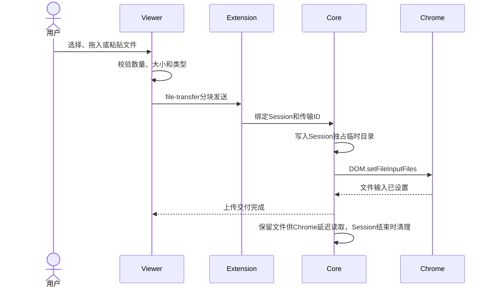

# Session and Viewer behavior

## Session所有权

一个Tab Session始终绑定一个User、一个Profile、一个Worker和一个远端主Tab。客户端不能提交tabId或targetId选择已有Tab；映射只能由Worker和Remote Tab Core建立。

同一User可以在同一Profile创建多个Session，类似在本地浏览器打开多个窗口。不同Session共享Profile登录态，但拥有独立画面、输入、临时文件、Viewer连接、回收计时和关闭原因。

## 创建与恢复

创建过程使用两阶段额度预留：Backend先在事务中创建`RESERVED`记录，再由Worker最终接纳。Worker命令携带幂等`messageId`，重复投递不能创建第二个Tab。

Profile Runtime已经运行时直接创建Tab；`ON_DEMAND`且停止时，Worker先启动Chrome并完成健康检查。Profile处于维护、禁用、错误、停止中或Proxy不健康时拒绝创建。

当前公开入口为`POST /api/v1/sessions`，只接受`{profileId, initialUrl}`，返回202及本人Session的
公开状态。需要`session.use`及实际Profile授权，管理员无普通使用旁路。容量不足返回409和
`SESSION_CAPACITY_EXCEEDED`，details包含USER、PROFILE或WORKER来源及上限、当前占用，不排队。
创建必须引用已发布Navigation Policy；命令快照与版本ID在预约事务中固定，后续发布不改变在途创建。
Worker对初始URL及后续HTTP主文档执行有序URLPattern规则，并在未命中或DEFER_TO_SCRIPT时调用
受限Policy Script。真实用户和Session上下文在创建命令中绑定，新创建要求Worker控制协议1.12。
Script超时、资源耗尽或非法返回拒绝对应导航。PROMPT_REMOTE由Core对真实暂停的主文档请求发起
Viewer确认，同意才继续原请求。Worker先校验初始URL；通过后创建空白Tab进入READY，首次Viewer
握手后才执行初始导航，因此READY不表示目标页面已经打开。Viewer连接使用独立接口，重连不
重新打开初始URL。拒绝确认保留当前页面；初始确认拒绝时保留可操作的空白Tab。

Chrome观察到的完整文档/同文档位置通过独立`navigationState`能力同步至Viewer，工具栏命令结果
不代表目标文档已经提交。地址栏正在编辑时保留输入，失焦后展示最新实际地址。有效的Notice确认
或取消响应计入输入活动，迟到或已失效请求的响应不重置活动时间。

`POST /api/v1/sessions/:id/viewer`接受`clientId`和可选`takeoverGeneration`，完成Worker准备后
返回Ticket、过期时间、Session/Gateway ID、WSS地址、generation及能力集合。响应禁止缓存，
Token只保留在客户端内存与Viewer元素属性，不写入URL、localStorage或sessionStorage。
Portal的`/workspace`提供获授权Profile卡片、分组筛选、搜索和容量；`/sessions`提供本人列表、
重命名、继续和结束；`/sessions/:id`在RESERVED/CREATING阶段展示准备状态，READY后申请Ticket
并挂载独立Remote Tab Web Component。路由离开卸载组件，关闭本机PeerConnection和传输；
远端Tab保留至用户结束或Server生命周期清理。当前用户页面使用带取消、离页清理和焦点刷新的
REST轮询；统一SSE状态总线和策略回收仍按PROGRESS中的未完成项推进。

授权续租由Worker周期快照发起，Backend重新校验当前授权并提交截止时间后返回。剩余5分钟以内
续为10分钟；不需要Portal请求保持页面活跃。控制面短暂离线时，已建立Viewer仍可在原授权期限
内使用；Worker本地到期清理不能被迟到续租复活。失焦暂停不等于断线，续租本身也不重置业务
闲置计时。协议与恢复规则见[控制协议](07-protocols.md#session授权租约minor7)。

用户重新打开`READY`、`CONNECTED`、`SUSPENDED`或`DISCONNECTED` Session时，Backend签发新的单次Viewer Ticket。`CLOSED`和`FAILED`不能恢复旧Tab，只能创建新Session。

## 单Viewer规则

同一Session最多一个活动Viewer：

1. 首个Viewer消费Ticket后成为活动连接。
2. 第二个客户端请求进入时，Portal显示当前设备和连接时间。
3. 用户确认接管后，Backend签发接管Ticket。
4. Core通知旧Viewer被替换并关闭其控制权限。
5. 新Viewer获得媒体和DataChannel。

网络抖动造成同一Viewer短暂重连不算接管。Viewer连接拥有稳定的客户端重连标识，但该标识不能绕过Ticket和Portal授权。

Portal每个浏览器页面使用独立clientId，同一页面内的组件重连与路由往返保留该标识；刷新或打开
另一页面会创建新标识，因此需要明确接管。Portal显示已有连接时间，未连接时明确显示待连接，
不会根据客户端传入的信息虚构已有设备身份。Web Component的公开重连回调重新申请单次Ticket，
被接管时停止旧Viewer控制并显示提示，不自动确认接管。

不同clientId未确认当前generation时返回409 `VIEWER_TAKEOVER_REQUIRED`及当前generation、
连接时间；提交过期的确认仍返回409。并发确认按Session行锁排序，只允许一个请求取得新的代数。
同一clientId可换发Ticket，无需再次确认。Core在首次NEGOTIATING期间也允许新generation替换旧请求。

## 维护 Session

维护者通过Profile维护预约取得独占Session；请求先阻止新普通预约、结束现有普通Session，再进入
MAINTAINING并创建主Tab。停止的Profile可由维护请求启动，因此首次登录不依赖普通导航策略发布。
维护使用独立的profile.maintain权限，普通Session继续要求session.use和Profile授权；管理员身份
不会绕过普通使用授权。维护者可复用会话读取、Ticket、接管和结束API，其他用户仍不能操作其Session。

维护与普通Session使用同样的不可变回收策略快照和10分钟租约，权限撤销会结束维护。维护结束会
清理主Tab、保留的后代窗口和Session文件；释放维护占用需Worker清理事实，不能仅依赖请求成功。
持久Chrome Profile中的登录态保留。浏览器异常后记录失败，不自动重建维护Session。

维护Page Script默认应用MAINTENANCE/BOTH发布版本；显式选择同Profile版本测试时使用创建时
源码快照，包括尚未发布的草稿。

Portal的`/maintenance`仅要求`profile.maintain`，通过最小维护目录展示Profile名称、运行状态、
普通Session数量、当前维护者和准备/维护/清理阶段，不要求一般Profile读取或普通使用权限。
启动弹窗明确提示结束该Profile全部普通Session和共享存储影响；请求失败保留起始网址，并重新
读取维护占用，避免把响应丢失误判为未创建。最终准入仍由后端原子预约判定。

维护者可从清单继续本人Viewer；其他维护者只看到占用者名称和状态，目录不返回其Session ID。
`/sessions`与Viewer路由允许拥有普通使用或维护权限的用户进入，后端按Session的不可变kind及
所有权决定访问。返回Portal只断开Viewer，结束维护才启动清理。Page Script编辑器只允许测试
已保存版本；测试Viewer可返回对应编辑器，已有维护Session不切换源码。

真实Viewer表单登录设置的HttpOnly Cookie已验证在结束维护、停止Chrome和再次启动维护后保留。
维护附属窗口目前被保留并随Session清理，但Viewer尚不能切换到附属窗口交互；多窗口登录仍待完成。

## WebRTC通道

```text
MediaStreamTrack
├── video: tabCapture画面
└── audio: 可选Tab音频

RTCDataChannel
├── control-reliable: 键盘、IME、导航、Notice结果和状态
├── control-realtime: 鼠标移动、滚轮等高频输入
└── file-transfer: 上传、下载、剪贴板和完整性元数据
```

- `control-reliable`有序可靠。
- `control-realtime`无序、有限重传，允许丢弃过时鼠标移动。
- `file-transfer`有序可靠并使用分块背压。
- 视频和音频由WebRTC拥塞控制管理，不经Backend或Gateway。

## 输入与坐标

Viewer依据Server确认的远端viewport计算坐标，不能只使用当前解码帧尺寸。画质切换和窗口缩放期间，旧帧可能短暂存在，输入仍必须映射到已确认viewport。

支持：

- 鼠标移动、按下、释放、点击和双击。
- 拖拽期间在`mouseMoved`中保持当前按键状态。
- 垂直和水平滚轮。
- 常用键、功能键、组合键和修饰键。
- 中文IME、Emoji和组合文本提交。
- 页面缩放不通过浏览器原生UI暴露，避免影响其他Tab。

Viewer暂停或视频尺寸尚未确认时禁止盲操作，并显示恢复遮罩。

## 导航与页面标题

导航栏能力由Capabilities控制。所有导航先经过Server侧Navigation Policy，Viewer不能以隐藏按钮作为唯一限制。

远端页面标题更新默认Session名称。用户手动重命名后保留自定义名，同时继续保存最新`remote_title`供详情页展示。

`PATCH /api/v1/sessions/:id`接受`{displayName: string | null}`，要求本人所有权及对应kind的`session.use`或`profile.maintain`权限，
管理员无所有权旁路。字符串trim后必须为1–256个Unicode码点，null取消自定义名称；更新、Session
事件与审计在同一事务提交。Portal按自定义名、已保存remoteTitle、Profile名称的顺序展示。
Core通过`onTitleChanged`持续采集主文档标题，Worker trim并限制为4096个Unicode码点，空标题
保存为null；现有运行快照将其同步到Backend，不覆盖用户自定义名。Portal列表与Viewer展示
最新标题，长标题收起显示并保留完整文本。采集在无Viewer时也工作，iframe标题不会覆盖主标题。

前进、后退和刷新只作用于主Tab。浏览器内部页面、下载页、扩展页和其他危险scheme始终拒绝。

## 画质与音频

自动画质默认从1280×720、30 FPS开始，根据Viewer尺寸、RTT、丢包、可用带宽和发送端编码压力调整，最高1920×1080、60 FPS。

Viewer提供：

- 自动、节省流量、均衡、高清和自定义画质。
- 当前分辨率、FPS、码率、RTT、丢包和ICE路径诊断。
- 本地静音和音量控制。
- 浏览器阻止自动播放时的“点击启用声音”提示。

管理员可以在全局或Profile层降低最大分辨率、FPS和码率。Viewer请求超出能力时返回实际应用值，不静默假装成功。

全局上限由系统设置的媒体卡片管理，Profile 可进一步降低限制。预约时每个数值取两层更严格值，
音频须两层同时允许，合并结果通过既有 Control 创建命令与 Remote Tab Session 媒体上限执行。
更新全局或 Profile 只影响新 Session。Remote Tab 0.1.23 候选将自动与自定义配置纳入公开能力：
只有双方同时协商 `qualityControl` 和 `advancedQuality` 时默认使用自动模式；只有前者时保留
三档预设。无画质权限时不显示入口，不能将旧版均衡档标记为自动。

自动模式从受 Session 上限约束的 30 FPS、2.5 Mbps 开始；Chrome 拥塞控制持续工作，Extension
另根据连续 RTT、丢包与编码器 CPU/带宽限制采样，降低 FPS、码率并增大分辨率缩小倍数，
持续健康后逐步恢复，最多 60 FPS、6 Mbps 且不超过 Session 上限。静态页面低 FPS/低码率
本身不触发降档。Viewer 尺寸通过既有 viewport 链路影响捕获尺寸，不改变已确认的输入坐标映射。

自定义配置包含最高码率、最高帧率和分辨率缩小倍数；Viewer 校验范围，展示发送端确认的
编码上限，并在提交失败时保留草稿。请求期间禁用相关控件；对话框内键盘操作不发送给远端。
`quality-configuration-change` 区分所选配置与已应用参数；这些编码上限不是实际网络吞吐
测量值。重连重新提交最后成功确认的配置，继续受当前 Session 的原始媒体上限约束。
本段说明候选实现契约；本批已完成的真实媒体与页面开发证据见下文，最终正常部署验收仍单独确认。

2026-09-06 开发验收在真实 Google Chrome Stable / WebRTC 链路上验证全局 640×360、10 FPS、
300 kbps、禁音与更宽松 Profile 的组合：请求高清后 ACK 仍为 10 FPS/300000 bits/s，实际解码
640×360、约 9.99 FPS，只有视频轨道。放宽全局并修改 Profile 后，原 Session 重新连接仍保持
640×360、约 9.67 FPS 和禁音；新 Session 应用更严格的 Profile 320×180、5 FPS、200 kbps，
实际约 5.00 FPS，双方允许时收到音频 RTP。取样实际视频码率约 34–84 kbps；这是该动画素材的
传输取样和发送器 ACK 验证，不将编码目标宣称为任意短窗口内的网络字节硬上限。

真实 API 验证包括 16 组非法输入、全局/Profile 逐字段合并、码率 null 两侧组合、音频两侧关闭、
旧 Session 和重签能力不扩权，以及四个 Worker READY 的持久命令快照。空库迁移和既有部署升级
均为 19/19。全局/Profile 页面通过校验、保存读回、离线重试、键盘及中英文窄屏验收。
这些模块证据不替代自动画质、自定义画质或正式发布 Gate。

### 高级画质开发验收（2026-09-06，0.1.23 候选）

Portal 复用 Remote Viewer 的真实 Chrome/WebRTC 链路已验证自动、预设、自定义与来源帧率
调整。高清与自定义 60 FPS 的 capture Track 报告 60，实际两个四秒区间分别约 46.9 和
49.2 解码 FPS；节流档约 14.5 FPS、640×360。这里确认有效上限和继续出帧，不承诺稳定
60 FPS 吞吐。实际 UDP 丢包和发送端 `qualityLimitationReason: cpu` 竞争均触发自动降档，
移除网络压力后恢复；未授权 diagnostics 时也观察到真实自动调整，静态页面不会仅因低 FPS 降档。

独立受限 Session 的初始自动和自定义均确认 400000 bits/s、12 FPS，发送端参数和 capture
Track 同为 12 FPS，Viewer 继续解码。该短窗口实测约 459.8 kbps，不能把编码目标解释为
网络字节硬配额。维护窗口在自定义 1.5 Mbps、40 FPS、scale 2 时切到子 Tab，再暂停切回
主 Tab 并恢复，配置、同一 PeerConnection 与40 FPS capture均保留。

真实默认对话框通过空值/范围/整数校验、取消、待决禁用和重试；1200.123 kbps 精确确认
1200123 bits/s，重新打开仍为合法小数。UI 失败保留草稿采用公开方法拒绝注入，随后重试
通过实际发送端；不能把该注入当作编码器故障实测。键盘操作未进入远端，390px 英文页面
与对话框无横向溢出；自动无障碍检查无确定违规，仍有对比度和实时视频字幕待人工判断项。

本地证据位于忽略的 `tmp/advanced-quality-qa/`，其中 `capped-*`、
`capture-replacement-report.json`、`ui-report.json`、`ui-fields-report.json` 分别记录上述边界。
最终 Portal typecheck/build 已通过且最终 UI 已部署。`final-ui-report.json` 记录真实发送端
下一次 capture constraints 的受控失败：由表单提交触发后，旧1.5Mbps/40FPS/scale2配置保留，
Session仍CONNECTED、表单错误可见、没有Reconnect入口；实际重试成功应用1.3Mbps，最终按钮
前景为rgb(11,12,16)。这覆盖发送端失败经过Portal至表单重试的完整路径，区别于此前公开方法注入。

`normal-runtime-report.json` 确认正常Worker已重建，NanoCpus为0、cpu.max为max 100000，
没有unsafe Extension debug开关或临时DeveloperToolsAvailability策略，运行Google Chrome
152.0.7977.75。`normal-final-smoke-report.json` 确认正常配置最终smoke通过：auto连接，
custom 1.4Mbps/40FPS/scale2实际640×360、约38.52FPS；high 6Mbps/60FPS/scale1实际
1280×720、约57.61FPS；暂停期间配置auto再恢复仍CONNECTED且同一peer。实际吞吐按
观测区间记录，不宣称稳定60FPS。

`final-harness.log` 已为clean且无待处理请求；本机专属Chrome已终止，advanced-quality
浏览器自动化会话关闭，三条测试转发取消，服务器压力进程和临时clsact规则已清除。
本批高级画质实现、相称真实链路验收、正常配置smoke与资源清理已完成。
受限配置、协商拒绝、捕获替换和UI已有相称证据，不将重复全部模式/重连排列作为新完成条件；
这些记录也不声称专门执行过动态撤权实测。上述开发验收不等同于正式发布或完整Direct/TURN Gate。

## 失焦暂停

模式：

- `NEVER`
- `WHEN_HIDDEN`
- `WHEN_UNFOCUSED`

默认`WHEN_UNFOCUSED`，15秒宽限。暂停后：

- 停止发送音视频RTP以节省带宽。
- 保留PeerConnection、DataChannel、Tab和页面执行。
- Session状态为`SUSPENDED`，不视为Viewer断线。
- 禁用输入并显示点击恢复遮罩。
- 恢复时请求关键帧，不重建Session。

## 上传



默认单文件50 MiB、单次10个、Session临时总量200 MiB。系统设置的“文件与剪贴板”可调整上传/下载/文字与图片剪贴板开关、字节上限、文件数及上传后缀白名单；只对新建Session生效。后缀默认全部允许，只校验文件名，不识别内容类型。文件路径不进入Profile目录；未完成的上传在取消或超时后清理；已交付的上传保留到Session结束，供Chrome File对象延迟读取，期间继续占用临时配额。

## 下载

Worker为一个Chrome Runtime配置位于Profile外的独立下载spool。Chrome以GUID作为落盘文件名；
Remote Tab Core依据所属页面的flattened CDP Session收到`Page.downloadWillBegin`，再用同一
Session上的`Page.downloadProgress`确认完成。`chrome.downloads.DownloadItem`不提供可靠的
来源`tabId`，不能作为归属依据。

完成后Core向当前Viewer发送包含规范化文件名和大小的offer。Viewer显示“保存远程下载？”；
用户确认后通过`file-transfer`接收分块、在本机组装Blob并触发浏览器保存。用户拒绝、offer
超时、Viewer被替换、Capability撤销、Session结束或传输失败都会删除spool文件。

- 无法通过所属CDP Session可靠归属的GUID不交给任何用户。
- Remote Tab不提供跨Viewer断线的持久下载收件箱；文件完成时没有可用Viewer则关闭该次交付。
- Backend和Gateway不转发文件字节，也不承担下载确认UI。
- 文件名只用于Viewer展示和本机保存，远端spool始终使用GUID，不能通过路径分隔符写出目录。
- 产品要求完成后保留30分钟、Session结束后最多再保留10分钟。BrowShare通过Worker持久存储和
  独立授权领取实现；Remote Tab0.1.21提供下载sink交接接口。当前即时交付仍是默认路径，业务
  接入尚待完成，详见[下载保留与领取](11-download-retention.md)。不延长Remote Tab内存Session。

## 剪贴板

剪贴板是Viewer拥有的浏览器交互，不是Portal业务交互。剪贴板元数据和字节通过Viewer与
Worker内Remote Tab之间的WebRTC `file-transfer` DataChannel直传，不经过Portal、Backend或
Gateway。Portal只负责打开Viewer和签发连接所需的业务授权。

剪贴板只由明确用户动作触发：

- 用户点击“粘贴到远端”后，Viewer才读取本机文本或图片并发送；Remote Tab写入Google
  Chrome Stable所在主机的剪贴板并只向所属Tab发送粘贴动作。
- 用户点击“复制远端内容”后，Remote Tab才读取远端剪贴板并返回；Viewer随后尝试写入
  用户本机剪贴板。
- 浏览器权限拒绝时，Viewer提供手工粘贴文本框或可选中的只读复制文本框。图片不能手工
  回退时必须明确提示，不能静默丢弃后宣称成功。
- 不在焦点切换、定时器或Page Script事件中自动同步。

`clipboardText`和`clipboardImage`是独立Capability。Remote Tab默认允许每次最多一个
`text/plain`和一个`image/png`，单项16 MiB、合计24 MiB、64 KiB分块、120秒无活动超时。
一个Profile Runtime内的Chrome剪贴板是共享资源，因此Worker内Remote Tab Core必须跨
Session串行执行完整剪贴板操作；传输结果、Viewer generation和所有中间缓冲仍按Session
隔离。

Viewer公开可取消的`clipboard-write-request`、`clipboard-read-request`和
`clipboard-read-complete`事件，允许Portal以外的Embedder替换默认本机权限/UI实现；
BrowShare Portal不监听这些事件来接管默认交互。部署页面需要安全上下文才能使用本机
Clipboard API，权限不足时由Viewer执行上述回退。

## 本机打开和Notice

远端新窗口URL经Policy处理后，以结构化事件发送Viewer。Viewer显示“是否在本机打开？”，用户确认后使用`noopener,noreferrer`打开HTTP/HTTPS URL。Portal不渲染这个确认，保持业务外壳和浏览器交互边界。

Notice由Viewer渲染。Headless Client只发结构化事件，Embedder可以使用自己的UI。确认类Notice的结果必须带请求ID返回，过期结果丢弃。

## Page Script事件边界

Worker在创建Remote Tab Session时传入已经由Backend锁定版本和适用范围的Page Script源码与
JSON上下文。Remote Tab负责顶层页面MAIN world执行、固定`browshare:*`事件派发、错误隔离和
生命周期消息；它不保存草稿、版本、发布指针或Profile适用策略。

固定事件在远端页面的`document`与`window`上提供给管理员脚本。Viewer收到的是去除业务
`context`后的`page-script-event`，只用于宿主观察；默认Viewer不增加界面，也不允许Portal把
它当作权限决定。源码错误只保留每个Session首次失败的固定`PAGE_SCRIPT_FAILED`诊断和审计
摘要，包含创建时锁定的发布版本ID以及Core在Worker进程内观察到错误的时间。原始异常文本、
源码和上下文不进入错误摘要及其日志、审计。Session与Navigation Policy继续按Server权威规则运行。
摘要随活跃Session事实及结束tombstone保留；Backend核对业务身份和版本后，在Session行锁内
同事务写`page_script.failed`事件及审计。已有事件作为持久去重标记，重复快照和重连不重复
写入；这是首次失败摘要，不承诺逐次脚本异常归档。Worker进程在摘要首次送达前硬退出时，
未送达观察与其他易失Runtime事实一样可能丢失。

## 回收和倒计时

策略优先级为User+Profile、User+ProfileGroup、全局。创建时保存完整快照。

可配置条件：

- Viewer断开超时。
- 无用户输入超时。
- 无画面变化且无输入超时。
- 最大Session时长。
- Proxy持续故障时长。
- 完全不主动回收。

默认只开启Viewer断开5分钟回收。其他主动回收默认关闭。触发前Viewer显示Server时间驱动的倒计时；“继续使用”可以重置软闲置条件，不能延长硬性最大时长。

Worker独立执行快照策略。断线、无输入及无画面变化的初始基准是Tab READY时间；最大时长从
Backend创建时间计算。已连接和暂停Viewer均算连接存在，重复断线事实或失败的Ticket准备不延后
断线窗口。多个条件取最早截止时间，同一截止时间优先硬条件；倒计时包含在超时内，不额外延长。

Remote Tab Core通过`onInput`通知已处理的Viewer操作，仅包含Session ID和观察时间。配置画面
闲置条件时，Worker每秒调用Core的`sampleFrameChange()`，并在按无画面变化条件关闭前再取一次
当前画面。Core比较当前可见视口的低质量JPEG，仅返回变化布尔值与时间，像素不进入Backend或
日志。画面变化或用户输入均重置这一条件；动画也属于画面变化。采样失败不能当作静止画面，
而以明确的观察失败原因关闭所属Session。

配置Proxy故障条件时，每五秒通过该Profile现有Proxy Adapter及HTTPS健康检查地址观察路由，
同Profile并发检查复用正在执行的请求。连续失败保留首次失败时间，恢复健康清空故障窗口；检查
走同一上游，不回落Direct。业务回收关闭时不启动画面/Proxy观察，但授权租约始终执行。

Viewer提示显示最早条件和Server时间倒计时，支持中英文、窄屏和键盘操作。继续使用须由当前
Viewer明确请求且在截止前完成；成功重置软闲置，失败保留倒计时和可重试错误。到零等待Backend
确认真实关闭，不自行显示成功。用户禁用、授权丢失、Profile或Worker禁用通过同事务关闭意图
和持久命令驱动独立清理，不受recycleDisabled影响；网络分区期间仍由本地租约限制有效期。


## 结束与清理

Viewer“结束Session”只发`session-close-request`。Portal业务层请求Backend结束，Standalone Embedder可以配置自动批准。

Worker清理顺序：停止捕获与输入、关闭主Tab和意外附属Target、停止文件传输、清理Session临时目录、释放额度、上报最终状态。单Session清理不能终止同Profile的Chrome或其他Tab。

当前用户结束API先提交CLOSING和持久命令，Worker完成真实Tab及文件清理后返回结果；Backend
依据结果或对账确认CLOSED并释放额度。202只表示已保存结束意图，不能在Portal中直接展示为
“已结束”。清理失败、断线或结果丢失期间保留CLOSING；Worker接收迟到创建时会拒绝已经结束
的Session。Portal列表、业务顶栏和组件公开session-close-request均接入本人结束API并要求明确
确认；等待Server状态后展示CLOSED。管理员结束与策略回收仍以进度文档为准。

### Viewer失焦策略配置

`GET/PUT /api/v1/settings/viewer-focus`要求`system.manage`，管理全局`{mode,gracePeriodMs}`；
默认`WHEN_UNFOCUSED`、15000毫秒，宽限时间为0–300000的整数，0表示立即暂停。
Profile的`viewerFocusPolicy=null`表示继承全局，也可使用相同结构独立覆盖。
创建/修改沿用`profile.manage`权限，读取沿用`profile.read`。全局变更写入
`system.viewer_focus.update`审计，Profile覆盖写入原有Profile变更审计。

签发Viewer启动响应时，Backend在已有Profile授权锁内读取覆盖或全局默认，返回有效`focusPolicy`。
Portal通过Remote Viewer公开属性设置策略，自动重新签发连接凭据时同步新策略；已连接Viewer不被
后台设置保存主动打断。恢复自动暂停可由返回前台触发，也可点击恢复按钮，显式手动暂停不被焦点变化恢复。
暂停/恢复执行仍在Remote Tab内，Worker和Gateway不增加平行计时或媒体协议。

2026-09-06 的开发验收使用测试部署与真实 Google Chrome Stable/WebRTC：全局设置权限及非法
输入拒绝、Profile 覆盖/恢复继承、页面保存读回、空值校验、离线草稿保留和恢复后保存通过。
390px 英文页面无横向溢出，新增卡片自动无障碍检查未发现确定违规。最新 Portal 实际 Viewer
取得 Profile 的 WHEN_HIDDEN/2300ms；修改为继承未立即改变它，断开信令触发自动重签后取得
WHEN_UNFOCUSED/15000ms，重新连接后视频帧继续增长。暂停时的真实 RTP、DataChannel 与页面
活动证据见 Remote Tab 的焦点暂停验收；锁屏环境的可见失焦使用受控事件输入，原生隐藏使用
真实窗口最小化。测试 Session、Profile、账号、临时审计、本机 Chrome 和转发已清理。
这是 0.1.22 候选的模块验收，不等同于正式发布或完整 Direct/TURN Gate。

### 当前Runtime路由健康

Profile、可访问工作区条目和Session读模型提供routeVersion、runtimeRouteVersion、
runtimeProxyHealth与restartRequired。页面显示实际运行版本的健康及检查时间，配置改变后提示
需要重启，不把最新Proxy目录探测当成此Runtime的健康。普通用户只能获得授权Profile的安全摘要，
其中不包含代理凭据、出口服务正文或healthcheckUrl。不同Runtime的健康不能挂到旧Session上。

运行中的Profile只有当前Runtime健康为HEALTHY时接受新增Session；尚未启动的按需Profile仍走
强制启动检查。已有Session保留原运行路由，故障恢复和回收继续由原Worker策略执行；保存路由
配置不会自动重启或切换Direct。Control1.18的具体事实与版本规则见接口文档。
