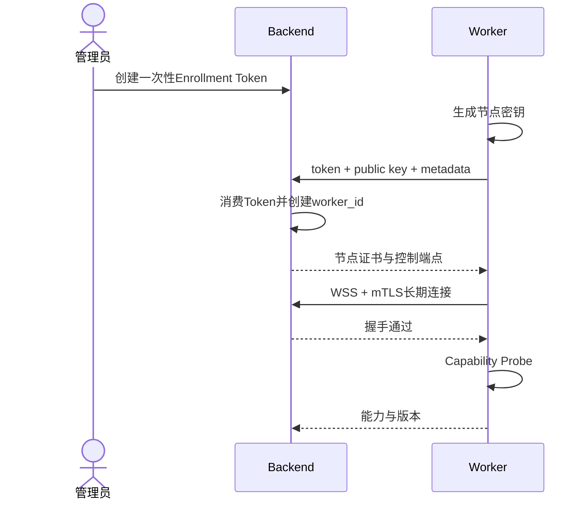
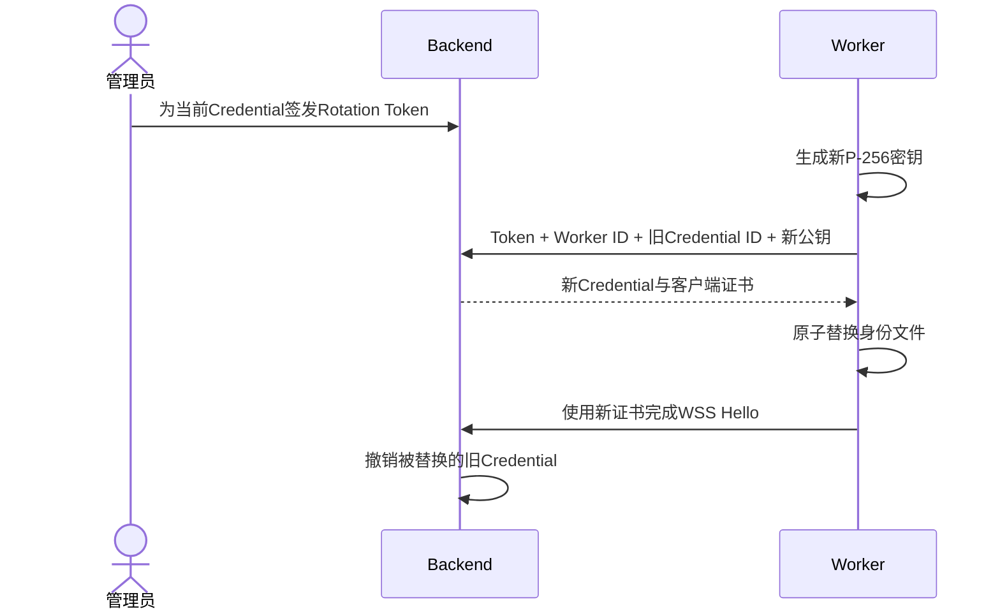

# Worker and Chrome runtime

## Worker职责

Worker是每台浏览器节点上的唯一BrowShare daemon。它负责：

- 注册和维持控制链路。
- 管理固定归属本节点的Profile目录。
- 启动、停止和诊断Google Chrome Stable。
- 管理每个Profile的loopback Proxy Adapter。
- 嵌入Remote Tab Core并维护Session到Tab映射。
- 管理Session临时文件和下载。
- 上报能力、指标、Runtime和Session事实快照。

Worker不决定用户授权，不读取Portal Session，不提供公网控制API，也不转发WebRTC媒体。

## 注册与身份



Enrollment Token必须短期、单次使用，并可由管理员撤销。Worker私钥和稳定ID保存在持久卷。重新创建容器但保留身份卷时继续使用同一Worker；丢失身份卷需要重新注册，不能仅凭名称接管旧Worker。

首次注册的可执行约束：

- Worker在本地生成 ECDSA P-256密钥，注册请求只发送标准 PEM SPKI公钥；私钥从不上传。
- Token通过`Authorization: Bearer`发送，不放入URL、请求正文、日志或审计。
- Backend用条件更新原子消费仍有效的`ACTIVE`Token；同一Token并发请求最多一个成功，所有重放均返回相同的无状态泄漏失败。
- Worker名称在未删除节点中唯一。名称冲突不消费Token，管理员修正名称后可以继续使用原Token。
- Backend创建`PENDING`Worker和`ACTIVE`Credential，记录主机名、平台、CPU架构和Worker版本，并在同一事务中把Enrollment关联到Worker。
- 默认签发90天客户端证书。证书只含`clientAuth`用途、`digitalSignature`Key Usage及`urn:browshare:worker:<worker_id>`URI SAN，不可作为Server证书或下级CA。
- Backend启动时校验 Worker CA当前有效、具备 CA约束且证书与 P-256私钥匹配；不满足时fail-fast。

Worker身份卷当前使用单个`worker-identity.json`原子落盘，文件权限必须为`0600`，其中保存版本、
Worker ID、Credential ID、本地私钥、证书链、指纹、有效期和控制地址。每次启动都会验证UUIDv7、
证书链、私钥匹配、指纹、序列号、URI SAN、有效期和`wss://`控制地址；任何不一致都停止启动，
不静默生成新身份。并发初始化通过身份目录内的独占锁拒绝。

如果Backend已经成功消费Token，而Worker在身份文件落盘前发生磁盘故障或进程崩溃，该次Token仍然
不可重放。管理员需要退役数据库中的孤立`PENDING`Worker并签发新Token；这是单次凭据语义下明确的
人工恢复边界，不能通过放宽重放规则掩盖。

### Enrollment Token管理

当前控制面已经实现管理员签发和管理入口：

- `worker.read`允许查看 Token元数据；`worker.manage`允许创建和撤销，不判断角色名称。
- Token格式为`bwe_`加32字节随机 base64url，默认有效期15分钟，可在60秒至24小时内指定。
- Backend只保存 Token的 SHA-256摘要。明文只在创建响应中返回一次，列表、审计和日志均不返回。
- 状态为`ACTIVE`、`CONSUMED`、`REVOKED`或`EXPIRED`。只有`ACTIVE`可以消费或撤销。
- Portal的一次性展示弹窗不允许遮罩或 Escape意外关闭；用户明确确认已保存后立即清除内存中的明文。
- 列表使用 UUIDv7和创建时间组成的游标分页，可按状态过滤。

管理员在`/admin/workers/enrollments`完成签发。普通用户没有导航入口，直接访问也会被 Permission
路由守卫拒绝。此入口只负责创建注册凭据；消费 Token、生成节点密钥和签发证书由
`POST /api/v1/workers/enroll`完成。

### Credential轮换与安全退役

禁用、轮换和退役是三个不同操作。`DISABLED`是可恢复的管理意图：它立即断开当前控制连接并拒绝
后续认证，但不撤销Credential。管理员恢复`ACTIVE`后，持有原身份卷的Worker可以自动重新建链。

Credential轮换使用与当前控制连接绑定的短期一次性Token：



- Token格式为`bwcr_`加32字节随机base64url，默认15分钟，可配置60秒至24小时。Backend只保存
  SHA-256摘要；明文只在创建响应中出现一次。
- 创建Token时记录当前实际连接的Credential。消费请求必须同时匹配Worker、旧Credential和Token，
  并以条件更新保证并发消费最多一次成功。
- 新私钥只在Worker生成。新证书验证通过后，身份文件先写临时文件，再用原子`rename`替换；任何
  请求、验证或落盘失败都保留旧身份。
- Backend签发新Credential后暂不撤销旧Credential。只有新Credential实际完成mTLS与Hello，才在
  数据库事务中撤销旧Credential并记录`worker.credential.rotate`。
- Worker在身份文件保存最后一次Rotation Token摘要。部署者忘记移除同一Secret时，后续启动只加载
  已轮换身份，不会重放Token。
- 单独撤销Credential时，非禁用Worker至少保留一个未过期的有效Credential；撤销当前连接会立即
  关闭socket。Rotation Token可在消费前由管理员撤销。

永久退役是带精确名称确认的独立操作。节点必须先进入`DISABLED`，且没有任何未删除Profile和非
`CLOSED`、非`FAILED`的Tab Session。Backend在一个事务中撤销仍有效的Credential和未消费Rotation
Token、写入审计并软删除Worker；不自动删除Worker机器上的身份卷或Profile文件。存在Profile归属时
不能退役，管理员必须先显式迁移业务归属或删除Profile。

注册完成后，Worker使用本地客户端证书主动连接Backend的独立WSS listener。Portal/API listener不请求
客户端证书；Worker控制listener强制mTLS，随后再用证书URI、序列号和指纹关联数据库中的活动
Credential。Worker只接受二进制MessagePack并用TypeBox验证首个Hello和响应。Backend临时不可达时
Worker进程保留健康端点并按指数退避重连，`backendControl`在`connected`与`not-connected`间反映
真实状态；Chrome Probe完成前整体readiness仍为`not-ready`。

## 官方容器

默认Worker镜像包含：

```text
Worker应用
固定google-chrome-stable
字体与必要系统库
Managed Policy系统目录到Worker运行目录的root-owned符号链接
```

部署时另外提供：

```text
固定版本Remote Tab Core与Protocol包
部署者使用长期私钥签名的固定版本CRX只读挂载
Profile、Worker identity和Session临时持久卷
本次Runtime Secret与Generation
```

默认运行方式是Chrome原生headless，不依赖GNOME或Xvfb。将来若某项经过实测的浏览器能力必须使用
有头模式，才在协调兼容集中增加Xvfb，不能让文档先于镜像承诺未安装的组件。

运行要求：

- `linux/amd64`。
- 非root运行用户。
- 不使用`--no-sandbox`。
- 不挂载Docker Socket，不使用privileged。
- 使用仅放行Chrome sandbox所需namespace系统调用的专用seccomp profile；禁止用
  `seccomp=unconfined`作为生产配置。
- 为`/dev/shm`配置足够空间。
- Profile、Worker identity、临时目录分别挂载。
- 可选映射`/dev/dri`；没有GPU时软件编码仍能工作。

镜像兼容集由`deploy/compatibility.json`统一记录，Dockerfile不得另外维护一套漂移的版本默认值。
Google Chrome Stable使用固定Debian包URL和SHA-256在部署者本地构建；安装后移除Google APT source、
keyring和cron入口，避免运行中绕过协调发布自行更新。最终runtime stage只保留Node运行时，不保留
npm、Corepack、pnpm或Yarn。Worker identity、Profile和Session临时目录默认归容器UID/GID
`1000:1000`且权限为`0700`，实际挂载卷必须保持相同访问边界。

CRX签名私钥永远不进入Worker。Worker只读取`/opt/browshare/extension-release`中的协调版本CRX，启动
时校验CRX3和显式SHA-256，只在loopback动态提供更新manifest与CRX。随后以`0600`原子写入本次
Runtime的Managed Policy，其中固定Extension ID，并携带Extension loopback URL、Secret和Generation。
Chrome系统策略目录中的root-owned符号链接只指向这一文件，不给予非root Worker写系统策略目录的
能力。启动顺序固定为loopback → release service → policy → Chrome；任何一步失败都不启动Chrome。

专用`deploy/docker/chrome-seccomp.json`从固定commit的Moby默认profile派生，保留deny-by-default，
仅将Chrome创建内部sandbox所需的`clone`、`clone3`、`setns`和`unshare`改为无条件允许。它不授予
`SYS_ADMIN`，也不等于关闭Chrome自身sandbox。每次Chrome或宿主容器运行时升级都要在Linux宿主上
重新执行真实headless CDP启动验证。

宿主机模式使用相同配置和Probe，但由部署者安装Google Chrome Stable、字体和运行依赖，并负责把
Managed Policy放到Chrome读取的系统目录；只有选择有头模式时才需要Xvfb或真实display server。

## Capability Probe

Worker每次启动必须验证：

1. Chrome二进制存在且版本可读取。
2. Chrome沙箱能够在当前容器或宿主机工作。
3. Chrome只使用私有CDP pipe，Worker认证loopback桥能创建、枚举和关闭Target。
4. 固定ID扩展已由Managed Policy安装且版本匹配。
5. `tabCapture`可以在无人值守条件下启动。
6. Extension能够连接loopback Core。
7. WebRTC PeerConnection和所需DataChannel可用。
8. Profile和临时目录可读写；磁盘容量属于独立业务准入状态，低空间不让控制连接或清理能力失去就绪。
9. Proxy Adapter可以绑定loopback端口。

Worker先建立Extension loopback，再启动受管Chrome，避免依赖已休眠MV3 service worker是否恰好
重连。Probe通过Remote Tab Core创建独占临时Tab；收到Extension准备的stream ID证明无人值守
`tabCapture`成功，收到Publisher的本地offer证明媒体轨、PeerConnection和三个DataChannel已经
成功创建。Probe不等待远端Viewer或公网ICE，Gateway、STUN和TURN由连接面诊断单独验证。无论成功
或失败都停止Publisher、关闭临时Tab并释放Session/Target映射。

Sandbox、CDP和媒体检查共用一只不带`--no-sandbox`的受管临时Chrome。Docker默认seccomp若阻止Chrome
创建所需namespace，节点保持不可用；正式镜像应提供最小专用seccomp profile，而不是授予
`SYS_ADMIN`、使用`privileged`或关闭全部seccomp。

任何必需能力失败时Worker不上线。Backend展示结构化错误码、实际版本和诊断建议，不只显示
“Worker offline”。控制连接完成Capability与Snapshot后仍可接收管理员诊断命令；依赖恢复后的成功
Probe会同时更新持久报告和当前连接的`capabilityReady`，使`PENDING`或`OFFLINE`节点无需重启即可
恢复`ONLINE`。

## Profile目录

Profile固定归属创建时选择的Worker。目录由Worker依据Profile ID生成，API不接受任意路径。

- 同一Profile同时最多一只Chrome进程。
- 启动前确认不存在遗留持有进程和锁。
- 停止时先阻止新Session，关闭所有Tab，等待Chrome正常退出，再上报`STOPPED`。
- 超时后可以升级为终止进程，但必须记录非正常退出并在下次启动执行Profile健康检查。
- 不在Session结束时复制、压缩或回写Profile。

Profile冷备份必须在Chrome完全退出后执行。恢复覆盖属于高风险操作，只允许在Profile停止且没有Session时由管理员发起。

## Chrome生命周期

### ALWAYS_ON

Worker上线且Runtime能力可用后启动Profile Runtime。Chrome或Core故障导致所有旧Session进入`FAILED`，随后按指数退避恢复Runtime。失败按运行generation去重，使用5、10、20、40秒间隔，连续五次失败后保持`ERROR`等待管理员检查并显式启动；稳定运行五分钟后重置连续失败计数。退避时间与计数持久化，Backend重启不清零。手动START或提交运行模式配置会重置预算；缺少启动检查地址时显式报告`PROFILE_HEALTHCHECK_REQUIRED`，修复后可自动启动。常驻且启用时不允许普通STOP；管理员须先禁用Profile或切换运行模式，避免STOP立即被自动启动覆盖。

### ON_DEMAND

首个Session启动Runtime。最后一个Session结束后，按Profile的runtimeIdleTimeoutSeconds停止Chrome，默认300秒，0表示无Session时立即停止。空闲起点持久化；新的预约在同一Profile行锁下清除该时间，避免自动停止与创建竞争。Runtime故障时旧Session失败，不自动为用户重建Tab；新请求可再次触发启动。停止保留Profile持久目录。

### MANUAL

只有管理员命令能启动和停止。故障后保持`ERROR`等待处理。

维护模式在所有运行模式中都要求独占。维护崩溃进入`ERROR`，不自动创建新的维护Session。

## Session映射

Remote Tab Core在Worker内维护：

```text
session_id
  ↔ profile_id
  ↔ Chrome process/runtime_id
  ↔ tabId
  ↔ CDP targetId
  ↔ capture/PeerConnection state
```

客户端不能提供或更换这些映射。Worker重连时上报实际Chrome、Profile、Tab和Session快照；Backend将孤儿数据库Session关闭，将没有有效租约的孤儿Tab交给Worker清理。

## Proxy Adapter

每个运行Profile拥有独立loopback Proxy Adapter：

```text
Chrome → 127.0.0.1:ephemeral → Adapter → Direct/HTTP/HTTPS/SOCKS5
```

Adapter统一上游认证并把凭据留在Worker进程内。配置通过mTLS控制链路按Runtime下发，不写入Profile。上游不可用时拒绝请求，绝不回落Direct。

网页HTTP/CONNECT目标先经过本机地址过滤：拒绝localhost及子域、127/8、0/8、IPv6未指定与
loopback地址（包括IPv4映射形式）；DIRECT的实际socket DNS解析结果也经过同一地址检查。
业务RFC1918地址保持可用。此规则同样作用于健康检查目标，但不限制管理员配置的上游Proxy
endpoint。上游保留远端DNS，若上游与Worker共用网络空间且把普通域名解析到loopback，仍须
通过部署网络边界处理；不能把目标过滤等同于Chrome/CDP/Core的完整隔离。

健康检查：

- 保存配置时可由管理员显式测试。
- Profile启动前强制检查；失败进入`PROXY_UNHEALTHY`并拒绝启动。
- 运行中周期检查；失败保留Chrome和Session，Viewer显示状态。
- 使用可配置HTTPS探测地址，不默认调用第三方出口IP服务。
- 管理页提供显式出口IP测试并清楚标记会访问外部服务。

Remote Tab Core和Extension loopback、Core到Gateway、Worker到Backend均绕过Profile Proxy。系统级透明代理和宿主机VPN不由BrowShare自动绕过，只在Probe中诊断。

### Adapter当前实现与验收边界（2026-09-05）

`apps/worker/src/proxy-adapter.ts`提供独立的`ProfileProxyAdapter`：配置在构造时校验并固定，
监听`127.0.0.1`临时端口；`start()`与`close()`幂等，关闭后不可重用。DIRECT也通过此本地
Adapter。网络类型始终生成非空上游地址，连接、认证或TLS失败均不会切换到DIRECT。
HTTP/HTTPS认证由Adapter处理；SOCKS5使用上游DNS并支持IPv4、IPv6和域名。

`checkHealth()`通过同一个Adapter建立CONNECT和目标TLS连接，验证证书，只返回时间、延迟、
HTTP状态和固定错误码，不返回页面正文、探测URL或底层错误文本。超时或关闭会取消请求。
Backend和Portal健康地址均限定为不带凭据的HTTPS URL；HTTP用户名不能含冒号，SOCKS5认证
必须同时提供用户名和密码，每项为1–255个UTF-8字节。无认证时两项均为空。

Adapter复用`proxy-chain@3.0.0`。真实断连测试发现HTTP等待响应和SOCKS握手时上游连接未取消，
IPv6测试发现URL方括号未剥离；`patches/`中固定了对应依赖补丁，原因与升级条件见
[`../../patches/README.md`](../../patches/README.md)。Docker安装依赖前复制补丁，发布部署包保留补丁后的代码。

Google Chrome Stable 152.0.7977.75已在Linux非特权、启用sandbox的容器中实测四种出口，
覆盖HTTP/HTTPS页面、POST、ws/wss、认证、上游DNS以及Adapter停止后不直连；测试网络使用
容器内真实TCP/TLS目标与代理服务。凭据错误、拒绝连接、TLS不可信、超时、关闭中握手和IPv6
另有真实socket验证，临时脚本与证据只保存在忽略的`tmp/proxy-adapter-qa/`。

上述记录为 Adapter 模块自身的真实验收。当前 Runtime 集成已通过控制协议 1.18 接入不可变
路由配置与 `routeVersion`：Profile 启动前使用同一 Adapter 完成 HTTPS 健康检查，RUNNING 后
每次检查结束等待 5 秒再检查，Profile 内共享并发检查。Worker 将 `proxyHealth` 与原有 Runtime
身份一起通过事实快照上报，保留最近成功时间；停止或退出时取消检查并清理定时器。

管理员显式健康与出口 IP 测试通过 `proxy.probe` 下发给选定 Worker，使用独立临时 Adapter，
完成或失败后关闭；结果按配置版本、Worker 实例和命令关联 ID 接受。运行中的 Profile 保持启动时
的路由，保存代理或绑定变更只增加配置版本并显示待重启；Backend 按匹配的 Runtime 健康事实
拒绝新 Session，维护目录同步显示不可开始，已建立的 Chrome 和 Session 保留并展示故障。

2026-09-06 已完成 Runtime 集成验收（Google Chrome Stable 152.0.7977.75、Remote Tab 0.1.23）。
真实 HTTP/HTTPS/SOCKS5 上游使用不同源地址证明实际出口；故障时 Chrome 请求失败且目标无
Direct 请求，现有 Viewer 保持同一 PeerConnection 和持续视频，恢复后原 Tab 再次走原上游。
无 Session 的 ALWAYS_ON Profile 同样持续上报故障与恢复。运行中保存新代理仅显示待重启，
Backend 重启重连仍保留原路由；显式重启后实际使用新 HTTPS 出口，解除绑定后重启使用 Direct。
工作区与维护目录在故障时拒绝新建、恢复后通过 SSE 更新；已有 Session 不因此被强制结束。
显式探测覆盖配置变更期间旧结果丢弃、异常响应和超限正文，审计与进程日志未包含测试代理密码
或出口服务正文。测试资源、Profile 目录、账号和临时 CA 已清理，Worker 以正常配置恢复就绪。

## 指标与状态

Worker定期上报：

- CPU和内存使用。
- 根数据卷总量、剩余和inode。
- Chrome实例数、Tab数和活动Session数。
- Worker、Core、Chrome和Extension版本。
- Proxy健康摘要。
- Profile Runtime和Session事实快照。

当前心跳包含CPU使用率与load average、总/可用内存、Worker RSS、identity/Profile/临时卷的容量与
inode、Linux非loopback网卡累计收发字节，以及通过CDP实时读取的Chrome实例和page Target数量。
Backend只保存最新观测值、Worker观测时间和Backend接收时间；慢消费者不会积压指标历史。Session
管理器通过Runtime注册表维护活动Session计数，不能从Tab数量推断。

每个Worker进程还生成一个只在该进程生命周期内稳定的UUIDv7 `instanceId`。进程内Runtime注册表
保存每个Profile Runtime和Tab Session的结构化事实，并同时持有实际`stop`、`close`回调；对账不能
只把条目从快照中删掉而不清理Chrome、Tab和Remote Tab资源。每次建链在Capability之后发送递增
sequence的全量快照，内容至少包含：

- Profile ID、Runtime ID、generation、状态、Chrome PID和启动时间。
- Session ID、Profile/Runtime映射、Tab/CDP Target、Viewer generation、租约和远端标题。

Backend先验证同一快照内的ID唯一性，以及Session确实引用其中相同Runtime ID和generation的
Profile。数据库中仍为活动状态、但Worker没有报告的Profile进入`ERROR`，Session进入`FAILED`并
释放Reservation；Worker报告而数据库不存在、已经终态、正在关闭、映射冲突或租约严重过期的事实
会收到清理计划。Worker始终先关闭Session再停止Profile，实际清理成功后发送下一sequence快照；
只有清理计划为空时才完成握手。Backend对过期租约保留60秒对账时钟容差，但不允许Worker自行延长
数据库授权的租约。

平台不根据指标自动改变管理员并发限制。

Backend列表和详情接口将每个Worker的手动调度信息组织为三组事实：

- `capacity`使用数据库中所有非`CLOSED`、非`FAILED`的Tab Session作为权威占用，返回管理员上限、
  当前占用、剩余槽位和`AVAILABLE | FULL | OVER_LIMIT | UNLIMITED`。
- `metricsSnapshot`保留Worker观测时间、Backend接收时间和完整最新指标，其中`runtime.activeSessions`
  是节点自报诊断值，不替代数据库容量计数。
- `workerEligible`和`schedulingBlockReasons`只表达Worker层是否满足`ONLINE`、控制连接READY和容量
  未满；Profile、User、策略、Proxy及Reservation仍由后续完整Session调度器检查。

`maxActiveTabs`默认4，允许非负整数或`null`。设为0只阻止新分配；把上限降低到当前占用以下时
返回`OVER_LIMIT`，但不主动结束现有Session。管理员可以据此Drain或结束Session，平台不能为满足
新上限而随机中止用户工作。

Worker状态：

- `PENDING`：已创建，或控制连接尚未完成READY Probe与Snapshot对账。
- `ONLINE`：READY Probe与Snapshot均完成，控制连接可接收新命令。
- `DRAINING`：管理员持久意图；保留控制连接和诊断，拒绝新Session并等待已有Session结束。
- `OFFLINE`：曾完成Snapshot的活动节点超过可配置期限没有有效心跳，默认期限为30秒。
- `DISABLED`：管理员持久禁用，当前连接立即断开；Credential保留但认证被拒绝，重新启用后可复用。

管理员接口不接受直接写`ONLINE`、`OFFLINE`或`PENDING`，而是写`ACTIVE`、`DRAINING`或
`DISABLED`意图。`ACTIVE`只有在当前控制连接完全就绪时落为`ONLINE`；已完成过Snapshot但当前
没有连接时为`OFFLINE`；从未完成Snapshot或当前连接尚未就绪时为`PENDING`。状态响应另外返回
`controlConnected`和`controlReady`，因此`DRAINING`不会因为掉线丢失管理员意图，也不会伪装成
实时在线状态。恢复`ACTIVE`不绕过Probe与Snapshot。

Backend按`BROWSHARE_WORKER_OFFLINE_AFTER_MS`扫描失活连接。该值默认30秒且必须至少为心跳间隔
两倍。超时会先让socket停止接收命令，再仅将数据库中的`ONLINE`节点转为`OFFLINE`；
`DRAINING`和`DISABLED`不会被后台扫描覆盖。禁用使用可重试的`WORKER_DISABLED`控制错误，已运行
Worker保持退避探测，重新启用后无需重启daemon即可重新握手。

## 磁盘保护

- `LOW_DISK`：默认剩余低于`max(5 GiB, 10%)`，拒绝新Profile启动、Session和导入。
- `CRITICAL_DISK`：默认低于`max(1 GiB, 3%)`，同时拒绝新上传和下载。
- Worker可以清理已过期Session临时文件和下载。
- Worker不能自动删除Profile内容或未过期用户文件。
- `ALWAYS_ON` Profile在磁盘不安全时不反复重启。

管理员可以设置Worker和Profile软配额。Profile只计算持久`user-data-dir`；Worker计算专用Profile目录和临时目录（上传、Chrome下载暂存、保留收件箱及能力探测临时数据），嵌套根目录只计一次，不计身份、发布、日志目录。Worker或所属Profile超额时拒绝新Runtime、Session和文件传输；临时传输大小仅计Worker与Session，不增加Profile持久用量，不截断Chrome正在写入的Profile文件。

Worker每5秒异步扫描实际文件大小和各卷`statfs`，新Runtime/Session准入前刷新。两个目录分别按所在卷判断空闲空间，不累加跨卷剩余量；inode耗尽按CRITICAL处理，无法读取目录/容量或扫描超时按UNKNOWN拒绝新写入。阈值使用`BROWSHARE_WORKER_LOW_DISK_BYTES`、`BROWSHARE_WORKER_LOW_DISK_PERCENT`、`BROWSHARE_WORKER_CRITICAL_DISK_BYTES`、`BROWSHARE_WORKER_CRITICAL_DISK_PERCENT`，临界阈值不能大于低空间阈值。

控制协议1.19的`storage.policy.set`与START/session.create携带版本化Worker/Profile策略。Worker以0600原子替换身份目录的`storage-policy.json`，断线及重启沿用；较旧推送不回滚，旧版本创建命令返回`STORAGE_POLICY_STALE`。正式删除Profile在Session与目录清理完成后原子移除本地策略，避免已删除身份长期参与轮转。心跳与事实快照上报Worker事实及每帧最多100条轮转Profile用量，包含停止的持久目录与已接收策略但尚未启动的Profile，供后台恢复判断。

文件计账使用同步预约：上传在创建文件前占用完整声明大小，已提交文件保留到Session清理；下载从首次开始事件到Chrome暂存、同卷移动、保留下载完成/过期删除都持有同一预约。扫描将预约关联路径实际大小与声明大小取较大值，其他文件全部计入，避免在途双计及未知残留漏计。已有传输只在增长额度时校验Worker预算，不因随后进入CRITICAL而主动中断；实际删除后才能释放预约，删除失败的残留继续计入。

冷启动仅清理匹配`.capability-[A-Za-z0-9]{6}`、由Worker用户拥有、内部为UUID Profile目录的旧能力探测目录；复用Chrome SingletonLock和`flock`检查后删除，活进程或不明锁明确失败，其他未知目录保留。

## 断线和租约

Session授权租约默认10分钟。Worker周期快照携带实际截止时间，Backend在剩余5分钟以内重新校验授权并持久化新的10分钟截止时间，Worker再应用同一Tab身份的授权；成功续签不重建PeerConnection或打断用户。

Worker与Backend断开后：

- 禁止创建新Session。
- 已有Session在有效租约内继续。
- Worker持续重连并保留本地事实状态。
- 本地授权租约到期即结束Tab；迟到续租不能复活已到期Session。Viewer断线的业务宽限与授权租约分别执行，不额外延长授权。
- 重连后先握手和上报快照，再接受新命令。

控制通道断开不会清空Runtime注册表或命令幂等缓存。Backend重启后，同一个Worker进程沿用
`instanceId`并继续增加快照sequence；Worker进程重启则使用新的`instanceId`，以便运维日志区分
网络重连和实际daemon重启。

## 受管 Chrome 生命周期实现

Worker使用`ProfileChromeRuntime`管理Linux上的持久Chrome进程。每个Profile对应
`<profileStorageDirectory>/<profileId>`，目录由Worker UID持有且权限为0700。启动前检查Chrome
原生SingletonLock并通过`flock`持有本地运行锁；同时启动同一目录只能有一个成功。外地主机或无法
确认的原生锁保持拒绝，不删除锁来强行接管。关闭后保留Profile目录和运行锁文件供下一代复用。

Control 1.21 START 的 `requireExistingData` 来自 Backend 持久初始化标记；为 true 时，在 mkdir
之前检查原 Profile 目录及非空普通 `Local State` 文件。缺失返回 `PROFILE_DATA_MISSING`，不启动
Chrome；ALWAYS_ON 保留该错误等待管理员恢复归档并手动启动，不消耗重试循环。临时能力探测
与尚未成功运行的新 Profile 仍可创建各自目录。此检查不承诺诊断 Chrome 内部数据库损坏。

业务Runtime启动必须先通过配置出口的HTTPS健康检查。Chrome网站流量使用本地Proxy Adapter，
关闭隐式loopback绕过，只允许Worker实际绑定的Extension连接和更新端口直接访问。
Chrome以`--remote-debugging-pipe`启动，不开放Chrome自带的HTTP/CDP listener。Worker通过
私有桥接核对实际版本，并在该Chrome自己的Tab上完成扩展角色、
捕获和WebRTC offer探测后才报告RUNNING。STARTING阶段已登记Runtime身份，停止和重复启动按
Profile/Runtime/generation处理。Chrome退出报告ERROR并清理所属Session，其他Profile不受影响。

`CdpPipeBridge`在Worker loopback临时端口上仅接受没有Origin且持有本Runtime随机秘密路径的
WebSocket连接，普通HTTP始终404，不提供`/json/list`、`/json/close`或其他HTTP管理方法。
地址只传给Worker内的Remote Core和探测器，不进入Portal、页面或日志。每个连接使用独立的
`Target.attachToBrowserTarget`会话，按浏览器/子会话分发响应和事件，保持Core多Session、
child-target interception和指标采样各自的autoAttach、下载事件订阅；关闭连接会解绑其浏览器会话。
桥接复用Remote Core现有的直接WS CDP入口，不增加媒体协议。

CDP帧上限沿用16MiB，单侧排队字节限制32MiB、待处理命令上限16,384；pipe背压暂停WS输入，
无法继续排队时明确断开。命令超时保留Core自己的限制，桥接在300秒内清理未返回的挂起操作。
pipe断开、协议损坏或无法确认解绑时按既有TERM/KILL顺序排空所属Chrome进程组，不释放仍有写入者的
Profile锁。supervisor的Worker IPC与调试pipe使用不同FD；Worker死亡时仍由supervisor回收Chrome。
历史Profile留下的`DevToolsActivePort`仅在新pipe Chrome已取得原Profile锁且版本验证通过后移除。

能力探测不再接受外部CDP配置。Worker在临时存储创建独立的短生命周期目录，复用同一进程启动和
关闭实现，以DIRECT Adapter验证节点自身能力；该探测没有业务上游健康URL，也不进入Profile事实
或业务容量统计。重叠探测共享同一个执行Promise。探测完成、失败或Worker关闭后，先等待完整Chrome
进程组退出，再删除临时目录。`flock`提前退出不代表Chrome已停止写盘；退出完成信号包含进程组排空，
必要时依次使用SIGTERM/SIGKILL。这里不靠重试删除目录掩盖仍存活的写入进程。

2026-09-05实测包括：同时启动同一Profile的单一所有权、两个Profile独立存储、Cookie/localStorage
重启持久化、两个新容器读写同一持久卷、Chrome崩溃后本地主机原生锁恢复、启动健康检查取消、
版本不匹配和Worker启动探测取消。协调Core/Extension 0.1.15在Chrome Stable 152.0.7977.75中
完成两个全新Profile首次强制安装、无人值守捕获和真实publisher offer；在线能力刷新不关闭业务Chrome。

控制协议minor 2通过`profile.runtime.set/result`接入该生命周期，按Profile串行并校验Worker实例和
generation；同实例重连复用ACK/结果缓存，Worker实例变化终止旧命令。详细字段见
[控制协议](07-protocols.md#profile-runtime命令minor-2)。

Backend持久Runtime状态、Portal运行操作、自动运行模式和Chrome所有权清理均由各自模块负责。
Profile磁盘配额按上述独立存储保护模块实施，真实链路验收进度以PROGRESS中的checkbox为准。

Worker就绪探测在新Chrome内保留单个探测Tab直到该Chrome的Extension完成映射；映射等待使用
同一45秒就绪期限并响应停止/关闭，不因其他已连接Chrome返回未找到而反复重建Tab。
2026-09-05在原版Core/Extension 0.1.15下通过15次并行场景和10次唯一Profile持久重启，以及
映射等待取消清理。Direct CONNECT在客户端完全关闭时销毁目标socket，避免远端半开连接阻止
Worker退出；补丁固定在`patches/proxy-chain@3.0.0.patch`并随生产依赖安装。

## 持久运行控制当前实现（2026-09-05）

控制协议1.3由Backend持久化Profile启动身份、运行意图及不可变outbox。Worker以周期全量事实
报告实际Chrome生死，并保留1.2的ACK/结果重放与逐Profile执行顺序。管理员可通过Portal配置
HTTPS业务检查地址、手动启动与确认停止，状态通过Profile SSE刷新。检查地址没有默认第三方站点。

真实Linux Chrome测试已覆盖双Profile并发、Chrome SIGKILL与手动恢复、Backend进程SIGKILL后
outbox继续投递、Worker优雅进程重启后旧Runtime缺失及新代恢复、超时后迟到事实收敛。
后续实现以IPC监督进程回收Worker被SIGKILL后遗留的Chrome，并通过同一持久outbox调度运行模式。
Session终态与预约共同决定空闲停止，新的预约在Profile行锁内清除空闲起点。

### Worker异常退出时的Chrome所有权

每次Profile Chrome启动先建立独立IPC监督进程，再由该进程启动flock/Chrome进程组。Worker保留
IPC连接和明确的进程组ID；正常停止仍先使用Browser.close，并等整组退出后释放Adapter、上报退出。
Worker被SIGKILL时，内核关闭IPC，监督进程向其唯一拥有的组发送SIGTERM，超过关闭期限再SIGKILL。
若监督进程自身异常退出而Worker尚在，Worker继续对同一已知进程组执行退出清理。

不按进程名扫描Chrome，不在重启时删除活锁，也不尝试接管未知Chrome。持久Profile仍由flock与
Chrome SingletonLock保护；前一组尚未释放时新启动明确失败，管理员可待清理完成后重试。
监督入口采用独立`.mjs`，源码运行和生产包均可由Node直接fork，不依赖开发期TypeScript加载器。
Docker的tini入口必须保留，以回收父进程退出后被收养的Chrome子进程。

真实Linux验证覆盖Worker SIGKILL后双Profile Chrome退出与原目录重新启动、监督进程SIGKILL后的
Worker清理、并发启动锁拒绝、错误版本与启动取消。这里完成的是Chrome进程所有权；未分配的
临时Probe目录、Session Tab与文件保留采用各自的所有权清理；这些边界的集中重启验收仍以PROGRESS为准，不由进程组验证替代。


## Session执行层当前实现（2026-09-06）

`EmbeddedRemoteTabRuntime`保留一个共享Remote Tab Core管理器，所有Tab映射与媒体仍由Core拥有。
`WorkerTabSessions`为每个业务Session保存独立的创建身份、Profile Runtime代数、Core Session句柄、
Viewer generation、租约和存储Adapter。共享Core保留其跨Session剪贴板互斥机制，不能按Session
复制Core管理器来破坏该协调边界。

执行入口为`createTabSession`、`createSessionViewerTicket`、`renewSessionLease`和
`closeTabSession`。版本化控制命令、Backend持久创建/关闭outbox、Viewer授权及Portal页面已调用这些Worker内部接口：

- 创建必须带Backend产生的Session、messageId、Profile/runtime/generation、Reservation期限、
  最长十分钟的租约、已授权Capabilities与Gateway绑定。Worker只能创建新Tab，不能提交任意旧Target。
- 相同活动命令共享创建结果；变更Session配置、跨Session重用messageId和重放仍在有效期内的
  已结束命令均拒绝。过期创建请求不能重新打开Tab。重启后的权威幂等与预约释放由Backend持久命令、Worker实例身份与快照对账共同承担。
- 初始URL和后续导航均经过同一授权Adapter。创建期等待Profile或授权时可取消；预约到期不继续创建。
  Ticket签发也响应Session关闭与租约失效，外部回调不返回不能阻止Tab清理。
- Ticket固定六十秒，按Session串行签发，并要求generation递增；真实单次消费及Gateway配对复用
  Remote Tab接口；Backend持久化Ticket摘要与消费状态，并校验Session、Gateway及Viewer generation。
- Core状态映射到Worker事实：READY、CONNECTED、SUSPENDED与RECONNECTING对应的DISCONNECTED。
  正在关闭的记录不会被迟到的连接状态恢复。Core关闭Promise完成且存储清理成功后才撤销所有权；
  失败清理保留记录，供对账重试。租约到期由本地定时器关闭，续签不能复活已失效Session。

上传目录为`temporaryStorageDirectory/sessions/<sessionId>/<opaque-transfer-id>/<filename>`，
目录与文件权限分别为0700和0600。Session传输策略中的临时总额度在打开文件前同步预留，覆盖并发传输；分块按顺序
写入，长度正确才提交，取消归还额度。中文文件名按UTF-8字节长度适配Linux文件系统。
Chrome的File对象可能延迟读取，因此已交付上传保留到Session结束；不能在CDP设置文件输入后立刻
删除路径。下载使用Core管理的`.browser-downloads`作为暂存，完成后通过Remote Tab 0.1.21的
`SessionDownloadSink`交接到同卷`retained-downloads`，与上传共用Session配额。Core关闭等待交接，
Worker随后收紧结束后的保留期限。启动清理旧`sessions/`与`.browser-downloads/`，恢复保留文件，
孤儿Session按结束处理且不延长已有期限。剪贴板传输保持Core内存生命周期。
Control 1.16 已同步下载元数据与终态确认；Control 1.17 接入独立文件监听与 Backend 领取鉴权，
Portal 下载收件箱已接入，实际 Worker CLI、Chrome 来源、跨源保存及自然到期清理已完成候选验收，
完整契约见[下载保留与领取](11-download-retention.md)。

Worker与Remote Tab chrome-node镜像设置`LANG=C.UTF-8`。真实Chrome实测确认POSIX locale下
`DOM.setFileInputFiles`会忽略中文路径，即使文件可读且CDP返回成功；UTF-8 locale下同一链路可
保留中文File.name并读取完整内容。这是Chrome运行环境约束，不通过改写用户文件名解决。

已使用真实Google Chrome Stable 152.0.7977.75、签名Extension 0.1.15和本机Stable Viewer完成双Tab
视频/输入/文件/剪贴板隔离、暂停、接管、并发关闭、本地租约到期、创建取消和Chrome SIGKILL清理。
Backend三级Reservation、策略快照、持久命令、无感租约续签和Portal入口已经接入；各模块验收状态以PROGRESS为准。每Session的独立执行句柄不等于独立Core管理器。

## 原子预约与按需启动接入（2026-09-05）

Backend的SessionReservationService已持久化三级容量预约和完整策略快照。停止的ON_DEMAND
Profile在同一事务写入Profile Runtime outbox，并复用手动启停的运行意图实现与已有WSS命令。
两个并发预约只启动一个Chrome代数；Worker的Tab Session创建等待该Runtime的健康检查与
Extension就绪。真实实测使用受控HTTPS健康检查阻塞启动，确认放行前不产生READY Tab，放行后
两个Session拥有各自Tab而共用同一Profile Runtime。

Session生命周期结果与周期快照采用新增持久Runtime身份、Worker进程和观察时间校验。有效创建
预约在同一Worker实例暂时缺失Tab时保持等待；过期原因由预约扫描统一写入，迟到Tab由对账关闭。
早于已接纳结果采样的快照不能把新Session判为丢失。CLOSING在Worker确认缺失Tab后转为CLOSED，
并释放Reservation，不再按普通丢失路径标FAILED。

### Profile删除执行

控制协议1.10的DELETE动作复用每Profile串行运行命令队列。停止记录generation终止意图，清理
所属Session并等待Chrome监督进程确认整个进程组退出，随后删除由Profile UUIDv7生成的固定目录。
目录不存在可直接确认；存在时要求Worker目录所有权、无存活Chrome原生锁，并取得现有flock，
避免删除仍被另一启动/监督进程持有的持久数据。目录清理失败保留显式错误，不能以Chrome停止代替
数据已删除。删除授权来自Backend持久意图，普通停止及Session结束继续保留Profile持久数据。


### Session 关闭失败与原 Chrome 身份恢复（2026-09-06）

Worker 通过共享 Core 的 `closeSession(sessionId, reason, options?)` 关闭 Session，覆盖
attachSession 在返回 handle 前失败的情况。CDP 明确拒绝、无法连接原 Chrome 或临时文件清理失败时，
保留 CLOSING、Session 事实和文件占用；成功后才移除事实并报告已关闭。Core 只根据已证明的 target /
opener 关系清理，断线恢复仍连接原 browser WebSocket 身份，不重新发现并操作替代 Chrome。

只有 Profile Chrome supervisor 确认所属进程组已终止后，Worker 才传入 `{ browserClosed: true }`，
继续完成剩余文件清理。退出观察被拒绝不构成终止证明。停止整个 Profile 时先尝试关闭 Session，再等待
Chrome 确实退出，使用该证明重试；Session 清理未完成时保留 Profile 映射，停止操作允许重试。

Backend close outbox 投递失败保留数据库 CLOSING。Worker 按心跳间隔主动发送快照，Backend 对
CLOSING 返回 closeSessions，Worker 再调用相同清理入口。Control 1.20 对单对象清理失败保留认证
连接、心跳与诊断，按后续周期快照重试，清理操作互不阻塞。Worker 处于 reconciling 时 readiness
仍为 503，不能新建或恢复 Viewer；Backend 不把非空计划当作 READY。快照保留安全错误码与时间，
Worker 管理页逐项区分 Backend 已登记与未知对象。故障解除后的验收应覆盖自动收敛，不能仅以手工
重复 close 作为完整业务证据。

管理员可从已观测原 Runtime 的 Profile 使用显式 STOP 并关闭全部非终态 Session。ALWAYS_ON
在同一事务中改成 MANUAL，避免停止后被自动启动；待删除意图保持。该操作在故障清理阶段仍可经
恢复通道送达，由原 Chrome supervisor 证明进程组退出后继续清理。具体资格与 REST 字段见
[持续恢复通道](07-protocols.md#持续恢复通道control-120)。
