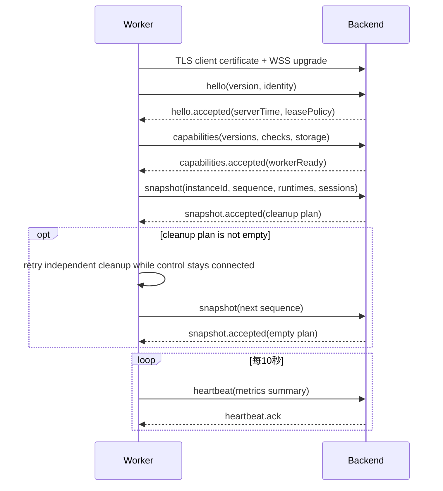

# Interfaces and protocols

## 协议分层

| 链路               | 传输       | 编码                      | 用途                               |
| ------------------ | ---------- | ------------------------- | ---------------------------------- |
| Portal → Backend   | HTTPS      | JSON                      | CRUD、认证、Session命令            |
| Backend → Portal   | SSE        | JSON事件                  | Profile、Worker、Session和审计状态 |
| Worker ↔ Backend   | WSS + mTLS | MessagePack               | 命令、ACK、事件、心跳、租约和对账  |
| Viewer ↔ Gateway   | WSS        | MessagePack或紧凑JSON握手 | Ticket消费、SDP和ICE               |
| Core ↔ Gateway     | WSS        | MessagePack或紧凑JSON握手 | Session绑定、SDP和ICE              |
| Extension ↔ Viewer | WebRTC     | RTP/SCTP                  | 音视频、输入、文件和控制           |
| Extension ↔ Core   | loopback   | Remote Tab内部协议        | CDP协调、捕获和Session映射         |

业务控制链路和Remote Tab协议可以共享基础编码库，但不能共享BrowShare业务实体。

## REST API

### 通用约定

- 基础路径为`/api/v1`。
- 请求和响应使用UTF-8 JSON。
- Cookie Session是Portal的默认身份。
- 修改请求校验`Origin`并使用SameSite Cookie防止跨站请求。
- 可安全重试的创建和命令接受`Idempotency-Key`。
- 列表使用基于游标的分页，不使用不稳定的页码偏移处理实时资源；`cursor` 必须是服务端返回的 base64url 游标，畸形编码、内容、UUID 或时间均返回 400 `BAD_REQUEST`。
- Backend 的成功与失败响应均带 `x-request-id`，值为服务端生成的 UUIDv7，不采用客户端同名请求头；错误包络 `error.requestId` 与响应头一致，允许的跨域 Portal 可读取该响应头。
- 时间使用RFC 3339 UTC字符串。
- ID使用UUIDv7字符串。

成功响应直接返回资源或统一列表对象：

```json
{
  "items": [],
  "meta": { "hasMore": false, "nextCursor": null }
}
```

错误响应：

```json
{
  "error": {
    "code": "PROFILE_MAINTAINING",
    "message": "Profile is currently in maintenance mode.",
    "requestId": "019f0000-0000-7000-8000-000000000000",
    "details": {
      "profileId": "019f0000-0000-7000-8000-000000000001"
    }
  }
}
```

`code`是稳定机器码，`message`用于诊断；Portal可以根据`code`本地化。`details`必须经过敏感信息审查。

### 首次初始化

`GET /bootstrap`（`getBootstrapStatus`）公开返回 `{ initialized, interactiveEnabled }`，两者均为 boolean。
只有完成标记不存在、用户表为空并配置初始化 Token 时，`interactiveEnabled=true`；响应不含用户数或秘密，
使用 `Cache-Control: no-store`。初始化数据不一致返回 503 `BOOTSTRAP_STATE_INCONSISTENT`。

`POST /bootstrap`（`initializeBrowShare`）接受 `{ token, email, displayName, password }`：Token 长度 1–1024、
邮箱为有效 email 且最长 320、非空显示名最长 128、密码 10–1024 字符。请求不接受额外字段。
成功返回 201 `{ initialized: true }`，不签发 Cookie。Token 在 Backend 内定长摘要比较，通过后复用
环境初始化的数据库事务锁与完成标记；并发只允许一个成功写入。已完成返回 409
`BOOTSTRAP_ALREADY_INITIALIZED`，Token 错误返回 403 `BOOTSTRAP_TOKEN_INVALID`，未配置交互式 Token
返回 503 `BOOTSTRAP_DISABLED`。客户端遇到网络中断可以重新读取状态；不能把无响应当作未提交。

两个入口均无需 Portal Session，POST 的授权凭据是部署者配置的 Token。Token 和管理员密码不能放入
URL、日志或浏览器持久存储。已完成初始化后，Token 不能重置管理员。`system.bootstrap` 审计的
`requestId` 与 HTTP `x-request-id` 相同，`metadata.method=token`；环境变量路径保持 `environment`。

### 管理总览

`GET /admin/diagnostics`（`getDiagnosticBundle`）接受可选 `sessionId` UUID，要求同时具备
`system.manage`、`worker.read`、`profile.read`、`audit.read`。返回版本化固定字段 JSON、
采样起止时间和各类 200 条上限的截断标记；不返回原始日志、审计 payload、页面或凭据。
响应不缓存，成功生成写入审计；详细字段与隐私边界见[部署与运维](08-deployment-and-operations.md#管理员诊断包)。

`GET /admin/overview`（`getAdminOverview`）返回全量聚合，不受管理列表分页影响，响应使用
`Cache-Control: no-store`。当前启用用户拥有 `worker.read` 或 `profile.read` 中任意一项即可访问；
两项均没有返回403。`workers` 仅在 `worker.read` 下返回，`profiles`、`sessions` 仅在
`profile.read` 下返回；无权分区为 `null`，`unavailableReasons` 相应字段为 `MISSING_WORKER_READ`
或 `MISSING_PROFILE_READ`，可访问分区的原因值为 `null`。不按角色名判断，不返回资源行或凭据。

- `observedAt` 为本次查询完成的服务端 UTC 时间；这是跨读模型与实时控制状态的当前采样，不是历史趋势或跨组件原子快照。
- `workers` 统计所有未退役节点：`totalWorkers`、`states`（pending/online/draining/offline/disabled），
  以及按真实控制连接计算的 `connectedWorkers`、`readyWorkers`、`eligibleWorkers`。后者沿用 Worker
  列表的 ONLINE、Control READY、容量未满条件，不根据 CPU/内存自动放宽配置。
- `workers.capacity.activeTabs` 包含普通与维护 Session；`finiteTabLimit`、`availableTabs` 汇总所有
  有限节点的配置上限及逐节点截零后的剩余，包括离线或 Drain 节点；`unlimitedWorkers` 单独计数。
  `fullWorkers`、`overLimitWorkers` 沿用现有容量状态。`schedulableAvailableTabs` 只汇总当前可调度
  有限节点的剩余，`schedulableUnlimitedWorkers` 只统计当前可调度无限节点。Worker 空槽不代表某个
  用户一定可创建 Session，仍受 Profile、用户、授权、健康等真实预约规则约束。
- `profiles` 复用管理 Profile 全量摘要（含普通 Session 的容量，不含维护占用），保留删除中但尚未
  软删除的 Profile。新增 `deletingProfiles`、`restartRequiredProfiles`；后者与 Profile 当前 REST
  的已保存/运行路由版本差异一致。`unhealthyRuntimes` 与 `unknownRuntimeHealth` 分别统计 RUNNING
  或 MAINTAINING 中健康为 UNHEALTHY、健康事实为 null 的 Runtime，停止后的历史健康不计为运行故障。
- `sessions` 包含 `activeSessions`、`normalSessions`、`maintenanceSessions` 和 `states`
  （reserved/creating/ready/connected/suspended/disconnected/closing）；CLOSED、FAILED 不计活动占用。

页面复用 `/workspace/events` 的空 `profiles-changed` 失效消息并重新读取有权 REST。Worker 状态、
容量、退役、控制连接/ready 变化及 Session 创建、结束、状态变化会通知；数据库心跳/租约/输入时间
变化不广播。三个区域之外的 Worker 指标或详情继续由已有管理 API 获取，按采样时间展示。

### 审计查询

`GET /audit-events`和`GET /audit-events/{id}`都要求`audit.read`，响应使用`Cache-Control: no-store`。
列表接受`actorUserId`、`withoutActor`、`action`、`targetType`、`targetId`、`result`、`requestId`、
`from`、`to`及通用`cursor`、`limit`。文本字段精确匹配，时间区间包含两端；`withoutActor=true`
不能与`actorUserId`同时使用。无操作者记录包括系统操作、未识别用户和物理移除用户后的记录。
结果为`SUCCEEDED`、`FAILED`或`DENIED`；畸形游标、非法ID和反向时间区间返回400。

列表按`(occurredAt,id)`倒序，返回`{items,meta:{hasMore,nextCursor}}`，仅包含事件摘要。
详情增加`requestId`、`sourceIpHash`、`changes`、`metadata`，不存在时返回404。
用户使用左关联，`actorName`是当前名称；已无关联时返回null，事件仍可读取。
结构化差异与关联信息由原业务写入者保证非敏感，不读取或回填源对象、脚本正文、代理凭据、
下载令牌及完整敏感URL。当前页面每5秒轮询已加载页，隐藏时暂停，并取消过时请求。

### 资源入口

| 资源                     | 代表操作                                |
| ------------------------ | --------------------------------------- |
| `/auth/*`                | 登录、登出、注册、设备Session和密码修改 |
| `/users`                 | 用户管理、状态、密码重置和角色          |
| `/roles`、`/permissions` | 读取预置权限模型                        |
| `/profiles`              | Profile CRUD、运行、维护、授权和策略    |
| `/profile-groups`        | Group CRUD及User/Profile关联            |
| `/proxies`               | Proxy CRUD、凭据查看、连接和出口测试    |
| `/workers`               | Enrollment、状态、容量、凭据、退役和诊断 |
| `/sessions`              | 创建、继续、重命名、接管和结束          |
| `/audit-events`          | 只读审计查询                            |
| `/settings`              | 运行期系统设置                          |

具体已实现请求与响应以[生成的OpenAPI](../../apps/backend/openapi.json)和[运行时Contracts](../../packages/contracts/src/index.ts)为准，
交付状态见[PROGRESS](../../PROGRESS.md)。上述资源表也包含尚待实现的目标入口，不能仅凭设计表推定路由存在。
用户管理响应不包含密码哈希、Portal Session Token或IP摘要；写操作在同一事务中记录审计事件。
所有资源沿用认证与Permission入口，不能从Cookie中缓存Role名称作为授权结论。

Navigation Policy接口以`/profiles/{profileId}/navigation-policy`为根路径：

| 方法 | 相对路径 | Permission | 行为 |
| --- | --- | --- | --- |
| `GET` | 根路径 | `profile.read` | Profile名称、当前发布指针与草稿 |
| `GET` | `/versions` | `profile.read` | 游标分页版本摘要，不返回规则和源码 |
| `GET` | `/versions/{id}` | `profile.read` | 当前Profile内的完整版本 |
| `PUT` | `/draft` | `profile.manage` | 校验并保存整份草稿及修改说明 |
| `POST` | `/preview` | `profile.read` | 试算请求内的内容和URL，不访问目标站点 |
| `POST` | `/versions/{id}/publish` | `profile.manage` | 发布或回滚到已有版本 |
| `POST` | `/versions/{id}/disable` | `profile.manage` | 禁用版本，仅在它是当前发布版本时清空指针 |

草稿正文为`{content: {rules, defaultAction, policyScript}, changeSummary}`；规则最多256条，
Script最多65536字符。试算正文为`{content, url, context?}`，返回动作、命中规则ID、规范化URL、改写URL和
原因。格式、模式或重复ID错误返回`400 BAD_REQUEST`，含非法规则时错误详情提供`ruleId`。
Script语法编译失败返回400及`details.field: policyScript`；试算中的运行时错误返回200和DENY，
原因区分SCRIPT_ERROR、SCRIPT_TIMEOUT、SCRIPT_BUSY及SCRIPT_INVALID。正常脚本判定原因是SCRIPT，
返回null则是DEFAULT。`context`字段与执行约定见[导航策略](04-auth-and-policy.md#navigation-policy)。
PROMPT_REMOTE规则及Script结果支持发布，实际主文档导航等待Viewer确认；取消或过期拒绝该次导航。
非当前Profile版本返回404。
审计只记录动作、Profile/版本ID、规则数量等元数据，不记录URL、Script源码和修改说明。

Portal入口为`/admin/profiles/{profileId}/navigation-policy`，从Profile管理表进入。已保存版本与
当前编辑内容分别管理，未保存内容不能随发布操作隐式提交。切换版本及离开编辑页提示未保存
内容；请求失败保留编辑器，刷新状态和版本历史不覆盖当前编辑。只读用户可以查看和试算。

Page Script 接口以 `/profiles/{profileId}/page-script` 为根路径：

| 方法 | 相对路径 | Permission | 行为 |
| --- | --- | --- | --- |
| `GET` | 根路径 | `profile.read` | Profile 名称、发布指针与草稿 |
| `GET` | `/versions` | `profile.read` | 游标分页摘要及适用范围，不返回源码 |
| `GET` | `/versions/{id}` | `profile.read` | 同 Profile 内完整版本及源码 |
| `PUT` | `/draft` | `profile.manage` | 保存完整源码、范围与修改说明 |
| `POST` | `/versions/{id}/publish` | `profile.manage` | 发布、重新启用或回滚至已保存版本 |
| `POST` | `/versions/{id}/disable` | `profile.manage` | 禁用版本，仅当前版本清空发布指针 |

草稿正文为 `{content: {source, appliesTo}, changeSummary}`。源码最多 65536 字符；适用范围为
`NORMAL`、`MAINTENANCE` 或 `BOTH`。源码按函数体语法只编译、不执行；语法错误返回
`400 BAD_REQUEST` 和 `details.field: source`，不返回包含源码的引擎诊断。非法范围、超长源码
及额外字段同样返回400。未发布草稿不能禁用，返回409；其他 Profile 的版本返回404。
已发布内容保持不可变，复制编辑会保存到当前草稿。禁用 Page Script 不阻止创建 Session，
仅让新 Session 不注入脚本；现有快照保持不变。维护态草稿测试使用后文的 maintenance 接口。

管理员变量使用 `GET/PUT /profiles/{profileId}/contexts/{userId}`，两者均要求 `profile.manage`。
PUT 为 `{variables:JSON对象}`，响应为 `{profileId,userId,variables,updatedAt}`；未配置时
`variables:{}`、`updatedAt:null`，保存空对象清空。不存在或已删除的 User/Profile 返回404，
删除中的 Profile 不接受写入（409）。变量值不进入审计和错误内容。

变量限制 UTF-8 32 KiB、8层嵌套，递归拒绝敏感键与可识别凭据值，详细口径见权限策略文档。
Session 创建读取准确的 `(userId,profileId)` 并再次验证，命令的 `pageScript` 增加可选
`context:{user_id,display_name,profile_id,variables}`；保留旧的已排队命令可读性，新的创建均
携带此快照。Control 解码校验 context 与 Profile/navigationUser 身份一致及变量合规。
Worker 使用现有 Remote Core `pageScript.context` 传递，Remote 公共 API 不变。

Worker Enrollment当前接口：

| 方法   | 路径                                                 | Permission      | 行为                                      |
| ------ | ---------------------------------------------------- | --------------- | ----------------------------------------- |
| `GET`  | `/workers/enrollments`                               | `worker.read`   | 状态过滤和游标分页，不返回 Token或摘要    |
| `POST` | `/workers/enrollments`                               | `worker.manage` | 签发 Token，明文只在该次`201`响应返回     |
| `POST` | `/workers/enrollments/{enrollmentId}/revoke`         | `worker.manage` | 只撤销`ACTIVE`Token，重复撤销返回`409`    |
| `POST` | `/workers/enroll`                                    | Enrollment Token | 原子消费Token并签发节点客户端证书          |

创建请求可以包含可选用途名称和`expiresInSeconds`。默认值为900秒，允许范围为60至86400秒。时间响应
统一为 RFC 3339 UTC；过期的`ACTIVE`记录在读取或撤销前转换为`EXPIRED`。创建和撤销分别记录
`worker.enrollment.create`与`worker.enrollment.revoke`，审计内容只保存名称、到期时间和状态变化。

首次注册请求使用`Authorization: Bearer bwe_...`，正文包含Worker名称、P-256 SPKI公钥以及主机名、
平台、架构和Worker版本。成功响应只返回本次新建的`workerId`、`credentialId`、客户端证书、Worker
CA证书、序列号、SHA-256指纹、有效期和配置的`wss://`控制地址，不返回或持久化Worker私钥。
无效、过期、撤销、已消费和并发失败Token统一返回`WORKER_ENROLLMENT_INVALID`；名称冲突返回
`WORKER_NAME_CONFLICT`且不消费Token。成功消费记录`worker.enrollment.consume`审计，但不记录
Token、公钥正文或证书正文。

Worker查询、容量和状态接口：

| 方法    | 路径                                     | Permission      | 行为                                                                    |
| ------- | ---------------------------------------- | --------------- | ----------------------------------------------------------------------- |
| `GET`   | `/workers`                               | `worker.read`   | 按状态、名称或上报主机名查询Worker，使用游标分页                        |
| `GET`   | `/workers/{workerId}`                    | `worker.read`   | 返回身份、状态、容量、能力、指标、版本和最近Probe结果                   |
| `PATCH` | `/workers/{workerId}`                    | `worker.manage` | 设置`maxActiveTabs`并记录`worker.capacity.update`审计                   |
| `GET`   | `/workers/{workerId}/state`              | `worker.read`   | 返回实际五态、控制连接状态、最后观测与禁用时间                          |
| `PUT`   | `/workers/{workerId}/state`              | `worker.manage` | 写`ACTIVE`、`DRAINING`或`DISABLED`管理意图并记录`worker.state.set`审计   |
| `POST`  | `/workers/{workerId}/diagnostics/probe`  | `worker.manage` | 通过控制通道运行完整Capability Probe并返回有效报告                      |

Portal的`/admin/workers`提供节点名称/主机名搜索、状态过滤、游标加载和可调度原因，
`/admin/workers/:workerId`展示控制连接、数据库容量、指标观测时间、版本、能力检查和证书记录。
两者均要求`worker.read`；`worker.manage`才显示容量、Drain、禁用、诊断、轮换、证书撤销和退役。
注册向导沿用`/admin/workers/enrollments`。可见页面定时刷新，离页取消请求与计时器；网络失败保留
已加载状态和正在编辑的表单。离线指标明确标为最后观测，不推断当前健康。轮换Token只保留于
当前弹窗内存，关闭即清除，不写浏览器存储。退役要求输入完整名称，引用约束仍由Backend判断。

Worker Credential与退役接口：

| 方法   | 路径                                                           | Permission/认证 | 行为 |
| ------ | -------------------------------------------------------------- | --------------- | ---- |
| `GET`  | `/workers/{workerId}/credentials`                              | `worker.read`   | 返回证书元数据、状态及是否为当前连接，不返回证书正文或公钥 |
| `POST` | `/workers/{workerId}/credentials/{credentialId}/revoke`        | `worker.manage` | 撤销冗余Credential；最后一个有效Credential要求Worker先禁用 |
| `GET`  | `/workers/{workerId}/credential-rotations`                     | `worker.read`   | 返回Rotation历史，不返回Token或摘要 |
| `POST` | `/workers/{workerId}/credential-rotations`                     | `worker.manage` | 为当前已连接Credential签发一次性Token，明文仅在本次`201`返回 |
| `POST` | `/workers/{workerId}/credential-rotations/{rotationId}/revoke` | `worker.manage` | 撤销尚未消费的`ACTIVE`Token |
| `POST` | `/workers/credential-rotation`                                 | Rotation Token  | Worker提交新P-256公钥并领取新证书 |
| `POST` | `/workers/{workerId}/retire`                                   | `worker.manage` | 精确名称确认后安全退役已禁用且无归属资源的Worker |

Rotation状态为`ACTIVE`、`CONSUMED`、`REVOKED`或`EXPIRED`；Credential状态为`ACTIVE`、`REVOKED`
或`EXPIRED`。创建Rotation会撤销同Worker仍未消费的旧Rotation，但不会改变当前Credential。消费时请求
正文必须同时携带Token绑定的`workerId`、`currentCredentialId`和新SPKI公钥；无效、过期、撤销、已消费
或绑定不匹配统一返回`WORKER_CREDENTIAL_ROTATION_INVALID`，不泄露命中条件。成功签发新Credential
后，旧Credential继续有效到Backend收到新Credential对应的`worker.hello`，从而保证Worker写盘失败时
仍有恢复路径。

退役请求正文只接受`expectedName`。Worker未禁用、名称不匹配、仍有Profile或非终态Tab Session时
返回`WORKER_RETIREMENT_BLOCKED`及可公开的阻断计数；成功响应返回退役时间和撤销数量。轮换、撤销、
接管与退役分别写入`worker.credential.rotation.*`、`worker.credential.revoke`、
`worker.credential.rotate`和`worker.retire`审计事件，Token、私钥与证书正文不进入审计。

列表查询的`state`接受`PENDING`、`ONLINE`、`DRAINING`、`OFFLINE`、`DISABLED`或`ALL`；
`search`同时匹配管理员命名和Worker上报的主机名。响应中的`capabilityReport`与`metricsSnapshot`
只返回通过当前Schema校验的最近有效值，CPU、内存、磁盘、Chrome和网络指标用于管理员人工判断，
不自动改变容量上限或节点状态。

`maxActiveTabs`默认是4；非负整数表示允许该Worker承载的最大非终态Tab Session数，`null`表示
不设平台容量上限，`0`表示停止接纳新Session但不结束已有Session。容量的权威占用来自PostgreSQL中
该Worker所有非`CLOSED`、非`FAILED`的`tab_sessions`，而不是可能短暂滞后的Worker心跳
`runtime.activeSessions`。降低上限不会回收已有Session：占用等于上限时容量状态为`FULL`，超过上限
时为`OVER_LIMIT`；两者都返回`schedulingBlockReasons: ["CAPACITY_REACHED"]`。

`workerEligible`只是一项Worker层预判：节点必须是`ONLINE`、控制通道完成握手和对账并处于READY，
且容量仍可用。它不代表用户、Profile、Proxy、Policy或Reservation已经通过完整Session调度校验；
调用方不能把该布尔值当作创建Session的最终授权结论。每次容量更新都在同一事务中写入
`worker.capacity.update`，审计变化包含旧值和新值；重复写相同值仍保留一次明确的管理员操作记录。

`PUT`是幂等状态设置，不让调用方伪造`ONLINE`或`OFFLINE`。响应中的`state`由控制连接、READY
Capability、Snapshot历史和管理意图共同决定；每次写入记录`worker.state.set`审计事件及前态、请求
意图和实际结果。禁用会在数据库更新后立即关闭当前控制socket，避免已经认证的连接继续接收命令。

首版不提供Personal Access Token或Service Account。公开API稳定性在正式实现后另行声明，不能因为路由存在就视为第三方长期兼容接口。

## SSE事件

Portal 使用带 Cookie 的失效 SSE；当前实现发送 `event: profiles-changed`、`data: {}`，不广播资源行、URL或凭据。订阅入口按页面权限区分：

- `GET /profiles/events` 要求 `profile.read`，供管理 Profile 页面使用。
- `GET /proxies/events` 要求 `proxy.read`，供代理管理页面使用。
- `GET /workspace/events` 要求有效且启用的 Portal 用户，供工作区、维护目录和当前 Session Viewer 使用；后续业务 REST 仍逐项执行权限和归属校验。

三个入口共享同一数据库通知订阅，100ms 合并同一批路由变更的通知。每次建链及重连立即发送一次失效事件，客户端重新读取 REST 快照；当前无事件日志，不使用 `Last-Event-ID` 恢复。15秒心跳复核登录态和入口权限，失效发送 `authentication-required` 后关闭连接。SSE 不承担 Viewer 实时控制。

Profile 路由版本、Runtime 路由版本及代理健康状态/错误码/HTTP状态变化触发失效；连续健康探测仅时间与延迟变化不广播，最新数值在下次 REST 刷新可见。显式 Proxy 探测结果及配置变更触发失效；开始探测时内部关联 ID 的变化不发送事件。Worker 状态/容量及 Session 状态的数据库变更、Worker 实时控制连接与 ready 变化也复用该失效通道；心跳指标和租约观察时间不触发广播。

## Worker控制协议

### 消息包络

每个WebSocket二进制帧恰好包含一个标准MessagePack对象。解码后的逻辑结构：

```json
{
  "protocolMajor": 1,
  "protocolMinor": 12,
  "type": "session.create",
  "messageId": "019f0000-0000-7000-8000-000000000010",
  "correlationId": null,
  "sentAt": 1788360000000,
  "payload": {}
}
```

- `messageId`全局唯一并用于幂等。
- 响应或事件使用`correlationId`关联原命令。
- `sentAt`用于诊断，不作为授权或顺序的唯一依据。
- `type`决定Payload的TypeBox Schema。
- 未知major、未知必需消息或Schema失败时返回协议错误；不得静默忽略会改变状态的消息。

编码使用标准MessagePack类型，不依赖库私有Record扩展，保证其他语言可以实现。

### 建链



握手和对账完成前，Worker状态不是`ONLINE`，不得接收创建Session命令。

Backend使用独立HTTPS listener承载Worker WebSocket，而不在Portal/API listener上全局请求客户端
证书，避免普通浏览器出现客户端证书选择提示。控制listener配置自己的Server TLS证书，并以Worker
CA验证客户端链；TLS握手缺少证书或证书链不受信时不会进入WebSocket。TLS通过后，Backend再按
URI SAN中的Worker ID、证书序列号、SHA-256指纹、Credential状态和Worker启用状态查询数据库，
不能只相信CA签名。

当前已实现的消息为`worker.hello`、`worker.hello.accepted`、`worker.capabilities`、
`worker.capabilities.accepted`、`worker.snapshot`、`worker.snapshot.accepted`、
`worker.heartbeat`、`worker.heartbeat.ack`、`diagnostic.probe`、`worker.command.accepted`、
`diagnostic.probe.result`和`protocol.error`，以及下文列出的Profile与Session命令。当前协议为1.22；首帧
必须是二进制MessagePack `worker.hello`，其Worker/Credential ID必须与客户端证书对应；成功响应
通过`correlationId`绑定Hello，并返回协商minor、Server时间、心跳间隔和需要快照的标志。Worker
随后必须发送包含全部必需检查、协调版本和卷状态的Capability Report，Backend验证检查名称唯一且
完整、READY与全PASS一致、容量/inode关系有效后才接受。协议minor `1`还要求Hello携带进程级
`instanceId`，Capability之后必须完成全量Runtime Snapshot对账。心跳sequence严格递增，ACK同时关联
`messageId`和sequence；ACK超时会关闭连接并进入退避重连。Backend只覆盖保存最新指标快照。

每帧最多256 KiB，关闭WebSocket压缩；文本帧、非法MessagePack、TypeBox Schema失败和不支持的
major均使用稳定错误码关闭。每个Worker只保留一个活动连接，新连接接管时旧连接收到`REPLACED`
且停止重连，避免两个相同身份的进程持续抢占。

管理员禁用节点时使用`WORKER_DISABLED`错误和WebSocket关闭码`4008`。该关闭原因允许现有Worker
继续有界退避重连；Backend在节点保持`DISABLED`期间拒绝每次Hello，重新设为`ACTIVE`或
`DRAINING`后才允许继续Capability与Snapshot。证书无效、撤销或身份不匹配仍使用不可恢复的
`AUTHORIZATION_FAILED`，不能把凭据错误伪装成临时禁用。

Worker初次启动要求握手成功；建立连接后遇到Backend重启或临时网络故障，则在配置范围内使用带
jitter的指数退避重连。重连沿用本地节点证书，不重新Enrollment，也不重启Worker进程。事实快照和
清理计划在每次重连时重新执行。仅为控制协议minor `0`的旧Worker保留无Snapshot兼容路径；新Worker
不得借此跳过对账。当前Session租约通过`worker.snapshot.accepted.payload.leases`续签，
绑定Session、Runtime、Profile generation及到期时间；Worker按本地时钟检查10分钟租约上界，
控制面不可达时不能无限延长。

### Runtime Snapshot对账

`worker.snapshot`绑定Worker ID、进程`instanceId`和严格递增sequence。Backend拒绝重复的Profile、
Runtime、Session、Tab或Target ID，以及Session到Profile Runtime的交叉映射。有效快照会原子保存到
Worker记录，并与数据库Profile、Tab Session和Reservation状态对账：

| 差异 | Backend动作 |
| --- | --- |
| 数据库活动Profile在Worker缺失 | Profile转`ERROR`并记录`WORKER_STATE_MISSING_AFTER_RECONNECT` |
| 数据库活动Session在Worker缺失 | Session转`FAILED`并释放Reservation |
| Worker Profile无数据库记录、数据库已停止或generation不同 | 返回`stopProfiles` |
| Worker Session无数据库记录、已终态、正在关闭、映射冲突或租约过期 | 返回`closeSessions` |

`worker.snapshot.accepted`必须关联请求`messageId`，回显instance和sequence，并保证
`resnapshotRequired`与清理数组是否非空一致。Control 1.20 在认证与 Capability 接受后保持
心跳与诊断通道；首份合法快照后允许 `session.close`、Profile STOP/DELETE。清理计划非空时
`controlReady=false`，Worker 处于 `reconciling`，拒绝 START、Session 创建、Viewer prepare/continue
和新调度，返回 `WORKER_RECONCILING`；`/health/ready` 保持 503。

每份计划分别执行独立对象的清理。同 Profile 的 STOP 包含其 Session 清理并可通过原 Chrome
退出证明完成关闭；一个对象失败不阻止其他对象，尚未完成的操作不阻塞心跳、下一份事实快照或
管理员 STOP。失败保留真实 Profile/Session 与容量、文件占用，通过后续快照再次产生清理计划。
只在真实空计划被接受后恢复 READY；非法消息、身份错误与实际断线仍关闭连接。协商 minor<20
的旧节点保留原有等待清理、最多八轮收敛的握手行为，不接收新清理错误字段。

### 消息类别

| 前缀           | 方向                       | 示例                                                |
| -------------- | -------------------------- | --------------------------------------------------- |
| `worker.*`     | 双向                       | `worker.hello`、`worker.snapshot`、`worker.heartbeat` |
| `profile.*`    | Backend → Worker及结果事件 | `profile.runtime.set`、`profile.runtime.result` |
| `session.*`    | 双向                       | `session.create`、`session.close`、`session.viewer.prepare`、`session.continue`及对应结果 |
| 租约续签      | Backend → Worker          | `worker.snapshot.accepted`中的`leases` |
| `proxy.*`（目标） | 双向                    | 健康检查和变化事件，尚待接入控制协议 |
| `diagnostic.*` | 双向                       | `diagnostic.probe`、`diagnostic.probe.result`       |

命令先返回接收ACK，再通过结果事件报告最终状态。ACK只表示通过Schema和幂等检查，不表示操作成功。
当前管理员接口`POST /workers/{workerId}/diagnostics/probe`使用该流程重新运行完整Capability Probe。
只要控制连接已接受初始Capability和Snapshot，即使初始Capability为`FAILED`也允许执行诊断；成功结果
会更新当前连接的READY状态和数据库Worker状态，失败结果保持节点不可调度。
Backend为命令生成到期时间，在可配置ACK期限内以同一`messageId`最多重试三次，并将最终结果超时独立
映射为`WORKER_COMMAND_TIMEOUT`。连接中断后命令保持待处理；Worker重新完成Hello和Capability握手后，
Backend在Worker重新完成Hello、Capability和Snapshot握手后继续重放同一命令。

### 幂等与顺序

- Worker当前使用256项有界进程内缓存保存已接收`messageId`、稳定ACK和最终结果；完成项保留一小时。
- Backend重发相同命令时，Worker返回同一ACK和结果，不重复执行Probe；控制通道重连不清空缓存。
- Worker进程重启会清空该缓存。Profile和Session变更命令携带Runtime身份、generation与期望状态，
  Backend持久outbox在确认Worker实例并完成快照对账后决定重放或终止，不能只依赖进程缓存。
- Profile生命周期命令携带期望Runtime generation；旧generation命令被拒绝。
- Session只允许按状态机转换。迟到事件不能让`CLOSED`回到`CONNECTED`。
- 单连接内帧顺序不能替代实体版本检查，因为重连后可能重放。

### 背压

控制协议不传媒体和用户文件。Worker指标采用最新值覆盖，不能让慢Backend积压无限历史；生命周期和审计相关事件必须可靠确认。达到发送缓冲上限时，Worker停止接受新Session并进入降级状态。

## Signaling与ICE

Backend创建Session时选择健康`gateway_id`并签发绑定该Gateway的Viewer Ticket。Core使用Worker已授权Session绑定Gateway；双方不能自行选择其他Session ID。

Gateway完成：

1. Ticket或Core身份校验。
2. 同一Session两端配对。
3. SDP Offer/Answer和ICE Candidate中继。
4. 下发短期TURN凭据和标准`iceServers`。
5. 配对超时、重放和速率限制。

Gateway不保存长期业务数据，不查看DataChannel或媒体。Gateway故障时已建立PeerConnection继续工作；需要ICE restart或重新协商时由Backend分配新连接流程。

## WebRTC控制协议

Remote Tab仓库拥有DataChannel消息定义。BrowShare只能通过Capabilities决定是否允许导航、文件、剪贴板、本机打开、画质或诊断，不能另造平行输入协议。

每个敏感操作同时包含Session绑定和递增输入序列。Core只接受当前活动Viewer的数据；旧Viewer或过期PeerConnection的数据全部丢弃。

## 版本策略

`GET /api/v1/version` 是无需登录的 Backend 版本入口，返回 `name: BrowShare`、`service: backend`、
`apiVersion: v1` 和产品 SemVer `version`。Portal 校验响应结构与支持的 `apiVersion`；产品版本用于
诊断展示，不以产品版本字符串完全相等作为 API 兼容门槛。网络失败、5xx、版本入口缺失或非 JSON
响应表示无法确认服务状态或契约，不能仅凭这些结果断言明确的 API 版本不兼容。


- 两个仓库独立SemVer。
- BrowShare精确锁定Remote Tab版本。
- Worker协议major不兼容时拒绝连接。
- minor只允许增加可选字段、消息和capability。
- 删除字段、改变语义或改变默认安全行为必须升级major。
- Protobuf式字段编号不适用，但字段名和`type`字符串一旦发布仍视为公共协议的一部分。

## 已实现的业务控制边界

### Profile、授权和策略入口

Profile CRUD、运行启停和删除使用`/profiles`，直接用户授权使用`/profiles/:id/grants`。
分组使用`/profile-groups`与`/:id/members`原子替换Profile/User关联；最小目录为
`/profile-groups/subjects?kind=USER|PROFILE`。管理读取要求`profile.read`，写入要求
`profile.manage`；普通可见清单`/workspace/profiles`要求`session.use`并独立验证授权。

SessionPolicy使用`GET/PUT /session-policies`、`DELETE /session-policies/:id`、`/defaults`和
`/effective`。全局写入要求`system.manage`，定向写入要求`profile.manage`，读取要求
`profile.read`。整套策略按User+Profile、启用Group高优先级、全局、系统初始值命中；同优先级
重叠Group的不同策略返回409。策略与授权的详细边界见[认证与策略](04-auth-and-policy.md)。

### 普通Session与Viewer

`POST /sessions`原子占用User/Profile/Worker三级额度并持久化创建意图，202表示已接纳；无队列。
Worker创建命令幂等绑定一个主Tab和Remote Tab Core，ON_DEMAND Profile先等真实Chrome就绪。
`GET /sessions`、`GET/PATCH /sessions/:id`和`POST /sessions/:id/close`限定本人所有权。
创建锁定回收策略、Page Script与Navigation Policy版本；实现和投递状态见[领域模型](03-domain-model.md)。

`POST /sessions/:id/viewer`提交客户端ID；冲突返回`VIEWER_TAKEOVER_REQUIRED`，确认接管后
提升generation并撤销旧Viewer。返回值包含已分配Gateway、WSS URL、60秒单次Ticket、generation
与Capabilities，不返回Core绑定凭据。Gateway通过Backend鉴权回调原子消费Ticket并校验Core绑定。
`POST /sessions/:id/continue`按当前generation/回收状态处理继续使用，不把客户端倒计时当作权威。
租约、断线宽限和回收语义见[Session与Viewer](05-session-and-viewer.md)。

Worker消息的字段、最小minor和结果联合类型以[Worker Contracts](../../packages/contracts/src/worker-control.ts)
为准：`profile.runtime.set/result`、`session.create/result`、`session.close/result`、
`session.viewer.prepare/result`和`session.continue/result`均复用ACK、关联ID及结果重放。
快照上报真实连接状态、标题、输入/画面活动、回收状态和关闭事实。终态清理必须确认Tab和临时文件
已释放，不能仅凭命令ACK、网络超时或Backend意图释放额度。

### 注册与用户默认额度

`GET/PUT /settings/registration`要求`system.manage`；响应和PUT正文为
`{registrationOpen, emailVerificationRequired, defaultMaxActiveSessions}`。额度接受0至1,000,000
整数或`null`，开放注册初始为1；修改只影响后续注册，不回写已有用户。没有邮件服务时开启邮箱验证
返回400。公开`/auth/config`只返回两个布尔开关。管理员`POST /users`省略额度时默认2。
设置写入和注册创建通过数据库行锁串行化，整组更新记录审计；Portal页面为`/admin/settings`。

### Profile运行模式配置

创建和编辑Profile接受可选runtimeIdleTimeoutSeconds（0至2147483647整数）；创建省略时为300秒，
编辑省略保留已有配置。Profile管理响应包含该值、runtimeFailureCount和可空UTC runtimeRetryAt。
手动START或提交runtimeMode配置会重置恢复失败预算；Portal保存完整配置时也会提交该字段。
启用的ALWAYS_ON Profile手动STOP返回409，需先禁用或切换模式。
自动运行操作继续复用持久Profile outbox，不新增Worker控制消息；窗口计时与失败去重存于0012迁移。


### 管理员Session查询与结束

- `GET /api/v1/admin/sessions`：要求`profile.read`，默认仅活动记录；`scope=ALL`包含终态。
  支持用户、Profile、Worker ID、状态和名称搜索，创建时间/ID倒序游标分页。名称搜索中的`%`、`_`
  按字面处理；不会通过搜索访问页面正文或完整URL。
- `GET /api/v1/admin/sessions/:id`：同一查询权限，返回User/Worker最小标识、运行代数、连接、
  租约与活动时间。没有Cookie、认证摘要、Viewer Ticket、策略源码或页面URL。
- `POST /api/v1/admin/sessions/:id/close`：要求`session.terminate_any`，202表示持久结束意图已接受。
  使用`ADMIN_REQUESTED`原因，撤销未消费Ticket；Worker确认Tab清理后释放额度。重复/并发请求
  保留第一个关闭意图和单一审计，不能以投递超时作为资源已清理的证据。

普通`/sessions`路径仍限定本人所有权。管理权限不允许获取他人的Viewer或重命名他人Session。
控制协议1.11新增`ADMIN_REQUESTED`、`PASSWORD_RESET`关闭原因；新原因投递要求协商minor≥11。
密码重置与Portal登录撤销、Ticket撤销、全部目标用户Tab关闭意图在同一事务提交，并使用既有
持久outbox处理控制断线与Backend重启。Worker离线期间沿用既有本地租约上界。

控制协议1.12在`session.create.payload`增加`navigationUser: {id, displayName}`，并允许导航规则动作
`DEFER_TO_SCRIPT`。Backend的新预约要求协商minor≥12，命令中的身份来自已锁定User记录；Worker
结合既有sessionId/profileId构造脚本上下文。协议schema保留旧无脚本在途命令的可解码性；含Script
而缺少navigationUser的命令返回NAVIGATION_CONTEXT_REQUIRED，不从页面或环境变量猜测身份。

### 维护 Session 的 Worker 边界

控制协议1.13为`session.create.payload`增加显式`kind: "MAINTENANCE"`分支，要求
`navigationPolicy: null`；只有这一分支允许在尚未发布普通导航策略时创建Tab。普通分支使用
`kind: "NORMAL"`并继续要求完整导航策略，旧持久命令省略kind时仍只解释为普通Session。
维护分支在minor<13时不符合协议schema，不能向旧Worker投递。

维护授权属于Backend的`profile.maintain`及维护预约事务，不能从Viewer参数或普通授权推导。
Worker只接受控制链路的显式命令，复用导航编译器允许HTTP(S)远端导航，继续拒绝非HTTP(S)、
带凭据URL及未经授权的本机打开。它不为维护伪造普通导航策略版本ID。

Worker在创建入口同步检查Profile内所有Session：维护与其他普通/维护Session不能共存。
正在创建或关闭、以及文件清理失败的Session仍持有独占权；只有Tab与Session临时文件清理完成
才能允许下一次创建。原messageId的幂等重试不创建第二个Tab，已结束命令不能重开。
维护向Core指定`childTargetPolicy: "retain"`，由Core跟踪并清理后代窗口；普通模式继续使用
`close-and-local-open`。租约、回收快照、Viewer Ticket与Session文件存储复用现有链路。

维护目录提供`GET /api/v1/maintenance/profiles`（search、cursor、limit）与
`GET /api/v1/profiles/{id}/maintenance`，均要求`profile.maintain`。响应仅包含操作所需的Profile
信息、普通Session数量、阻止启动原因和当前维护状态；维护Session ID仅对其所有者返回。
`defaultInitialUrl` 为可空字符串，取 Profile 当前启动检查地址，供维护表单首次预填；
用户仍可编辑，POST 的 `initialUrl` 继续独立校验，不自动创建或跳过维护确认。
目录状态用于展示，不能替代预约事务的实时授权、容量和独占校验。

控制面提供`POST /api/v1/profiles/{id}/maintenance`，请求为`{initialUrl, pageScriptVersionId?}`，
返回202 TabSession；只接受`profile.maintain`。普通Session创建请求不允许提交kind或脚本版本。
维护请求与普通会话关闭意图原子提交，重复维护/维护中普通预约返回409 PROFILE_MAINTENANCE_ACTIVE。
维护仍使用120秒预约期限，不为普通Session增加排队。

`TabSession.kind`随所有会话响应返回，`GET /sessions`可按kind过滤，只列出当前User拥有且有对应
类型权限的会话。既有`/sessions/{id}`、`/viewer`、`/continue`、`/close`与重命名入口按不可变kind
选择session.use或profile.maintain；Gateway、租约和撤销传播使用相同权限边界。

维护不读取普通导航发布指针。默认选取已发布且适用于MAINTENANCE/BOTH的Page Script；显式
pageScriptVersionId只允许同Profile版本，并将当时源码复制到不可变创建命令，用于草稿测试。
此显式测试不受普通/维护脚本默认适用范围限制，后续编辑草稿不改变已经创建的会话。

Portal维护目录、维护者Viewer和草稿脚本测试复用现有会话组件。Remote Tab 0.1.18 / Viewer
protocol1.2提供附属窗口选择器与关闭操作：Backend仅为MAINTENANCE创建命令授予
`windowSelection`，预约前要求Worker实际能力报告包含该能力。普通Session不授予该能力。
Worker继续按kind设置retain策略，Core负责完整窗口目录、切换、输入绑定与关闭后回主窗口。
窗口标题/URL目录走WebRTC，不新增Backend中继或数据库字段；主Tab仍是Session绑定和存续边界。
这是既有capabilities数组的能力接入，Worker Control仍为1.13。真实Portal→Backend→Worker→Chrome
验证了子窗口表单登录、HttpOnly登录态共享、子窗口关闭后回主窗口，以及结束维护、重启Profile
Chrome后再次维护和普通Session的登录态保留。正式构建以兼容性表为准，外部发布单独验收。

### Page Script Notice 能力接入

Remote Tab 0.1.16 / protocol 1.1 以既有能力报告公布 `noticeRequests`。普通 Session
预约要求`noticeRequests`、`navigationConfirmation`及`navigationState`能力，创建命令包含这些能力；Worker 执行前还必须核对实际加载包的能力，
不允许把不可用能力静默裁掉。此接入未新增 Worker 控制字段，该能力接入不改变 Control 协议版本。
Notice 请求、响应和取消走 Remote Tab 的可靠 DataChannel；Backend/Gateway 不转发
页面正文，也不新增业务 Notice 中继。页面侧结果与授权限制见[Notice 安全模型](04-auth-and-policy.md#notice安全模型)。

导航确认复用Remote Tab Notice请求/响应，不新增Worker控制字段。Core保留Chrome暂停的主文档
请求，确认后继续；`deferUntilViewer`是Worker到Core的嵌入选项，不是新的Backend命令字段。
`navigationState`协商后，Core通过`navigation.location_changed`同步实际主框架URL；此信息来自
Chrome CDP，不来自Page Script自报的生命周期事件。该能力接入不改变Control协议版本。


### Viewer 焦点策略（Remote Tab 0.1.22）

`GET/PUT /api/v1/settings/viewer-focus` 使用 `system.manage`，保存全局
`{mode, gracePeriodMs}`。`mode` 为 `NEVER`、`WHEN_HIDDEN` 或 `WHEN_UNFOCUSED`，
宽限时间为 0–300000 的整数。migration 0017 写入默认 `WHEN_UNFOCUSED` / 15000ms，
并增加可空 `profiles.viewer_focus_policy`；Profile REST 的 `viewerFocusPolicy=null` 表示继承。
创建和修改 Profile 复用原有管理权限、运行时校验及审计。

Viewer launch 响应新增必需的 `focusPolicy`，在既有授权事务中解析 Profile 覆盖与全局默认。
Portal 在挂载 Viewer 前设置公开 `focusPolicy` 属性，并在自动重签连接凭据时更新。
保存配置不主动推送到当前 Viewer。暂停、宽限计时、恢复和音视频发送器仍由 Remote Tab 负责，
不新增 Worker Control 消息或 Gateway 媒体中继；本次 Control 协议版本不变。

### Profile媒体策略快照（Control 1.14 / Remote Tab 0.1.19）

`session.create.payload.qualityPolicy`携带预约事务读取的Profile画质上限，字段复用
`maxWidth`、`maxHeight`、`maxFps`、`maxBitrateKbps`。1.14命令必须包含完整且经过运行时验证的
快照；旧版命令保留读取schema，但新Worker拒绝执行缺少快照的创建命令，不能回退为无限制。
Backend预约要求Worker已协商1.14。升级前完成旧版待创建命令或停止相关Session再升级。

Worker将kbps转换为bits/s，通过Core的`AttachSessionInput.mediaLimits`下发，不复制媒体编码器。
Core限制初始viewport、后续Viewer viewport/画质请求、子窗口切换及Viewer重新连接；Extension
在首次创建视频发送器时设置编码上限。`viewport.ack`和`quality.ack`报告实际应用参数，默认Viewer
也发出`quality-change`，画质控件说明实际FPS与码率上限。`null`码率由Remote Tab预设决定。

音频仍通过创建时的`tabAudio`能力快照控制。修改Profile的音频/画质只影响新Session，不能扩大
既有Session；重签Viewer Ticket也不能扩权。并发容量在预约事务内检查，超额返回
`SESSION_CAPACITY_EXCEEDED`及`scope: PROFILE`，不排队。

### 全局与 Profile 媒体上限

`GET/PUT /api/v1/settings/media` 要求 `system.manage`，读写 `system_settings.session.media`，
结构为 `{qualityPolicy, tabAudioEnabled}`，画质字段与 Profile 共用运行时 schema。
migration 0018 初始化 1920×1080、60 FPS、不额外限制码率、允许音频；保存产生
`system.media.update` 审计并保留请求 ID 与变更前后值。

Session 预约在事务内锁定全局设置行，与 Profile 每项取更小的宽度、高度、FPS 和码率。
码率 `null` 只表示该层不额外限制，另一层的数值上限仍生效；两层均为 `null` 时由 Remote Tab
选择当前画质模式的码率。仅当两层都允许音频时授予 `tabAudio`。合并结果进入既有持久创建命令的
`qualityPolicy` 和 Session 能力快照，Worker/Core 继续执行原有受限媒体链路。
该规则同时覆盖普通与维护 Session，不改变 Control wire schema 或协议版本。
修改全局或 Profile 设置只影响后续预约，现有 Session 和重新签发的 Viewer Ticket 不扩权。


### 高级画质配置（Remote Tab 0.1.23 候选 / Viewer wire 1.4）

高级画质由 Remote Tab 公共边界拥有，不新增 Backend REST 或 Worker Control 消息。
BrowShare 继续授予 `qualityControl`；新 Session 同时授予 `advancedQuality` 才能协商自动和
自定义。Core 要求 Viewer minor 至少为 4，双方均具备两个 capability；缺少协商条件时保留
原 `quality.request` / `quality.ack` 三档契约，不向旧 Viewer 发送新的状态消息。

新 DataChannel 命令 `quality.configure` 携带独立 `requestId` 和 `configuration`：
`{mode:'auto'}`、`{mode:'preset',preset:'data-saver'|'balanced'|'high'}`，或
`{mode:'custom',maxBitrate,maxFrameRate,scaleResolutionDownBy}`。码率单位为 bits/s，
范围 100000–20000000；帧率为 1–60 整数；缩小倍数为 1–4。Core 和 Extension 继续应用
Session 的媒体上限，自定义请求也不能放宽管理员限制。

成功返回 `quality.configuration {requestId?,state}`；`state` 包含 `configuration` 与
`applied` 编码参数。自动模式调整产生无 `requestId` 的状态事件，不结束任何显式请求。
失败返回 `quality.configuration_failed {requestId,error}`。Headless 的
`configureQuality(configuration): Promise<QualityState>` 严格按请求 ID 相关，替换、超时、
断线或能力撤销清理待决请求；延迟到达的旧响应不能结束新请求。自动重连重新提交最后成功
确认的配置；原 `requestQuality()` 在高级连接上调用 preset 配置，旧连接继续使用原协议。

默认 Web Component 公开同名方法、只读 `qualityState` 与
`quality-configuration-change` 事件。Portal 复用这个 UI，不复制发送端自适应算法，也不将
音视频或媒体统计控制流引入 Gateway 字节转发路径。能力加入当前策略快照只影响新 Session；
旧 Session 重签 Ticket 不扩权，仍可继续使用原三档入口。


Remote loopback 的 `media.start` 与 `media.replace_capture` 增加可选
`captureFrameRateLimit`（1–60 整数）。Core 从 Session 的 `mediaLimits.maxFrameRate` 下发
源采集上限，Extension 再按当前已确认画质约束 capture/sender FPS。这样初始30 FPS不会
永久限制后续60 FPS；旧低层调用省略字段时沿用 viewport FPS。原 required 字段不变，
提供新字段要求协调版本 Extension；BrowShare Control 消息不因这一内部边界改变。

2026-09-06 的真实协议验收通过 minor3仍声明advanced、minor4去advanced、去qualityControl
仍声明advanced三种组合：旧三档可用或按权限隐藏，不发送未协商的高级状态。显式raw高级
请求得到同requestId的CAPABILITY_UNAVAILABLE，原连接继续出帧；该主动拒绝响应不属于
向旧peer主动推送新消息。去diagnostics保留双quality能力时，真实编码CPU竞争仍产生自动
状态更新。并发显式请求的旧调用拒绝、新调用只由自己的ACK完成。

新受限Session的自动/自定义ACK、实际sender与capture均保持400000 bits/s、12 FPS。
自定义1.5Mbps/40FPS/scale2经过真实子窗口捕获替换、暂停切回和恢复保留同peer与配置。
证据分别在忽略的 `tmp/advanced-quality-qa/capability-*.json`、`capped-*.json` 和
`capture-replacement-report.json`。这些结果证明本次变更的受限配置、协商与替换边界，不声称穷尽
所有模式/重连组合或专门执行过动态撤权实测。最终UI部署后，真实sender约束失败经关联失败
响应到达表单，旧quality/CONNECTED保留且不出现Reconnect，随后真实重试ACK成功
（`final-ui-report.json`）。正常Worker配置已恢复，Chrome152、无临时debug开关与CPU配额
（`normal-runtime-report.json`）。正常配置最终smoke已通过：auto、自定义与高清均CONNECTED，
自定义1.4Mbps/40FPS/scale2实际640×360约38.52FPS，高清6Mbps/60FPS/scale1实际1280×720
约57.61FPS，暂停期间配置auto再恢复同peer（`normal-final-smoke-report.json`）。
最终harness已clean，本机专属浏览器和自动化会话关闭、三条转发取消、服务器压力清除。
最终构建通过、配置恢复与实际媒体通过分别有证据，不以本批模块验收替代正式发布Gate。


### 全局传输策略快照（Control 1.15 / Remote Tab 0.1.20）

`GET/PUT /api/v1/settings/transfers` 要求 `system.manage`，读写 `system_settings` 中的
`session.transfers`，保存产生 `system.transfers.update` 审计。migration 0014 初始化默认值：
上传、下载、文字/图片剪贴板开启，单文件 50 MiB、单批最多 10 个、Session 临时配额 200 MiB，
上传后缀不限。设置对象整体保存；单文件上限不得超过 Session 配额。

Backend 创建 Session 时在预约事务中读取设置，按四个开关裁剪 capabilities，并将完整
`transferSettings` 固化进 `session.create`。预约要求 Control 1.15；1.15 消息必须带此快照，
Worker 对缺失或非法值显式失败。旧版消息 schema 保持可读，升级前须处理旧的待创建命令。
管理员修改全局设置只影响后续 Session，不更改现有 Session 的权限或额度。

Worker 将 maxFileBytes、maxFiles、maxTemporaryBytes、allowedExtensions 交给 Core；
maxTemporaryBytes 同时用于上传批量上限、SessionStorage 上传配额和 Core 的上传/下载共用计数。
Core 按 Chrome 下载进度预留已知长度或累计已收字节，超额立即取消；这不是文件系统硬配额，
Chrome 在进度通知之间仍可能短暂写入。已交付上传保留并计费到 Session 结束，供 File 对象延迟读取。
Remote Tab wire 1.3 将上传限制提示给 Viewer；旧 Viewer 仍受 Core 校验。
后缀 allowlist 只用于上传文件名，不是 MIME/内容识别。此设置不提供持久下载收件箱。


### 下载元数据对账（Control 1.16）

`worker.downloads` 在完成 Hello、Capability 和 Runtime 对账后使用现有 mTLS WSS 发送，
包含认证 Worker 对应的 `workerId`、当前 `instanceId` 和最多 100 条下载元数据。文件内容、
本地路径和用户自报归属不进入消息。新普通/维护 Session 预约要求协商 minor ≥ 16。

Backend 从 Session 关系确定归属，以单批事务提交到 `session_downloads`，然后通过
`worker.downloads.accepted` 关联原 messageId 并返回精确终态 ID 集合。Worker 收到有效 ACK 后
才删除终态清单；网络中断重放幂等，旧状态和较晚期限不能逆转持久记录。完整语义见
[下载保留与领取](11-download-retention.md)。


### 下载领取（Control 1.17）

Worker Hello 可公布 `downloadEndpoint`，必须是无凭据、query、fragment 的 HTTPS URL。
Worker 在独立文件监听启动后公布；Backend 仅在该实例的连接、能力和状态均准备完成时返回入口。

Portal REST 提供 `GET /sessions/:id/downloads` 和 `POST /sessions/:id/downloads/:downloadId/claim`。
前者使用 UUID cursor 和 limit 1–100，返回 items、nextCursor、workerOnline、serverTime；
后者返回 claimId、token、endpoint、expiresAt。允许原所有者领取已结束 Session 文件，管理员无所有权旁路。
凭据绑定原 Portal 登录，仅存摘要，最多 60 秒且单次消费。签发、消费均不改变文件 AVAILABLE 状态。

Worker 使用原 mTLS HTTPS 监听的 `POST /internal/downloads/consume` 与 `/internal/downloads/check`，
分别提交 instanceId+token、instanceId+claimId；响应仅有 claimId、downloadId、sessionId、expiresAt。
每次核对当前证书、WSS 实例和业务授权。消费后的持续复查受文件截止时间和当前授权约束。
浏览器仅向独立 Worker 文件入口原生表单 POST token+claimId；Backend、Gateway 均不承载文件字节。
详细状态机、部署配置与页面错误契约见[下载保留与领取](11-download-retention.md)。

### Proxy显式探测与Runtime路由事实（Control 1.18）

`POST /api/v1/proxies/:proxyId/probe`同时要求`proxy.manage`与`worker.read`，body必须指定
`workerId`和`mode`。health模式使用已配置的Proxy HTTPS healthcheckUrl，缺失时明确400；
exit-ip模式必须显式提供HTTPS `exitIpUrl`，接口期待JSON `{ip:string}`，没有默认第三方。
响应仅有Proxy/Worker标识、configurationVersion、mode、健康摘要和经IP语法验证的exitIp，
不返回服务正文、凭据或请求URL。命令不能让Backend代为访问目标网络。

WSS `proxy.probe`/`proxy.probe.result`复用现有command accepted、重发、截止时间和实例绑定。
请求携带Proxy配置快照、目标URL及配置版本；结果必须关联原commandId、Worker实例、Proxy和
配置版本。Control minor低于18的Worker明确拒绝新探测及带路由版本的新START，不建立第二套协议。
同实例短暂重连可复用既有待决命令机制，换实例不能接受原结果。

migration0019增加Proxy.configurationVersion和内部lastProbeId。每次真实探测复用WSS的
UUIDv7 commandId作为lastProbeId，完成时同时匹配Proxy版本和lastProbeId才更新最近事实；
即使两个请求同毫秒发出，也不能由旧结果覆盖新探测。网络配置或Proxy探测URL改变递增版本并
清除旧探测摘要。该健康状态只证明指定Worker的一次探测，不作为其他Worker运行路由的准入依据。

Profile的routeVersion在绑定、Profile healthcheckUrl或所绑定Proxy网络配置改变时递增，名称
变化不递增。START持久命令包含routeVersion，Runtime事实包含routeVersion与proxyHealth；
minor18必须提供字段，STARTING健康为null。健康对象为status、checkedAt、lastSucceededAt、
latencyMilliseconds、httpStatus、errorCode；既有Runtime快照传输周期事实，SSE沿用现有读模型。

Backend先匹配Runtime ID、generation和Worker实例，再接受不可变routeVersion与更新的健康时间。
新START清空旧健康事实，不用旧Runtime时间抑制新事实。当前运行路由非HEALTHY时拒绝新Session，
不再依据Proxy跨Worker汇总状态拒绝。路由配置修改不自动重启Chrome；REST Profile、工作区和
Session摘要给出routeVersion、runtimeRouteVersion、runtimeProxyHealth与restartRequired，
后者表示当前运行版本不同于已保存配置。摘要不包含Proxy凭据和检查URL，Session也不借用另一个
新Runtime的健康。执行与真实网络验收仍按本批开发测试结果确认，migration不在文档阶段自动执行。


## 存储保护与软配额（Control 1.19）

Worker 的物理磁盘阈值为部署配置，LOW 默认剩余低于 max(5GiB,10%)，CRITICAL 默认低于
max(1GiB,3%)；实际阈值随事实公开，不在 Portal 假定可以在线修改。profiles、temporary 目的卷
分别检查可用字节，不合计不同文件系统的剩余空间。每卷事实公开 `totalInodes`、`availableInodes`，
不支持 inode 统计的文件系统两者均为 null；可用 inode 为0时同样判为 CRITICAL，不视为控制协议故障。
Worker 软配额只计独占业务 Profile 与上传、
spool、retained 临时数据，嵌套根目录去重，不计 identity、发布包或日志；Profile 软配额只计其
持久 user-data-dir，不把 Session 临时上传下载计入 Profile 持久配额。

Worker PATCH 与 Profile create/PATCH 接受可选 `storageQuotaBytes`，null 为无限，0 明确拒绝
对应配额内新增写入。Worker `maxActiveTabs` 在 PATCH 中可省略，配额更新不清除原并发配置。
两种实体各自持久化 `storagePolicyVersion`，只有配额值改变才加一，Worker/Profile ID 的已有归属
约束不变。管理员降低配额不杀 Chrome、不终止已有 Session、不截断 Chrome 的在途文件写入。

独立的 `storage.policy.set/result` 沿用 commandId、实例校验、幂等及结果关联。请求携带
`workerPolicy:{version,quotaBytes}` 和可选 `profilePolicy:{profileId,version,quotaBytes}`；
响应为 Worker `storage` 与目标 `profileUsage|null`。不能降低已应用版本，同版本配额必须相同。
START 与 session.create 的 1.19 payload 必须直接携带 `workerStoragePolicy` 和
`profileStoragePolicy`，来自事务内锁定的当前配置。Worker 在本地应用/校验策略，再重新采样和
执行最终准入，不能以 Backend 的最近心跳或按钮禁用代替检查。旧的不可变排队命令若策略已过时，
明确返回 `STORAGE_POLICY_STALE`，不回退本地配额。

Worker heartbeat 与 Runtime snapshot 在 1.19 必须上报 `storage:WorkerStorageFact`、
`profileStorageUsage:ProfileStorageUsage[]`。后者每帧最多100条，循环覆盖停止但仍有目录、
活动传输或保留文件引用的 Profile；实际 Runtime fact 另外可携带 `storageUsage`。Backend 按
Worker 归属、期望配额版本、观察时间和已应用版本接收，较旧观察不能回退较新配额事实。
数据库配置变更通过只含 Worker/Profile ID 的通知安排异步命令；后续观察持续比较版本并补发
未应用配置。异步投递不在串行消息接收队列内等待自己的结果，且不新增 outbox 表或全量 Profile
策略缓存。断连继续使用 Worker 已应用策略，重连通过实际目录/传输与 Runtime 观察恢复同步。

无本地目录的 Profile 尚无 usage 时，不为它制造同步死锁：期望 quota=0 时 Backend 可以直接
拒绝；解除后旧版本 EXCEEDED 不再作为当前拒绝依据，下一次 START 携带最新配置交 Worker 检查。
`storagePolicyPending` 是应用版本尚未对齐的显示状态，不单独拒绝创建。

LOW 拒新 Runtime、Session 和导入；CRITICAL 还拒新上传下载。不可测量明确使用
`STORAGE_UNAVAILABLE`。控制、清理、停止、删除和配额修改保持可用，物理存储状态不会清除
Control READY。存储准入错误是可恢复阻塞，Backend 不将其计入 ALWAYS_ON 的 Chrome 崩溃预算；
它等待比拒绝更新的独立存储观察，再按实际状态恢复自动启动，避免按每秒调度间隔重复启动。

REST Worker 返回 `storageQuotaBytes`、`storagePolicyVersion`、`storageSnapshot`、
`storagePolicyPending`。Profile、Workspace、维护目录和 Session 统一公开 `storageQuotaBytes`、
`storagePolicyVersion`、`storageUsage`、`storagePolicyPending`、`storageBlockedReason`。
这些摘要不包含路径、文件名或内容。Worker 列表调度原因增加 `STORAGE_BLOCKED`；总览增加
`workers.storage`（lowDiskWorkers、criticalDiskWorkers、quotaExceededWorkers、unknownWorkers）
及 Profile `storageQuotaExceededProfiles`、`storageUnknownProfiles`，仍按原分区 Permission 授权。
SSE 只因磁盘/配额状态、应用版本或期望版本变化失效；字节数和采样时间变化不广播全部列表。

migration 0021 添加配额、版本、事实列及触发器，存量期望配额默认为无限，事实为 null；启动新的
1.19 Worker 并完成实际观测后补齐。数据迁移与真实磁盘、传输、恢复验收由本批测试环境执行，
构建或 schema 通过本身不代表这些实际链路已验收。


## 持续恢复通道（Control 1.20）

Runtime Snapshot 的 Profile/Session 事实可携带 `cleanupError:{code,occurredAt}`。`code` 仅允许
最长 128 字符的大写字母、数字、下划线，不上传异常正文、文件路径或页面内容。Backend 持久保存
原始事实，不伪造缺失的 Session/Reservation，也不因投递失败释放占用。

Worker REST `cleanupFailures` 将每条失败映射为 `{scope,profileId,runtimeId,generation,sessionId,
error,registered}`。`registered` 由 Backend 数据库与 Worker、进程 instance、Runtime 和 generation
的实际绑定判断；Session 还须匹配 Profile、Tab 与 Target。未知或旧代事实照常展示并阻止 READY。
缺少 `profile.read` 时 API 将 `profileId/runtimeId/sessionId` 置为 null，仍返回运维错误信息；
页面不可将仅有 Worker 读权限等同于 Profile 管理权限。

Profile REST 返回 `runtimeRecovery:{canRecover,blockedReason}`；阻塞原因分别为
`WORKER_UNAVAILABLE`、`WORKER_PROTOCOL_INCOMPATIBLE`、`RUNTIME_UNOBSERVED`、`RUNTIME_STOPPED`。
可恢复要求当前认证的 Control 1.20 Worker、已收到有效快照，以及该快照内原 instance/runtimeId/
generation 与数据库一致。待删除 Profile 允许显式恢复停止，但保留原删除意图。

`PUT /api/v1/profiles/{profileId}/runtime` 接受 `{action:"START"}` 或
`{action:"STOP",closeSessions?:boolean}`。普通 STOP 保留无活动 Session、ALWAYS_ON 需先切换模式的
限制。显式 `closeSessions:true` 需要 `profile.manage`，在同一事务中锁定并关闭该 Profile 的所有
非终态 Session（含维护 Session），撤销 Viewer Ticket，保存原 Runtime 的 STOP outbox，并将
ALWAYS_ON 改成 MANUAL，防止立即自动启动；审计记录该持久变化。真实关闭证明到达前仍保留
CLOSING、Runtime 事实和占用。目录删除仍要求单独的已确认 DELETE 结果。

## 持久 Profile 数据检查（Control 1.21）

`profile.runtime.set` 的 START payload 新增 `requireExistingData:boolean`，1.21 必须显式提供。
Backend 使用内部 `profiles.data_initialized` 生成该值，并要求 Worker 协商 minor 至少 21 才可新建
START。旧消息格式保留解码能力，但新版 Worker 不执行没有该字段的旧 START；STOP、DELETE 和
诊断沿用已有版本要求。升级前完成旧 START outbox，迁移 0022 在其存在时明确拒绝执行。

`true` 时 Worker 在创建目录、代理和 Chrome 之前检查原 Profile 目录与非空普通 `Local State`
文件；缺失返回 `PROFILE_DATA_MISSING`，不重建空目录。`false` 仅适用于尚未确认初始化的新 Profile。
Backend 只在当前实例与 generation 的成功 START 结果或 RUNNING 快照事务中将初始化标记置 true，
并在允许创建业务 Session 前持久保存。标记不由客户端编辑、不在 STOP/错误后清除。此检查只能发现
目录或关键状态文件缺失，不证明 Cookie、数据库或归档内容完整；恢复仍需实际验证所需登录态。

## Page Script 首次错误摘要（Control 1.22）

`WorkerSessionRuntimeFact`和`WorkerSessionClosedFact`新增可选`pageScriptError`：
`{code:"PAGE_SCRIPT_FAILED",versionId,occurredAt}`。字段严格校验，禁止额外字段。时间使用Core
诊断事件的Worker进程时钟，版本ID来自不可变Session创建命令。Worker每Session只冻结首次
错误；结束事实保留同一摘要，直到Backend确认tombstone。协商minor小于22时，Worker在快照
及含Session fact的命令结果中剥离该字段；历史消息仍可解码，但minor小于22的消息不能携带它。

Backend在现有Session行锁下验证Worker、instance、Profile、Runtime、generation和已知Tab身份，
并核对Session数据库的pageScriptVersionId。错误版本拒绝整个快照；未知或错属业务身份不产生
审计。`session_events`中的`page_script.failed`用作该Session首次错误的持久去重标记，并与同名
`audit_events`在同一事务写入，不增加数据库迁移。摘要只含固定码、版本、Session/Profile/Worker
身份和发生时间；不记录异常正文、URL、源码、上下文或输入。旧Worker不报告该摘要，混合版本
部署不能据此认定脚本没有错误；首次观察未送达前Worker硬退出不提供持久投递保证。
